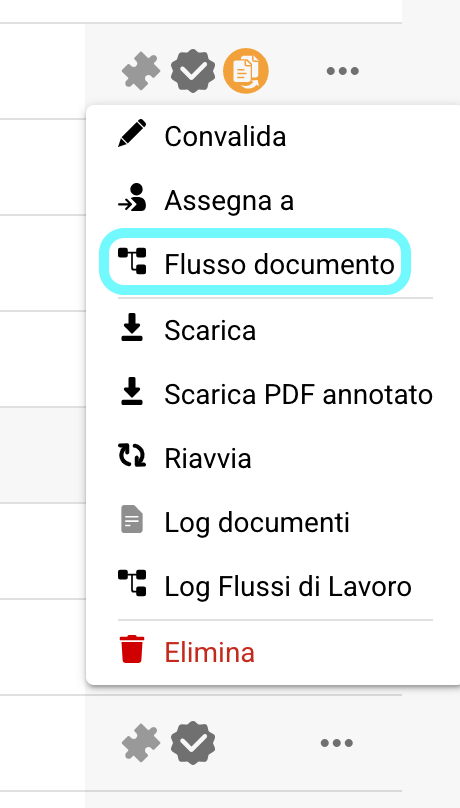
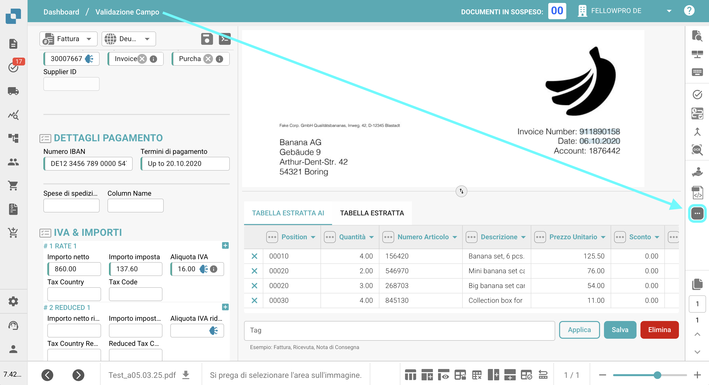
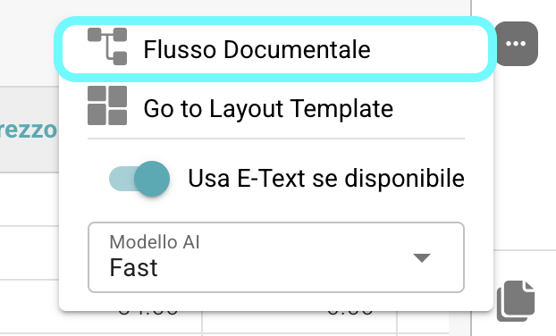
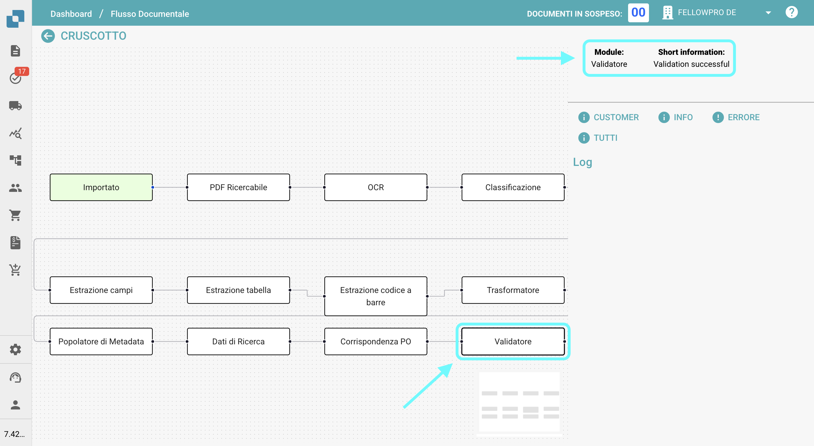

# Flusso Documento

## **Panoramica:**

Questa pagina fornisce una panoramica grafica dei vari passaggi che un documento ha attraversato fino a questo punto.

## **Come Accedere:**

### **Opzione 1:**

1.  Naviga nella colonna delle azioni sul Dashboard e clicca sui tre puntini accanto al documento per il quale desideri visualizzare il flusso documento.

    <figure><figcaption></figcaption></figure>
2.  Seleziona **Flusso Documento**.

    <figure><figcaption></figcaption></figure>

### **Opzione 2:**

1. Apri il documento per il quale desideri visualizzare il flusso documento.
2.  Clicca sui tre puntini sul lato destro della Validazione Campo.

    <figure><figcaption></figcaption></figure>
3.  Seleziona **Flusso Documento**.

    <figure><figcaption></figcaption></figure>

## **Descrizione:**

Sul lato sinistro dello schermo, vedrai i singoli passaggi del flusso documento, elencati da sinistra a destra.

<figure><figcaption></figcaption></figure>

* I passaggi che avviano il processo di flusso documento (come importazione o riavvio) appariranno in verde.
* Per navigare tra i passaggi, basta trascinarli e rilasciarli sullo schermo.
*   Quando clicchi su un passaggio, il nome del modulo e informazioni su se il passaggio è stato completato con successo o meno appariranno sul lato destro dello schermo.

    <figure><figcaption></figcaption></figure>
