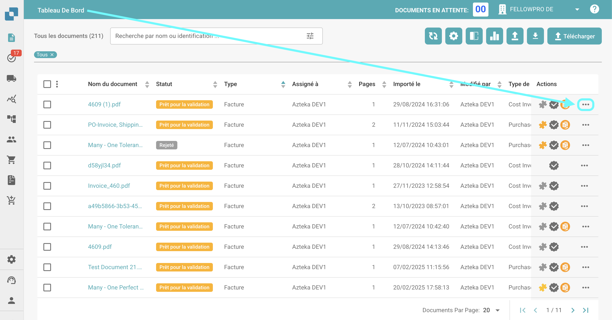
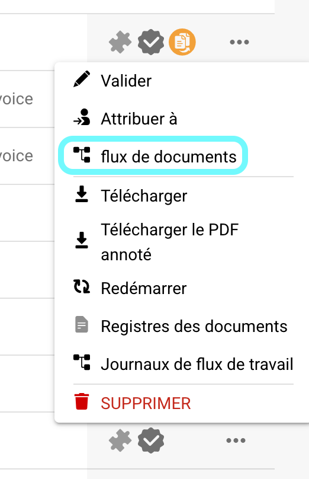
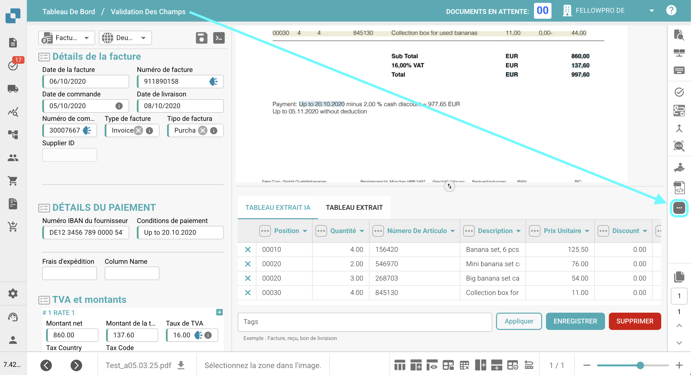
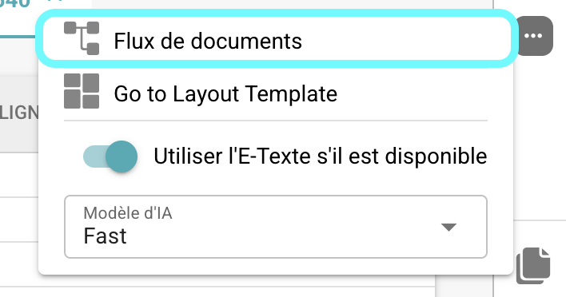
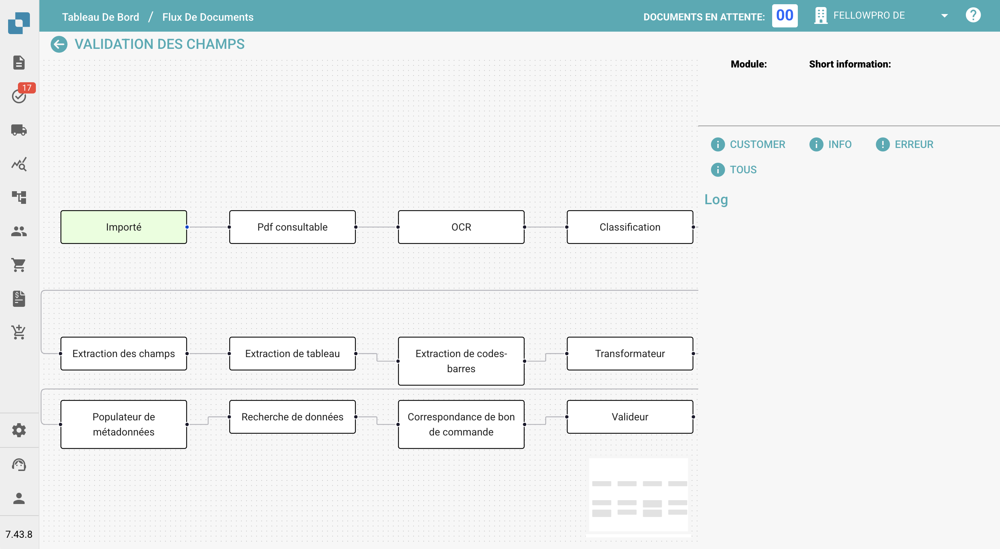
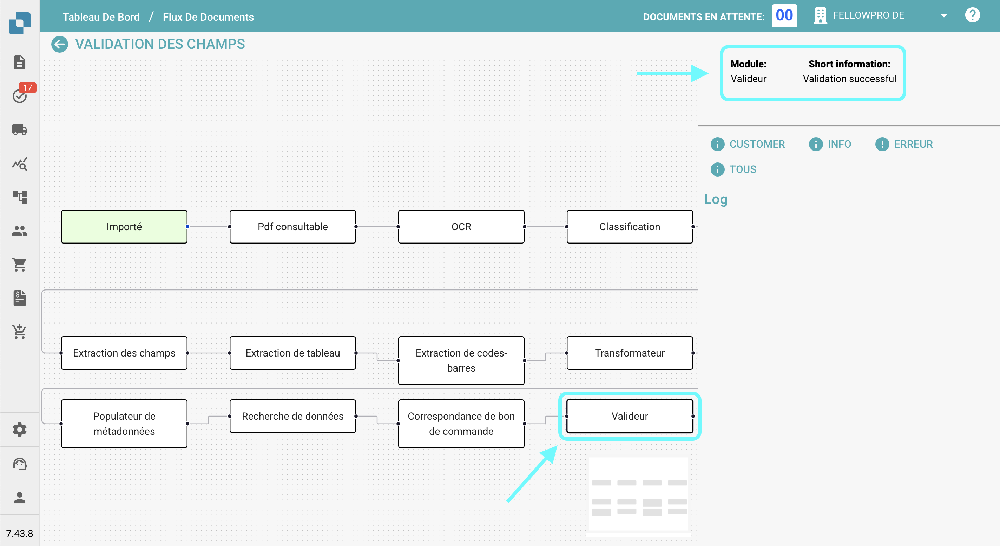

# Flux De Documents

## **Aperçu :**

Cette page fournit un aperçu graphique des différentes étapes qu'un document a traversées jusqu'à présent.

## **Comment Accéder :**

### **Option 1 :**

1.  Naviguez vers la colonne des actions sur le tableau de bord et cliquez sur les trois points à côté du document pour lequel vous souhaitez voir le flux de documents.

    <figure><figcaption></figcaption></figure>
2.  Sélectionnez **Flux De Documents**.

    <figure><figcaption></figcaption></figure>

### **Option 2 :**

1. Ouvrez le document pour lequel vous souhaitez voir le flux de documents.
2.  Cliquez sur les trois points sur le côté droit de la Validation Des Champs.

    <figure><figcaption></figcaption></figure>
3.  Sélectionnez **Flux De Documents**.

    <figure><figcaption></figcaption></figure>

## **Description :**

Sur le côté gauche de l'écran, vous verrez les étapes individuelles du flux de documents, listées de gauche à droite.

<figure><figcaption></figcaption></figure>

* Les étapes qui initient le processus de flux de documents (comme l'importation ou le redémarrage) apparaîtront en vert.
* Pour naviguer à travers les étapes, il suffit de les faire glisser et de les déposer sur l'écran.
*   Lorsque vous cliquez sur une étape, le nom du module et des informations sur la réussite ou l'échec de l'étape apparaîtront sur le côté droit de l'écran.

    <figure><figcaption></figcaption></figure>
