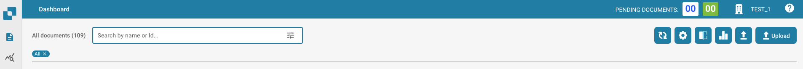

# Fusion de Documents

## Aperçu

La fusion de documents vous permet de combiner plusieurs documents.

Tout d'abord, vous devez sélectionner les documents que vous souhaitez fusionner. Cela peut être fait en sélectionnant les cases à cocher des documents. Une fois que vous avez sélectionné les documents, cliquez sur l'icône avec trois points.

Un menu s'affichera alors, sélectionnez l'option "Fusionner" qui se trouve en bas.

<figure><figcaption></figcaption></figure>

La fusion de documents est une fonctionnalité importante dans un système de gestion de documents qui permet aux utilisateurs de combiner plusieurs documents en un seul document. Voici quelques raisons pour lesquelles la fusion de documents peut être utile :

* **Organiser des documents connexes :** En fusionnant plusieurs documents en un seul document, les utilisateurs peuvent organiser et conserver ensemble des informations ou des fichiers connexes. Cela peut aider à améliorer l'efficacité dans la gestion et l'accès aux documents.
* **Créer des rapports ou des résumés :** La fusion de plusieurs documents peut être utile pour créer des rapports ou des résumés en combinant des données ou des informations provenant de différentes sources ou documents. Cela permet aux utilisateurs de créer des rapports ou des présentations complets sans avoir à copier et coller manuellement les informations.
* **Archiver des documents :** Lorsque plusieurs versions d'un document existent, ou lorsque des documents doivent être résumés dans une période de temps spécifique, la fusion de documents peut aider à garantir des pratiques d'archivage cohérentes et à optimiser l'espace de stockage.
* **Optimisation des flux de travail :** La fusion de documents peut faire partie d'un flux de travail automatisé où les documents sont automatiquement combinés une fois que certaines conditions sont remplies. Cela peut être utilisé, par exemple, dans un processus d'approbation ou lors de la création de contrats ou de rapports.

## Exemples de fusion de documents :

* **Combinaison de factures :** Une entreprise doit résumer toutes les factures d'un mois donné à des fins comptables. Les factures individuelles sont téléchargées en tant que documents distincts, puis fusionnées pour créer un aperçu consolidé.
* **Combinaison de formulaires d'approbation :** Un flux de travail d'approbation d'application nécessite que plusieurs formulaires soient fusionnés avant d'être transmis à la direction. Les différents formulaires sont automatiquement combinés au fur et à mesure qu'ils sont remplis et soumis par les parties concernées.
* **Création d'un rapport annuel :** Plusieurs départements d'une entreprise travaillent ensemble pour créer un rapport annuel complet. Chaque département prépare sa propre section du rapport en tant que document distinct. Ces documents sont ensuite réunis pour créer le rapport annuel final.

En fusionnant des documents, les organisations peuvent rationaliser leurs processus de gestion documentaire, améliorer la collaboration et accroître l'efficacité.
