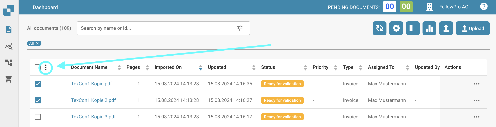

# Documenten Samenvoegen

## Overzicht

Documenten samenvoegen stelt je in staat om meerdere documenten te combineren.

Eerst moet je de documenten selecteren die je wilt samenvoegen. Dit kan worden gedaan door de selectievakjes van de documenten aan te vinken. Zodra je de documenten hebt geselecteerd, klik je op het pictogram met drie stippen.

Er wordt dan een menu weergegeven, selecteer de optie "Samenvoegen" die onderaan te vinden is.

<figure><figcaption></figcaption></figure>

<figure><figcaption></figcaption></figure>

Documenten samenvoegen is een belangrijke functie in een documentbeheersysteem waarmee gebruikers meerdere documenten kunnen combineren tot één enkel document. Hier zijn enkele redenen waarom documenten samenvoegen nuttig kan zijn:

* **Gerelateerde documenten organiseren:** Door meerdere documenten samen te voegen tot één document, kunnen gebruikers gerelateerde informatie of bestanden bij elkaar houden en organiseren. Dit kan helpen de efficiëntie bij het beheren en openen van documenten te verbeteren.
* **Rapporten of samenvattingen maken:** Het samenvoegen van meerdere documenten kan nuttig zijn om rapporten of samenvattingen te maken door gegevens of informatie uit verschillende bronnen of documenten te combineren. Dit stelt gebruikers in staat om uitgebreide rapporten of presentaties te maken zonder de informatie handmatig te hoeven kopiëren en plakken.
* **Documenten archiveren:** Wanneer er meerdere versies van een document bestaan, of wanneer documenten binnen een specifieke periode moeten worden samengevat, kan het samenvoegen van documenten helpen om consistente archiveringspraktijken te waarborgen en opslagruimte te optimaliseren.
* **Workflow optimalisatie:** Documenten samenvoegen kan deel uitmaken van een geautomatiseerde workflow waarbij documenten automatisch worden gecombineerd zodra aan bepaalde voorwaarden is voldaan. Dit kan bijvoorbeeld worden gebruikt in een goedkeuringsproces of bij het maken van contracten of rapporten.

## Voorbeelden van het samenvoegen van documenten:

* **Facturen combineren:** Een bedrijf moet alle facturen van een bepaalde maand samenvatten voor boekhoudkundige doeleinden. Individuele facturen worden geüpload als afzonderlijke documenten en vervolgens samengevoegd om een geconsolideerd overzicht te creëren.
* **Goedkeuringsformulieren combineren:** Een goedkeuringsworkflow voor aanvragen vereist dat meerdere formulieren worden samengevoegd voordat ze naar het management worden doorgestuurd. De verschillende formulieren worden automatisch gecombineerd zodra ze zijn ingevuld en ingediend door de betrokken partijen.
* **Een jaarverslag maken:** Meerdere afdelingen in een bedrijf werken samen om een uitgebreid jaarverslag te maken. Elke afdeling bereidt zijn eigen sectie van het verslag voor als een apart document. Deze documenten worden vervolgens samengebracht om het definitieve jaarverslag te maken.

Door documenten samen te voegen, kunnen organisaties hun documentbeheerprocessen stroomlijnen, samenwerking verbeteren en efficiëntie verhogen.

