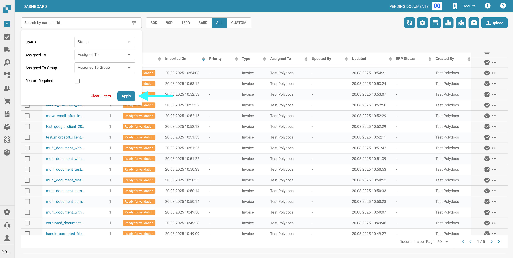
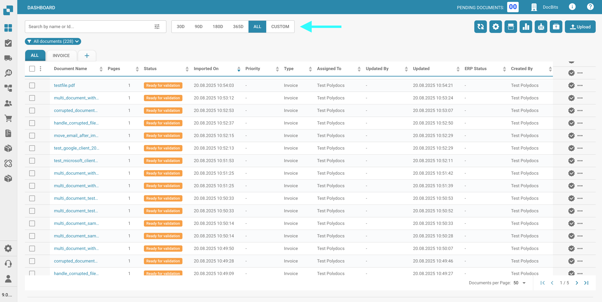
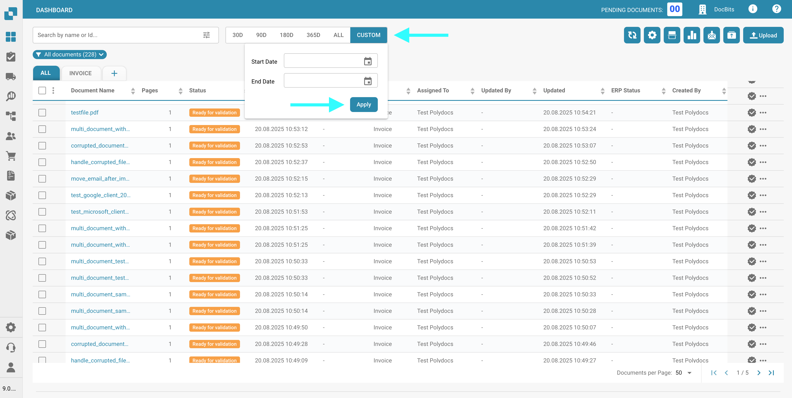
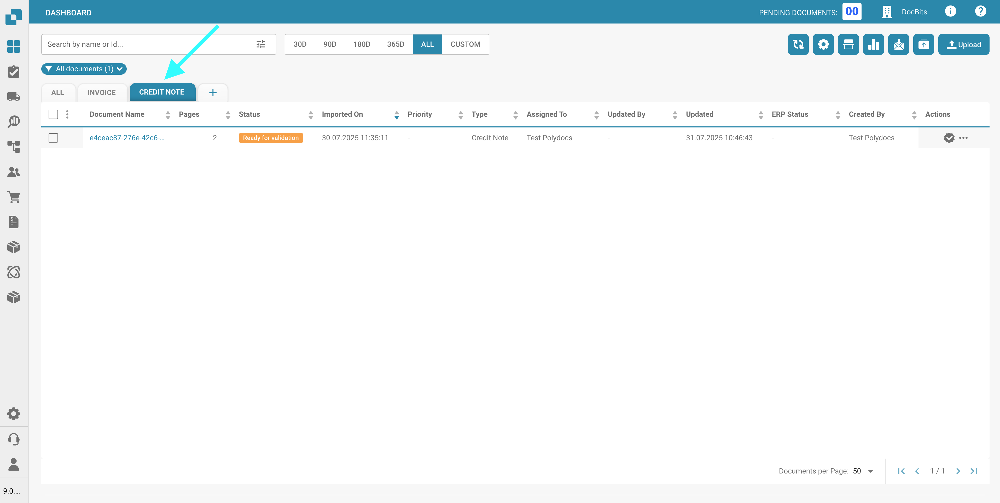

# Filtering Documents

## Default Filtering Options

You can search for specific documents by entering the document name or ID into the search bar located at the top of the dashboard.

<figure><figcaption></figcaption></figure>

For more refined filtering, click the filter icon located on the right side of the search bar to select specific criteria for searching documents.

<figure><figcaption></figcaption></figure>

The following filter options are available:

* **Status**: Filter by processing status (e.g., Ready for validation, Rejected).
* **Assigned To**: Filter by the user assigned to the document.
* **Assigned to Group**: Filter by the group assigned to the document.
* **Restart Required**: Filter for documents that require a restart.

Click **Apply** to apply the selected filters, or **Clear Filters** to reset them.

<figure><figcaption></figcaption></figure>

## Time-Based Filtering

To filter documents by import date, use the time filter located to the right of the search bar. You can choose from the following preset time ranges:

* **30 Days**
* **90 Days**
* **180 Days**
* **365 Days**
* **All**

<figure><figcaption></figcaption></figure>

You can also select a custom date range by clicking **Custom**, then specifying a **Start Date** and **End Date**. After that, click **Apply** to activate the filter.

<figure><figcaption></figcaption></figure>

<mark style="color:red;">**Note**</mark>: Selecting a longer time period may result in slower loading times.

## Filter by Document Type

To filter by specific document types:

1.  Click the plus (+) icon at the top of the dashboard.

    <figure><figcaption></figcaption></figure>
2. Select a document type from the list.
3.  After selecting a document type, you can switch between filters using the tabs at the top of the dashboard.

    <figure><figcaption></figcaption></figure>
