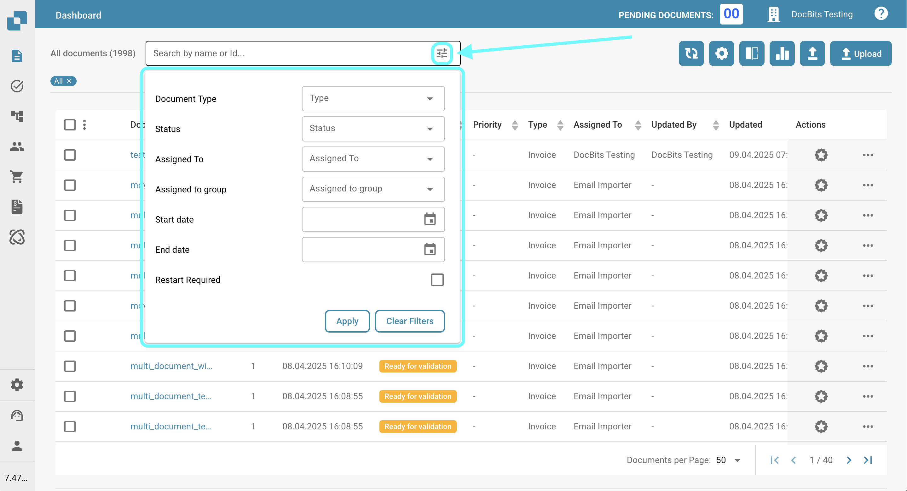

# Filtering Documents

You can search for specific documents by entering the document name or ID into the search bar, as shown below.

<figure><figcaption></figcaption></figure>

For more refined filtering, click the icon on the right side of the search bar to select specific criteria for searching documents.

<figure><figcaption></figcaption></figure>

The following filter options will be available for you to use.

* **Document Type**: Type of the document (e.g., Invoice, Purchase Order).
* **Status**: Processing status (e.g., Ready for validation, Rejected).
* **Assigned To**: User to whom the document is assigned.
* **Assigned to group**: Group to which the document is assigned.
* **Start date / End date**: Date range in which the documents were imported.
* **Restart Required**: Documents that require a restart.

Click "Apply" to apply the filters, or click "Clear Filters" to reset them.
