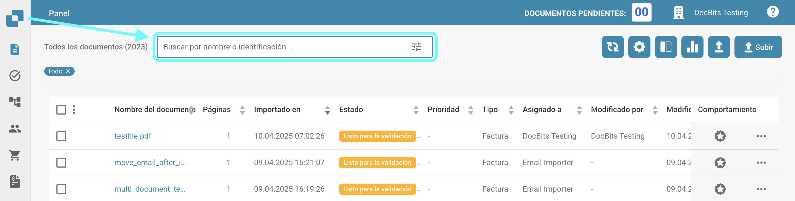
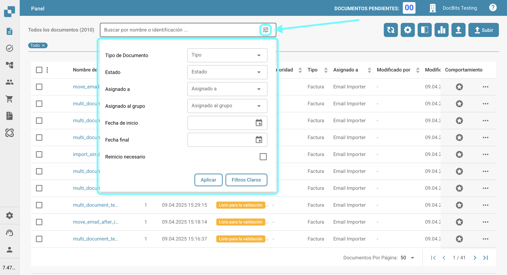

# Filtrar documentos

Puedes buscar documentos específicos ingresando el nombre o ID del documento en la barra de búsqueda, como se muestra a continuación.

<figure><figcaption></figcaption></figure>

Para un filtrado más refinado, haz clic en el ícono en el lado derecho de la barra de búsqueda para seleccionar criterios específicos para buscar documentos.

<figure><figcaption></figcaption></figure>

Las siguientes opciones de filtro estarán disponibles para que las uses.

* **Tipo de Documento**: Tipo del documento (por ejemplo, Factura, Orden de Compra).
* **Estado**: Estado de procesamiento (por ejemplo, Listo para validación, Rechazado).
* **Asignado a**: Usuario al que se le asigna el documento.
* **Asignado al grupo**: Grupo al que se le asigna el documento.
* **Fecha de inicio / Fecha final**: Rango de fechas en el que se importaron los documentos.
* **Reinicio necesario**: Documentos que requieren un reinicio.

Haz clic en "Aplicar" para aplicar los filtros, o haz clic en "Filtros claros" para restablecerlos.
