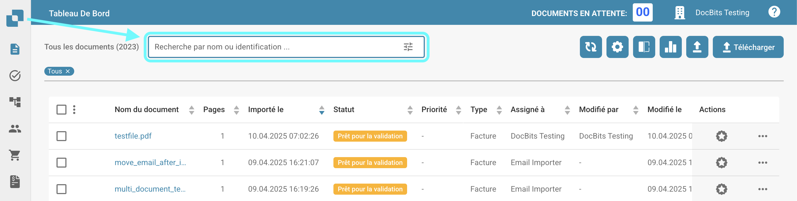
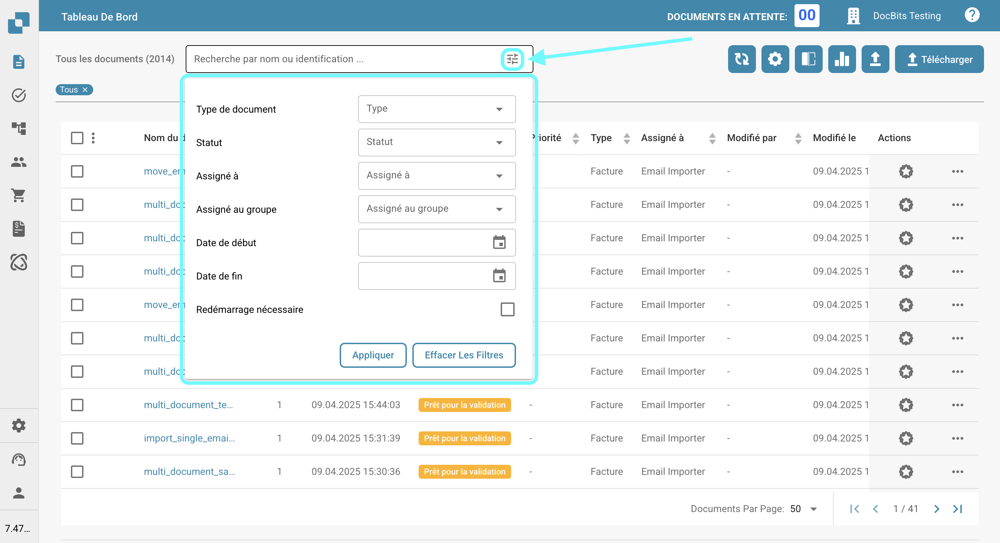

# Filtrage des documents

Vous pouvez rechercher des documents spécifiques en saisissant le nom ou l'ID du document dans la barre de recherche, comme indiqué ci-dessous.

<figure><figcaption></figcaption></figure>

Pour un filtrage plus précis, cliquez sur l'icône à droite de la barre de recherche pour sélectionner des critères spécifiques pour rechercher des documents.

<figure><figcaption></figcaption></figure>

Les options de filtrage suivantes seront disponibles pour vous.

* **Type de document**: Type de document (par exemple, Facture, Bon de commande).
* **Statut**: Statut de traitement (par exemple, Prêt pour validation, Rejeté).
* **Assigné à**: Utilisateur auquel le document est assigné.
* **Assigné au groupe**: Groupe auquel le document est assigné.
* **Date de début / Date de fin**: Plage de dates dans laquelle les documents ont été importés.
* **Redémarrage nécessaire**: Documents nécessitant un redémarrage.

Cliquez sur "Appliquer" pour appliquer les filtres, ou cliquez sur "Effacer les filtres" pour les réinitialiser.
