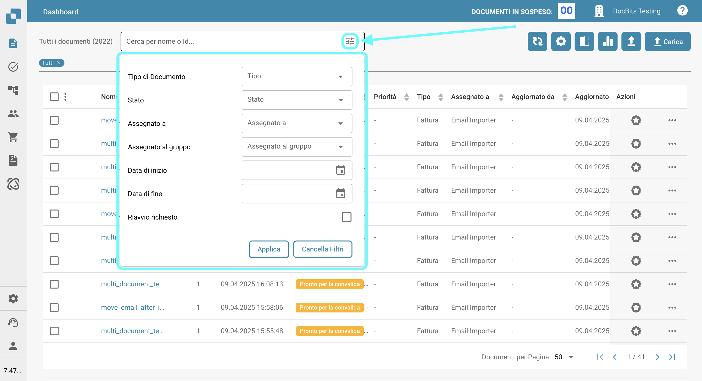

# Filtrare Documenti

Puoi cercare documenti specifici inserendo il nome o l'ID del documento nella barra di ricerca, come mostrato di seguito.

<figure><figcaption></figcaption></figure>

Per un filtraggio più raffinato, fai clic sull'icona sul lato destro della barra di ricerca per selezionare criteri specifici per la ricerca dei documenti.

<figure><figcaption></figcaption></figure>

Le seguenti opzioni di filtro saranno disponibili per te.

* **Tipo di Documento**: Tipo del documento (ad es., Fattura, Ordine di acquisto).
* **Stato**: Stato di elaborazione (ad es., Pronto per la validazione, Rifiutato).
* **Assegnato a**: Utente a cui è assegnato il documento.
* **Assegnato al gruppo**: Gruppo a cui è assegnato il documento.
* **Data di inizio / Data di fine**: Intervallo di date in cui i documenti sono stati importati.
* **Riavvio richiesto**: Documenti che richiedono un riavvio.

Fai clic su "Applica" per applicare i filtri, oppure fai clic su "Cancella filtri" per reimpostarli.
