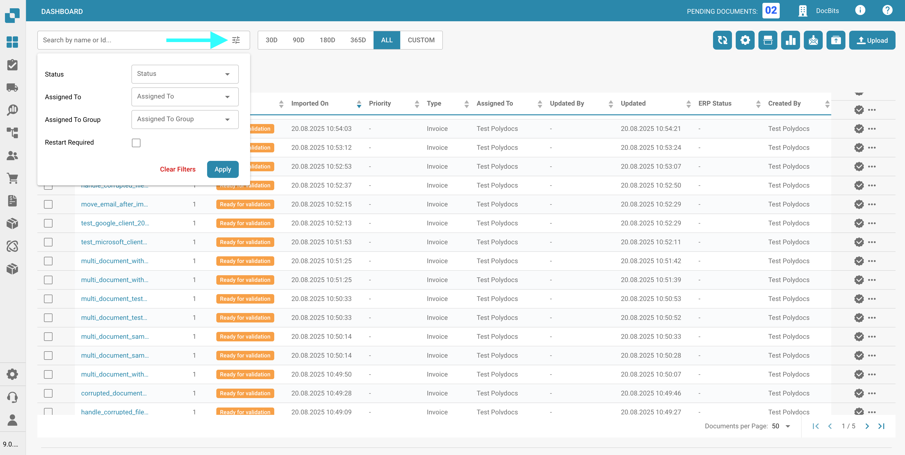

# Filtrando Documentos

Você pode buscar documentos específicos inserindo o nome ou ID do documento na barra de pesquisa, conforme mostrado abaixo.

<figure><figcaption></figcaption></figure>

Para uma filtragem mais refinada, clique no ícone no lado direito da barra de pesquisa para selecionar critérios específicos para buscar documentos.

<figure><figcaption></figcaption></figure>

As seguintes opções de filtro estarão disponíveis para você usar.

* **Tipo de Documento**: Tipo do documento (por exemplo, Invoice, Purchase Order).
* **Status**: Status de processamento (por exemplo, Ready for validation, Rejected).
* **Atribuído a**: Usuário ao qual o documento está atribuído.
* **Atribuído ao grupo**: Grupo ao qual o documento está atribuído.
* **Data de início / Data de término**: Intervalo de datas em que os documentos foram importados.
* **Reinício Necessário**: Documentos que requerem um reinício.

Clique em "Apply" para aplicar os filtros ou clique em "Clear Filters" para redefini-los.
