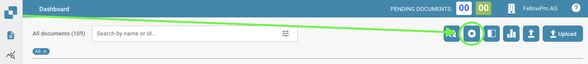
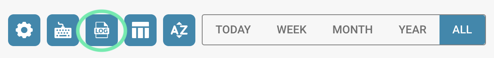
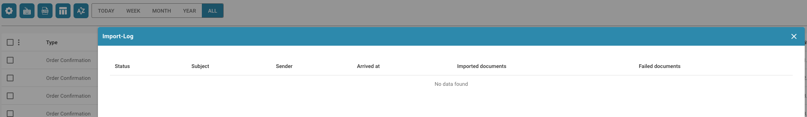

# Registro de importación

Si desea ver un registro detallado de todos los documentos importados a su entorno de DocBits, siga estos pasos.

Desde su Panel de Control de DocBits, seleccione la opción de Configuración Avanzada.

<figure><figcaption></figcaption></figure>

Después de que aparezca la barra de Configuración Avanzada, seleccione el botón de Registro de Importación.

<figure><figcaption></figcaption></figure>

A continuación, aparecerá una tabla con todos los documentos importados recientemente, así como otra información relevante sobre ellos.

<figure><figcaption></figcaption></figure>
