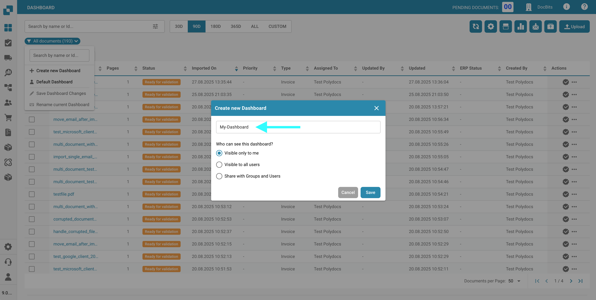
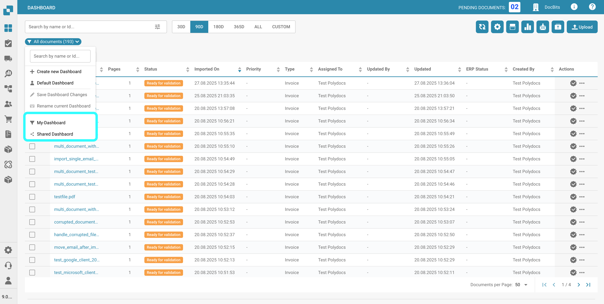
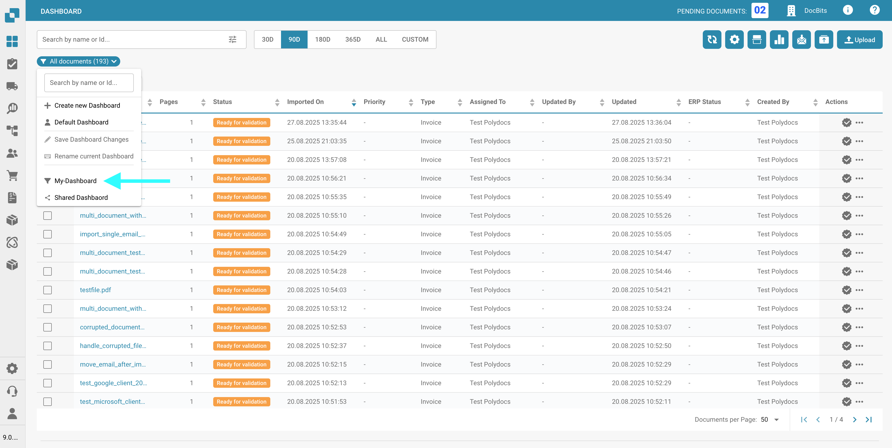
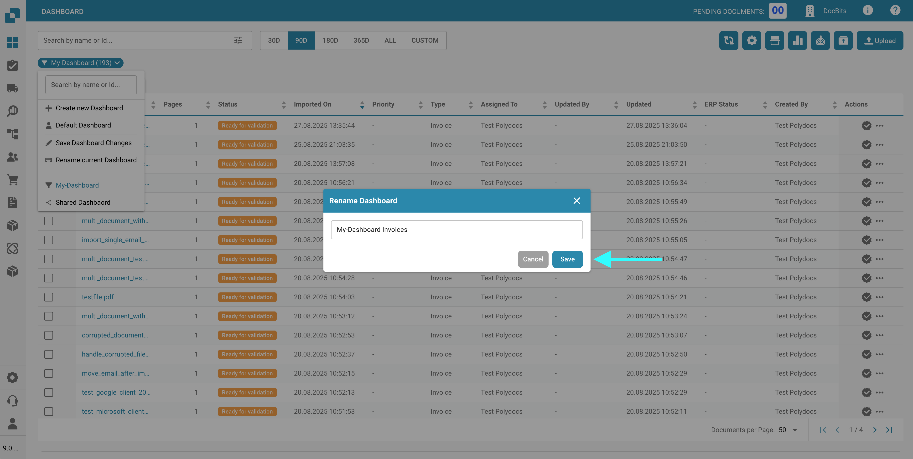
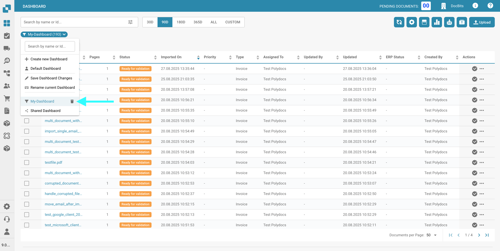

# Personal Dashboards

## Overview

You can create and manage custom dashboards tailored to your specific needs. These dashboards allow you to:

* Define a custom column order
* Select only the columns relevant to your use case
* Apply and save personalized filters
* Share dashboards with team members

## Create new Dashboard

To create a new dashboard:

1.  Click the filter button below the search bar.

    <figure><figcaption></figcaption></figure>
2.  Click **Create New Dashboard**.

    <figure><figcaption></figcaption></figure>
3.  Enter a name for your dashboard.

    <figure><figcaption></figcaption></figure>
4. Set the desired visibility level. You can choose from:
   * **Visible only to me**: Only you (the currently logged-in user) can view this dashboard.
   * **Visible to all users**: All users in your organization will have view access.
   *   **Share with groups and users**: Select specific users or user groups who will have view access to the dashboard.

       <figure><figcaption></figcaption></figure>
5.  Click **Save** to create and save your dashboard.

    <figure><figcaption></figcaption></figure>

## Switch between Dashboards

To switch between dashboards:

1. Click the filter button below the search bar.
2.  In the dropdown menu, select a dashboard from the list of personal or shared dashboards.

    <figure><figcaption></figcaption></figure>

<mark style="color:red;">**Note**</mark>: You can identify whether a dashboard is personal or shared by checking the icon in front of the dashboard name.

## Editing/Deleting a Personal Dashboard

To edit your personal or shared dashboard:

1.  Click the filter button below the search bar.

    <figure><figcaption></figcaption></figure>
2.  Click on the name of the personal dashboard you want to edit.

    <figure><figcaption></figcaption></figure>
3. Make the desired changes, such as:
   * Changing the column order
   * Adjusting the visibility of columns
   * Editing filters

### **Saving Dashboard Changes**

Once you've made your changes, click the filter button below the search bar, then select **Save Dashboard Changes**.

<figure><figcaption></figcaption></figure>

<mark style="color:red;">**Note**</mark>: Only personal dashboards can be edited. Shared dashboards can only be edited by their original creator.

### **Renaming a Dashboard**

To rename a personal or shared dashboard:

1.  Click the filter button below the search bar.

    <figure><figcaption></figcaption></figure>
2.  Select the dashboard you want to rename.

    <figure><figcaption></figcaption></figure>
3.  Select **Rename Current Dashboard**.

    <figure><figcaption></figcaption></figure>
4.  Enter the new name, then click **Save**.

    <figure><figcaption></figcaption></figure>

<mark style="color:red;">**Note**</mark>: Only personal dashboards can be renamed. Shared dashboards can only be renamed by their original creator.

### Delete a Dashboard

To delete a personal dashboard:

1.  Click the filter button below the search bar.

    <figure><figcaption></figcaption></figure>
2. Hover over the dashboard you want to delete.
3.  Click the trash can icon next to it.

    <figure><figcaption></figcaption></figure>
4.  Confirm the deletion by clicking **Delete**.

    <figure><figcaption></figcaption></figure>

<mark style="color:red;">**Note**</mark>: Only personal dashboards can be deleted. Shared dashboards can only be deleted by their original creator.
