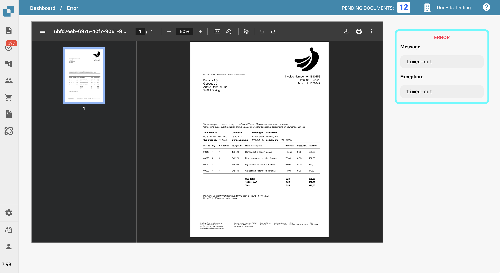
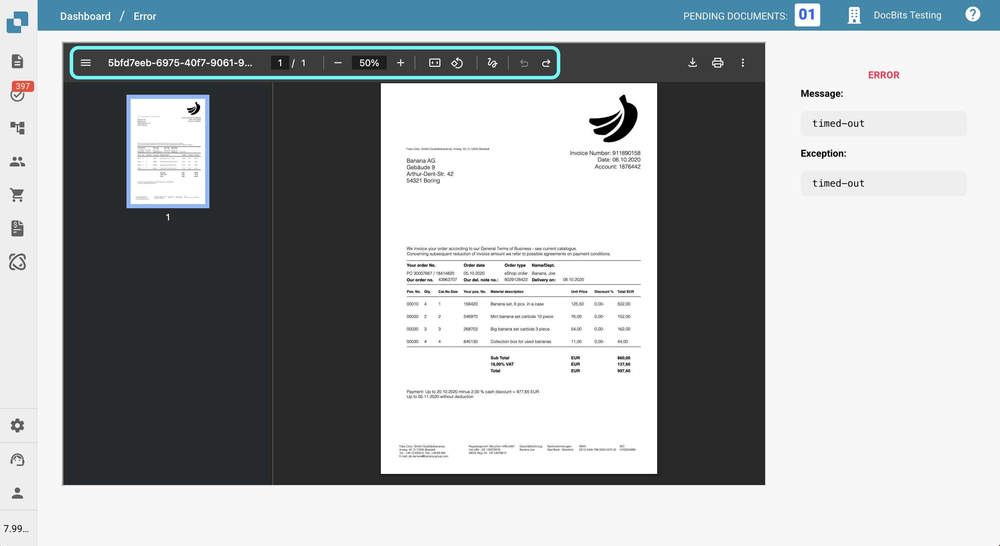
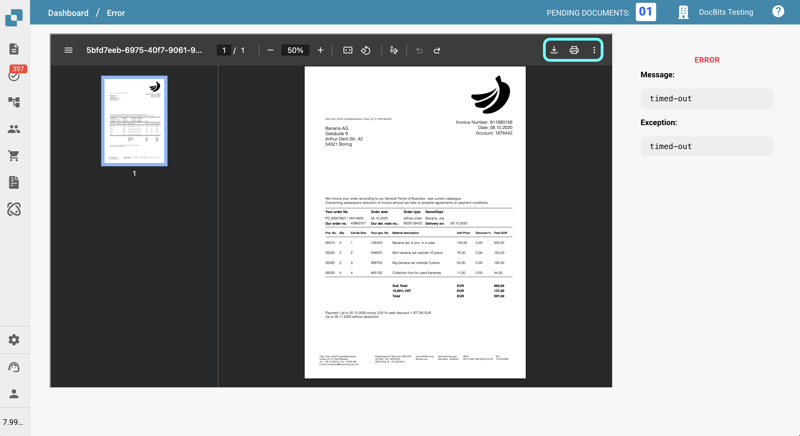
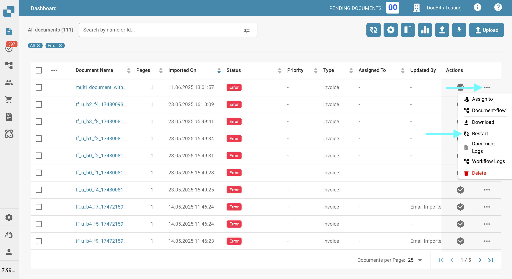

# Error

## Overview

If an error occurs during your document workflow, the document will enter the **Error** status. When this happens, you can click on the document to:

* View critical details explaining why the error occurred
* Add notes to the document
* Print or download the document

This allows you to diagnose issues and take appropriate actions without losing access to the document itself.

This page provides an overview of the tools available to help you review and manage documents in the **Error** state.

## Error Details

On the right side of the document view, you will find the **Error Message**, which provides a brief description of what went wrong.\
Below the error message, the **Exception** is displayed, showing where the error occurred in the code. This information is useful for troubleshooting and should be included when reporting the issue to support.

<figure><figcaption></figcaption></figure>

## Editing Options

On the left side of the page, your document is displayed along with several tools for interaction and review.

<figure><figcaption></figcaption></figure>

### **Left Toolbar Options**

<figure><figcaption></figcaption></figure>

The toolbar on the left side of the page provides tools to interact with the document:

* **Toggle Thumbnail View**\
  Show or hide the sidebar that displays all document pages as thumbnails for easy navigation.
* **View the Document ID**\
  Helpful when reporting an issue—include this ID in your support request.
* **Track Current Page and Zoom Level**\
  See which page you're viewing and at what zoom percentage.
* **Fit to Height or Width**\
  Adjust the document display to fit either the height or width of the viewer.
* **Rotate the Document**\
  Rotate the document for easier viewing of scanned or sideways content.
* **Add Notations**\
  Annotate the document with comments or highlights.
* **Undo or Redo Actions**\
  Quickly reverse or reapply recent actions.

***

### **Right Toolbar Options**

<figure><figcaption></figcaption></figure>

The toolbar on the right side of the page offers additional functionality:

* **Download the Document**\
  Save the document to your device, with or without annotations.
* **Print the Document**\
  Send the document to a printer, including visible annotations.
* **Switch Viewing Modes**\
  Change between different display styles or reading modes.
* **View Document Properties**\
  Access metadata such as file name, type, size, and creation date.

## How to Proceed Further

If a document enters the **Error** state, you have several options to continue:

**1. Restart the Document**

In many cases, restarting the document can resolve the issue and allow processing to resume.

*   To restart the document:

    1. Click the three dots in the **Actions** column.
    2. Select **Restart** from the menu.

    <figure><figcaption></figcaption></figure>

**2. Contact Support**

If the error persists after restarting, you can contact our support team for further assistance.\
Please provide as much information as possible to help our team resolve the issue efficiently (e.g., document ID, error message, actions taken).

Instructions for submitting a support ticket can be found [here](ressources-and-support/user-support.md).
