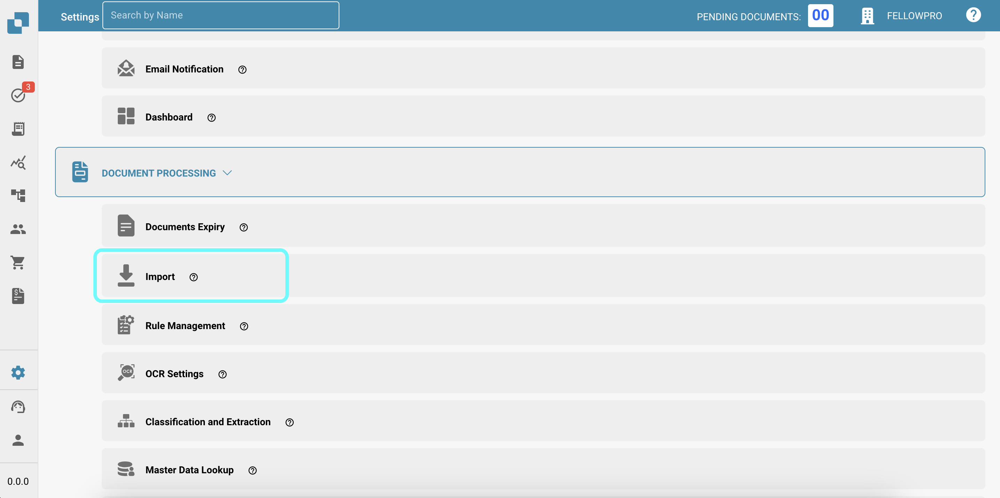
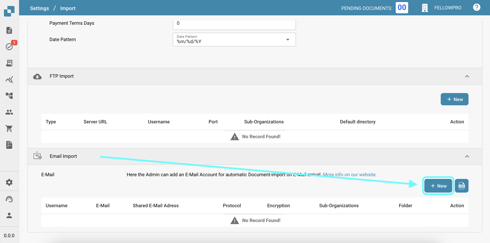
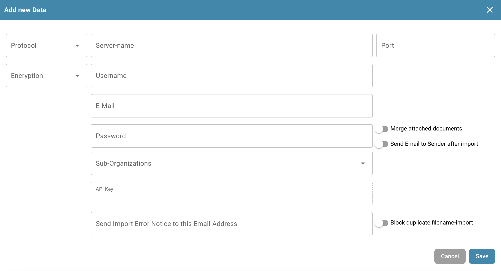
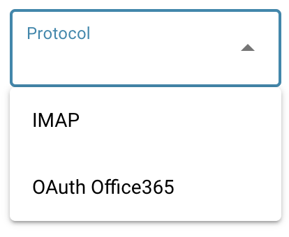

# Email

Vá para o menu Configurações e selecione "Importar" em Processamento de Documentos.

<figure><figcaption></figcaption></figure>

Role até o final da página e selecione o botão NOVO para criar uma nova importação de email.

<figure><figcaption></figcaption></figure>

Após pressionar NOVO, o seguinte menu será mostrado para você.

<figure><figcaption></figcaption></figure>

Aqui você pode selecionar qual Protocolo gostaria.

<figure><figcaption></figcaption></figure>
