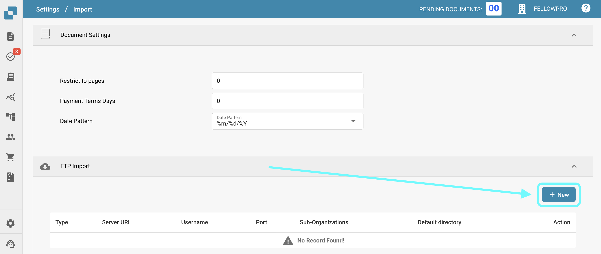

# FTP

Se você gostaria de integrar seu SFTP com o DocBits para importar documentos.

Requisitos

* Servidor SFTP compatível com Linux, configurado corretamente
* Nome do host SFTP, Nome de usuário e Senha
* Pasta de Importação dedicada

**Configuração de Importação**

No Painel de Controle, abra Configurações e navegue até Importar. Em Importação FTP, selecione para adicionar uma nova configuração.

<figure><figcaption></figcaption></figure>

Insira as credenciais SFTP nos espaços fornecidos e selecione salvar (O campo Chave de API será preenchido automaticamente com a Chave de API do ambiente em que você está trabalhando).

Depois de inserir todos os detalhes necessários do seu SFTP, clique em SALVAR.
