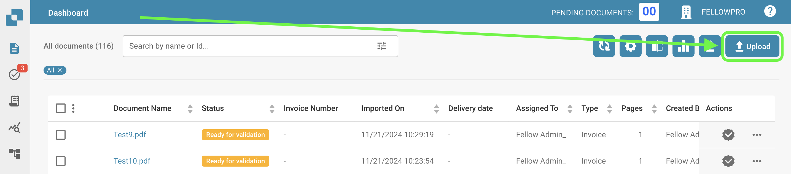

# Importation Manuelle

Si vous souhaitez importer des documents manuellement dans DocBits, suivez ces étapes simples :

* Cliquez sur le bouton Importer sur le tableau de bord de DocBits.
* Une fenêtre apparaîtra où vous pourrez importer vos documents via le navigateur de fichiers ou par glisser-déposer. Vous pouvez importer jusqu'à 10 documents à la fois.
* Pour importer des documents via le navigateur de fichiers, cliquez sur le bouton Importer des documents et sélectionnez les fichiers que vous souhaitez importer. Une fois les fichiers sélectionnés, cliquez sur Confirmer pour démarrer le processus d'importation.
* Alternativement, vous pouvez glisser-déposer vos fichiers sur la fenêtre d'importation de DocBits.
* Une fois les fichiers importés, ils auront le statut initial de "En cours". Pendant ce temps, l'importation est en cours de traitement et l'édition du fichier n'est pas possible. Le temps de traitement peut varier en fonction de la taille et de la complexité du fichier.
* Une fois le fichier traité, il recevra le statut "Prêt pour la validation". Vous pouvez maintenant commencer le processus de validation.

<figure><figcaption></figcaption></figure>
