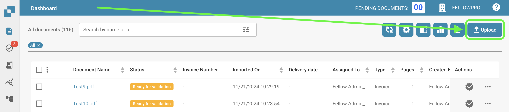

# Ręczny Import

Jeśli chcesz ręcznie importować dokumenty do DocBits, postępuj zgodnie z tymi prostymi krokami:




* Kliknij przycisk Prześlij na pulpicie nawigacyjnym DocBits.
* Pojawi się okno, w którym możesz przesłać swoje dokumenty za pomocą przeglądarki plików lub metodą przeciągnij i upuść. Możesz przesłać do 10 dokumentów jednocześnie.
* Aby przesłać dokumenty za pomocą przeglądarki plików, kliknij przycisk Prześlij dokumenty i wybierz pliki, które chcesz przesłać. Po wybraniu plików kliknij Potwierdź, aby rozpocząć proces przesyłania.
* Alternatywnie, możesz przeciągnąć i upuścić swoje pliki na okno importu DocBits.
* Po przesłaniu plików będą miały początkowy status „W toku”. W tym czasie przesyłanie jest przetwarzane i edytowanie pliku nie jest możliwe. Czas przetwarzania może się różnić w zależności od rozmiaru i złożoności pliku.
* Po przetworzeniu pliku otrzyma on status „Gotowy do walidacji”. Możesz teraz rozpocząć proces walidacji.

<figure><figcaption></figcaption></figure>
