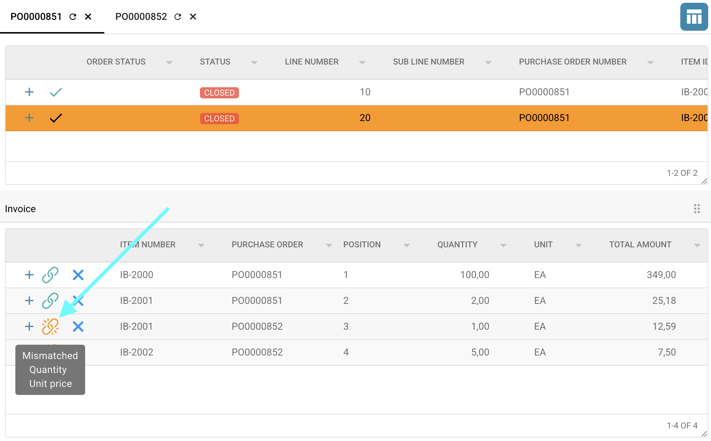

# Écran de Correspondance des Bons de Commande

## Aperçu

Dans l'écran de **Correspondance des Bons de Commande**, vous pouvez comparer les lignes extraites de votre document avec celles stockées dans le **système Infor**, en utilisant le numéro de bon de commande comme référence.

Vous pouvez :

* **Identifier immédiatement** toute différence entre les données extraites et stockées
* **Définir des tolérances** pour permettre des écarts acceptables
* **Ignorer des statuts spécifiques** d'Infor, si nécessaire
* **Approuver et exporter** le document après une correspondance réussie
* **Rejeter** le document si les données ne répondent pas aux critères de validation requis

Cette page vous guidera à travers le processus de correspondance des bons de commande et expliquera toutes les fonctionnalités associées disponibles dans cette section.

## Outils dans l'Écran de Correspondance des Bons de Commande

En haut de l'écran de Correspondance des Bons de Commande, vous trouverez plusieurs outils—comme **Enregistrer**, **Correspondance Automatique**, **Exporter**, et d'autres—qui aident au processus de correspondance.\
Une description détaillée de chaque outil et de sa fonctionnalité peut être trouvée [ici](purchase-order-matching-tools.md).


## Filtrer et Ajouter des Numéros de Bons de Commande

Vous pouvez rechercher des numéros de bons de commande spécifiques en entrant le numéro dans le champ de recherche.\
Pour un filtrage plus raffiné, cliquez sur l'icône sur le côté droit de la barre de recherche pour sélectionner des critères spécifiques pour votre recherche.


Les options de filtrage suivantes sont disponibles pour vous aider à affiner votre recherche de bons de commande :

* **Mot-clé** – Filtrer par numéros de bons de commande.
* **Fournisseur** – Filtrer par nom ou ID du fournisseur.
* **Après la date** – Afficher les bons de commande créés après une date spécifique.
* **Avant la date** – Afficher les bons de commande créés avant une date spécifique.
* **Montant minimum de commande** – Filtrer par valeur de commande minimale.
* **Montant maximum de commande** – Filtrer par valeur de commande maximale.
* **Trier par** – Sélectionner l'attribut pour trier les résultats (par exemple, date, montant).
* **Direction du tri** – Choisir l'ordre de tri : croissant ou décroissant.
* **Nombre d'enregistrements à afficher** – Définir combien de résultats doivent être affichés par page.
* **Plus** – Options de filtrage supplémentaires incluent :
  * **Numéro de livraison**
  * **Numéro de bon de livraison**
  * **Identifiant de l'Article**

Après avoir configuré vos filtres, cliquez sur **Appliquer** pour les appliquer ou **Supprimer** pour réinitialiser tous les paramètres de filtre.

Les bons de commande correspondants seront affichés en fonction des filtres appliqués.\
Vous pouvez soit :

* Ajuster les filtres et rechercher à nouveau, ou
* Double-cliquer sur une entrée de bon de commande pour l'ajouter à l'écran de Correspondance des Bons de Commande.


## Sélectionner des Numéros de Bons de Commande et Réorganiser les Colonnes

Vous pouvez passer d'un bon de commande individuel à l'autre pour voir leurs lignes respectives en cliquant sur le numéro de bon de commande en haut du tableau.

Vous pouvez également réorganiser les colonnes dans chaque vue de bon de commande en les faisant simplement glisser et déposer dans l'ordre de votre choix.


Pour masquer définitivement des colonnes spécifiques, utilisez la fonctionnalité [**Définir les colonnes du tableau PO pour l'organisation**](./#definir-les-colonnes-du-tableau-po-pour-lorganisation).

## Définir les Colonnes du Tableau PO pour l'Organisation

Vous avez la possibilité de masquer ou d'afficher des colonnes spécifiques dans le tableau des bons de commande en cliquant sur l'icône des paramètres de colonne (montrée ci-dessous).\
Ce paramètre est disponible à la fois dans l'écran de **Correspondance des Bons de Commande** et dans le menu de **Recherche Avancée des Bons de Commande**.


Des détails supplémentaires peuvent être trouvés [ici](purchase-order-matching-tools.md#definir-les-colonnes-du-tableau-po-pour-lorganisation).

## Resynchroniser le numéro de bon de commande avec Infor

Pour resynchroniser les données dans **DocBits** avec les données d'**Infor**, cliquez sur le **bouton de rafraîchissement** à côté du numéro de bon de commande au-dessus du tableau.


Si votre processus de correspondance est basé sur l'attribut **Réception Livraison Quantité en cours**, vous avez également la possibilité d'effectuer une **synchronisation manuelle**, comme décrit en détail [ici](purchase-order-matching-tools.md#donnees-de-synchronisation).


## Comment faire correspondre ?

Pour faire correspondre une ligne de bon de commande avec une ligne extraite du document, vous avez trois options :

1. **Glisser et Déposer**\
   Faites glisser la ligne de bon de commande souhaitée et déposez-la sur la ligne correspondante dans le tableau extrait.
2. **Clic Droit et Connecter**
   * Cliquez avec le bouton droit sur la ligne de bon de commande que vous souhaitez faire correspondre et sélectionnez **Sélectionner pour correspondre**.
   * Ensuite, cliquez avec le bouton droit sur la ligne correspondante dans le tableau extrait et sélectionnez **Connecter**.
3.  **Correspondance Automatique**

    Cliquez sur le bouton **Correspondance Automatique** pour laisser le système tenter automatiquement de faire correspondre toutes les lignes en fonction des données extraites et des données de bon de commande.

    

Vous pouvez également sélectionner **plusieurs lignes de bon de commande** et les faire correspondre à une **ligne unique** dans le tableau extrait.

## Quelles colonnes sont correspondantes ?

Le processus de Correspondance des Bons de Commande ne correspond qu'à des colonnes spécifiques. La liste ci-dessous décrit quelles colonnes sont correspondantes, si disponibles. Si aucune [tolérance](./#accepter-les-tolerances) n'est définie, les colonnes ne correspondront que si elles sont une correspondance exacte (100%).

* [Quantité](./#quantite) (Quantité | Quantité Reçue | Réception Livraison Quantité en cours)
* Prix Unitaire
* Numéro de Bon de Commande
* Numéro d'article/Identifiant de l'article du fournisseur
* Date de livraison promise

### Quantité

Vous avez trois options pour faire correspondre la quantité.

* Quantité
* Quantité Reçue
* Réception Livraison Quantité en cours

Vous pouvez définir cette option dans **Paramètres → Paramètres globaux → Types de documents → Plus de paramètres → Section Bon de Commande → Bon de Commande**

## Accepter les Tolérances

Vous pouvez spécifier des niveaux de tolérance acceptables pendant le processus de correspondance.\
Par défaut, seules les correspondances exactes (100%) sont considérées comme valides.

Si des tolérances sont configurées dans les paramètres du système, vous pouvez les ajuster pour les attributs autorisés directement dans le **Tableau Extrait** sous la colonne **Actions**.


Pour plus d'informations sur la configuration et l'utilisation des tolérances, consultez la [documentation détaillée](../../../administration-and-setup/settings/global-settings/document-types/more-settings/purchase-order/purchase-order-tolerance-settings-additional-purchase-order-tolerance.md).

## Désactiver les statuts

Vous pouvez exclure des lignes spécifiques avec certains statuts de la correspondance. Pour plus d'informations, reportez-vous à la [documentation détaillée](../../../administration-and-setup/settings/global-settings/document-types/more-settings/purchase-order/purchase-order-disable-statuses.md).

## Vérifier les lignes correspondantes

Plusieurs indicateurs sont disponibles pour vous aider à vérifier si un article a été correctement associé ou non.

### Tableau des Bons de Commande


* Cet icône indique que la ligne de bon de commande a été correctement associée.


* Cet icône indique que la ligne de bon de commande contient un désaccord.


### Tableau Extrait du Document

*   Cet icône indique que l'article a été correctement associé. Vous pouvez survoler l'icône pour mettre en surbrillance la ligne de bon de commande correspondante.

    
*   Cet icône indique que l'article contient un désaccord. Vous pouvez survoler l'icône pour mettre en surbrillance la ligne de bon de commande correspondante et voir les colonnes où se produisent les désaccords.

    

## Correspondances Multiples

Si un seul article est associé à plusieurs lignes, vous pouvez voir des informations détaillées en cliquant sur l'icône plus (+) à côté de l'article respectif.

Cela développe la vue pour montrer toutes les entrées correspondantes, vous aidant à vérifier et à gérer efficacement les correspondances multiples.


## Supprimer les Connexions de Bon de Commande

Pour supprimer une connexion entre une ligne de bon de commande et une ligne extraite, cliquez simplement sur l'icône **X** à côté de la paire correspondante.\
Une fois supprimée, la connexion est annulée et l'article devient à nouveau disponible pour correspondance.


## Calcul

Sous le tableau contenant les informations extraites de votre document, vous pouvez trouver des calculs simples pour vérifier si le total des réservations correspond.


### Réservations enregistrées :

La valeur des réservations enregistrées est dérivée du montant net extrait du document.

```
Réservations enregistrées = Montant net total (extrait du document)
```

### Total correspondant :

Cette valeur est calculée en additionnant les montants totaux de toutes les lignes qui ont pu être associées aux lignes du numéro de bon de commande.

```
 Total correspondant = Somme des montants totaux de toutes les lignes correspondantes
```

### **Frais :**

Tous les frais applicables seront inclus dans cette section s'ils sont présents.\
Pour plus de détails, reportez-vous à la [documentation détaillée](../../../administration-and-setup/settings/document-processing/classification-and-extraction/table-extraction-for-costing-element.md).

```
Frais = Élément de coût
```

### Montant non réglé :

La différence résultante est affichée ici et est calculée comme suit :

```
Montant non réglé = Réservations enregistrées - Total correspondant - Élément de coût
```

## Visualiser le Document pour Validation

Sur le côté droit de l'écran de **Correspondance des Bons de Commande**, vous pouvez visualiser le document pour aider à la validation.


**Fonctionnalités de la Barre d'Outils du Visualiseur de Document :**

* Faites défiler les pages du document pour examiner le contenu.
* Cliquez sur le nom du fichier pour ouvrir l'écran de validation complet.
* Entrez un numéro de page et appuyez sur Entrée pour sauter directement à cette page.
* Utilisez les boutons plus (+) et moins (–) pour zoomer ou dézoomer sur le document.
*   Cliquez sur le bouton tout à droite pour ouvrir le document dans une fenêtre séparée, ce qui est particulièrement utile lorsque vous travaillez avec plusieurs écrans.

    

## Enregistrer les Modifications :

Pour enregistrer vos modifications, cliquez sur le bouton **Enregistrer** dans la barre d'outils.\
Si vous quittez la page sans enregistrer, tous les progrès réalisés pendant le processus de correspondance seront perdus.


## Exporter le Document

Après avoir fait correspondre toutes les lignes et validé leur exactitude, vous pouvez exporter le document en cliquant sur le bouton **Exporter** dans la barre d'outils.

* Cliquer sur la petite flèche à côté du bouton **Exporter** révèle toutes les options d'exportation disponibles.
* Cliquer directement sur **Exporter** déclenchera l'option d'exportation par défaut (la première de la liste).


