# Purchase Order Matching Screen

## Overview

In the **Purchase Order Matching** screen, you can compare the line items extracted from your document with those stored in the **Infor system**, using the purchase order number as the reference.

You can:

* **Immediately identify** any differences between extracted and stored data
* **Set tolerances** to allow acceptable deviations
* **Ignore specific statuses** from Infor, if necessary
* **Approve and export** the document after a successful match
* **Reject** the document if the data does not meet the required validation criteria

This page will guide you through the purchase order matching process and explain all related functionality available in this section.

## Tools in the Purchase Order Matching Screen

At the top of the Purchase Order Matching screen, you’ll find several tools—such as **Save**, **Auto-Match**, **Export**, and others—that assist with the matching process.\nA detailed description of each tool and its functionality can be found [here](purchase-order-matching-tools.md).

<figure>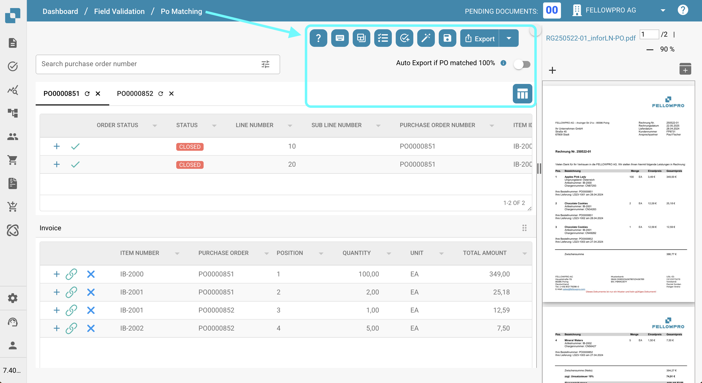<figcaption></figcaption></figure>

## Filter and Add Purchase Order Numbers

You can search for specific purchase order numbers by entering the number into the search field.\nFor more refined filtering, click the icon on the right side of the search bar to select specific criteria for your search.

<figure>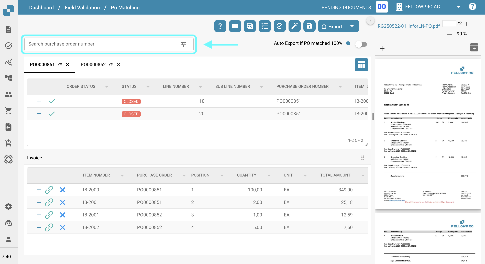<figcaption></figcaption></figure>

The following filter options are available to help you refine your search for purchase orders:

* **Keyword** – Filter by purchase order numbers.
* **Supplier** – Filter by supplier name or ID.
* **After Date** – Show purchase orders created after a specific date.
* **Before Date** – Show purchase orders created before a specific date.
* **Minimum Order Amount** – Filter by minimum order value.
* **Maximum Order Amount** – Filter by maximum order value.
* **Sort By** – Select the attribute to sort the results (e.g., date, amount).
* **Sort Direction** – Choose the sort order: ascending or descending.
* **Number of Records to Display** – Define how many results should be shown per page.
* **More** – Additional filtering options include:
  * **Delivery Number**
  * **Packing Slip Number**
  * **Item ID**

After configuring your filters, click **Apply** to apply them or **Clear** to reset all filter settings.

The matching purchase orders will be displayed based on the applied filters.\nYou can either:

* Adjust the filters and search again, or
* Double-click on a purchase order entry to add it to the Purchase Order Matching screen.

<figure><figcaption></figcaption></figure>

## Select Purchase Order Numbers and Rearrange Columns

You can switch between individual purchase orders to view their respective line items by clicking on the purchase order number at the top of the table.

You can also rearrange the columns within each purchase order view by simply dragging and dropping them into your preferred order.

<figure>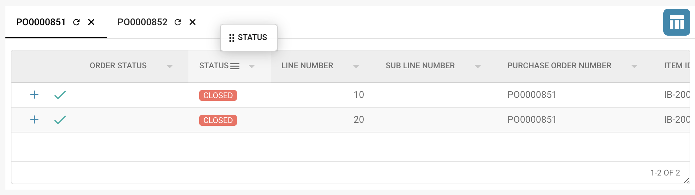<figcaption></figcaption></figure>

To permanently hide specific columns, use the [**Set PO Table Columns for Organizations**](./#set-po-table-columns-for-organizations) feature.

## Set PO Table Columns for Organizations

You have the option to hide or show specific columns in the purchase order table by clicking the column settings icon (shown below).\nThis setting is available in both the **Purchase Order Matching** screen and the **Advanced Purchase Order Search** menu.

<figure><figcaption></figcaption></figure>

Additional details can be found [here](purchase-order-matching-tools.md#set-po-table-columns-for-organization).

## Re-Sync purchase order number with Infor

To resynchronize the data in **DocBits** with the data from **Infor**, click the **refresh button** next to the purchase order number above the table.

<figure><figcaption></figcaption></figure>

If your matching process is based on the **Received Delivery Open Quantity** attribute, you also have the option to perform a **manual synchronization**, as described in detail [here](purchase-order-matching-tools.md#sync-data).

<figure><figcaption></figcaption></figure>

## How to match?

To match a purchase order line item with a line item extracted from the document, you have three options:

1. **Drag and Drop**\n   Drag the desired purchase order line item and drop it onto the corresponding line item in the extracted table.
2. **Right-Click and Connect**
   * Right-click the purchase order line item you want to match and select **Select for match**.
   * Then, right-click the corresponding line item in the extracted table and select **Connect**.
3.  **Auto Match**

    Click the **Auto Match** button to let the system automatically attempt to match all line items based on the extracted and purchase order data.

    <figure><figcaption></figcaption></figure>

You can also select **multiple purchase order lines** and match them to a **single line** in the extracted table. For more details, click [here](./#multi-matches).

## Which columns are being matched?

The Purchase Order Matching process matches only specific columns. The list below outlines which columns are matched, if available. If no [tolerance](./#accept-tolerances) is set, the columns will only match if they are an exact (100%) match.

* [Quantity](./#quantity) (Quantity | Received Quantity | Received Delivery Open Quantity)
* Unit Price
* Purchase Order Number
* Item Number/Supplier Item ID
* Promised Delivery Date

### Quantity

You have three options for matching the quantity. 

* Quantity 
* Received Quantity
* Received Delivery Open Quantity 

You can set this option in **Settings → Global Settings → Document Types → More Settings → Purchase Order Section → Purchase Order**

The selected quantity option determines which **Purchase Order quantity column** is used for comparison during the matching process.

## **Consumed PO Line Status**

This feature adds color coding to PO lines, making it easier to identify their matching status at a glance.\nMore information is available on the [**Consumed PO Line Status**](../../../administration-and-setup/settings/global-settings/document-types/more-settings/purchase-order/consumed-po-line-status.md) settings page.

<figure><figcaption></figcaption></figure>

## **PO Shipment Order Section**

This section provides a visual overview of how much has been delivered and invoiced for each PO item.\nIt helps track invoicing progress using quantity values and a progress bar.

<div align="left"><figure>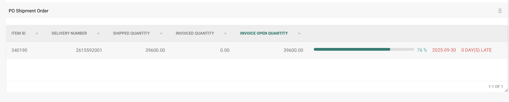<figcaption></figcaption></figure></div>

More details can be found on the [**PO Shipment Order Setting**](../../../administration-and-setup/settings/document-processing/module/po-shipment-order-setting.md) page.


## Accept Tolerances

You can specify acceptable tolerance levels during the matching process.\nBy default, only exact (100%) matches are considered valid.

If tolerances are configured in the system settings, you can adjust them for the allowed attributes directly in the **Extracted Table** under the **Actions** column.

<figure>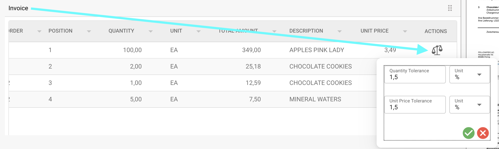<figcaption></figcaption></figure>

For more information on configuring and using tolerances, see the [detailed documentation](../../../administration-and-setup/settings/global-settings/document-types/more-settings/purchase-order/purchase-order-tolerance-settings-additional-purchase-order-tolerance.md).

## Discounts

If discounts are present in your extracted table, they will be automatically applied to the **unit price** before matching—except when using [multi matches](./#multi-matches). More information on discounts can be found [here](./#discounts).

## Disable statuses

You can exclude specific lines with certain statuses from being matched. For more information, refer to the [detailed documentation](../../../administration-and-setup/settings/global-settings/document-types/more-settings/purchase-order/purchase-order-disable-statuses.md).

## Verify matched lines

Several indicators are available to help you verify whether a line item has been successfully matched or not.

### Purchase Order Table

<figure>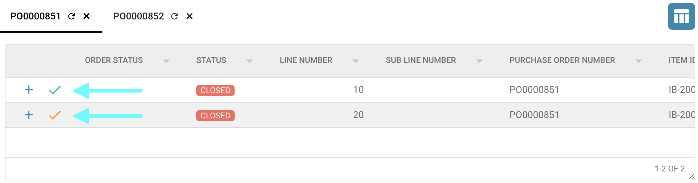<figcaption></figcaption></figure>

* This icon indicates that the purchase order line item has been successfully matched.

<figure><figcaption></figcaption></figure>

* This icon indicates that the purchase order line item contains a mismatch.

<figure><figcaption></figcaption></figure>

### Extracted Table from the Document

*   This icon indicates that the line item has been successfully matched. You can hover over the icon to highlight the corresponding purchase order line.

    <figure>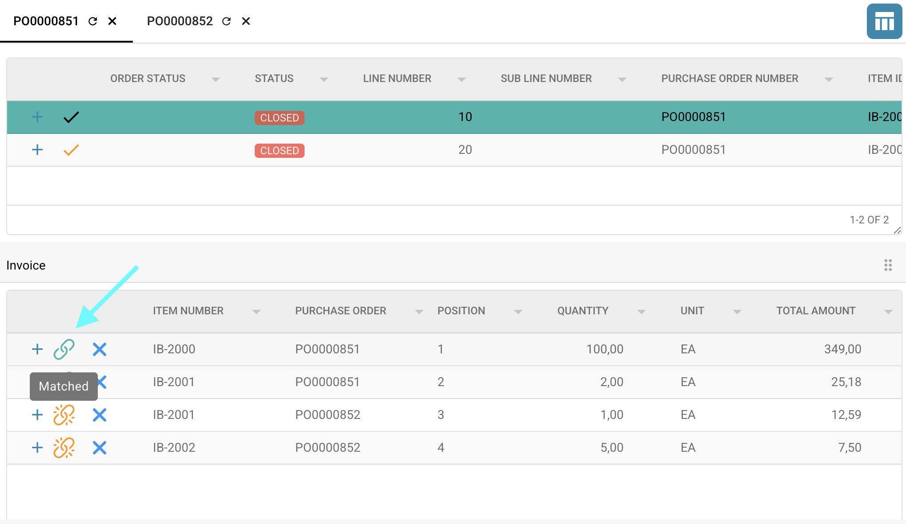<figcaption></figcaption></figure>
*   This icon indicates that the line item contains a mismatch. You can hover over the icon to highlight the corresponding purchase order line and view the columns where mismatches occur.

    <figure><figcaption></figcaption></figure>

## Multi Matches

Multi-matching allows multiple lines from one table to be matched against a single line in the corresponding (opposite) table.

<figure>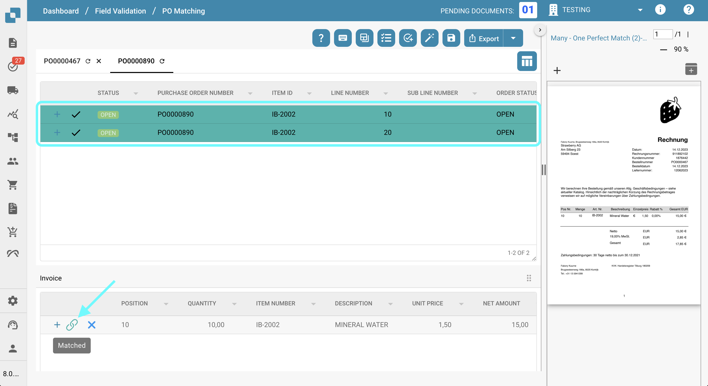<figcaption></figcaption></figure>

This feature is particularly useful for scenarios where details are split across several line items.

### Matching Criteria

Lines will be considered a match if the following aggregated conditions are met:

* **Unit Price**:\n  The average unit price of the multiple lines is calculated and compared against the unit price in the opposite table.
* **Quantity**:\n  The sum of the quantities across the matched lines must match the quantity in the opposite table.
* **Additional Requirements**:\n  Any additional [matching criteria](./#which-columns-are-being-matched) must also be satisfied.

If a single line item is matched to multiple lines, you can view detailed information by clicking the plus (+) icon next to the respective line item.

This expands the view to show all matched entries, helping you verify and manage multiple matches effectively.

<figure><figcaption></figcaption></figure>

<figure>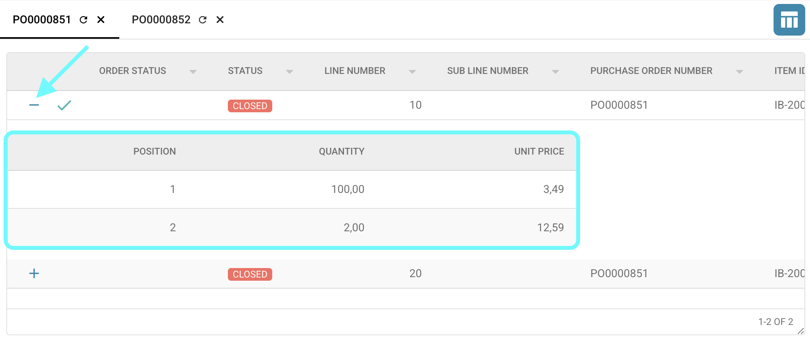<figcaption></figcaption></figure>


## Remove PO Connections

To remove a connection between a purchase order line item and an extracted line item, simply click the **X** icon next to the matched pair.\nOnce removed, the connection is canceled, and the line item becomes available for matching again.

<figure><figcaption></figcaption></figure>

## Calculation

Below the table containing the information extracted from your document, you can find simple calculations to verify whether the total bookings match.

<figure><figcaption></figcaption></figure>

### Recorded bookings:

The recorded bookings value is derived from the net amount extracted from the document.

```
Recorded bookings = Total net amount (extracted from the document)
```

### Matched total:

This value is calculated by summing the **Unit Price** × **Quantity** for all line items that successfully matched with the line items from the purchase order number.

```
 Matched Total = Sum of (Unit Price × Quantity) for all matched line items
```

### **Charges:**

Any applicable charges will be included in this section if present.\nFor more details, refer to the [detailed documentation](../../../administration-and-setup/settings/document-processing/classification-and-extraction/table-extraction-for-costing-element.md).

```
Charges = Costing element
```

### Unsettled amount:

The resulting difference is displayed here and is calculated as follows:

```
Unsettled amount = Recorded bookings - Matched total - Costing element
```

## Viewing the Document for Validation

On the right side of the **Purchase Order Matching** screen, you can view the document to assist with validation.

<figure>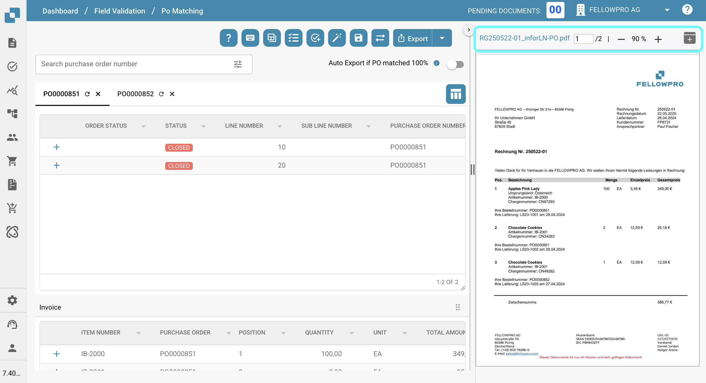<figcaption></figcaption></figure>

**Document Viewer Toolbar Features:**

* Scroll through the document pages to review content.
* Click the file name to open the full validation screen.
* Enter a page number and press Enter to jump directly to that page.
* Use the plus (+) and minus (–) buttons to zoom in or out of the document.
*   Click the button on the far right to open the document in a separate window, which is especially useful when working with multiple screens.

    <figure><figcaption></figcaption></figure>

## Saving Changes:

To save your changes, click the **Save** button in the toolbar.\nIf you leave the page without saving, all progress made during the matching process will be lost.

<figure>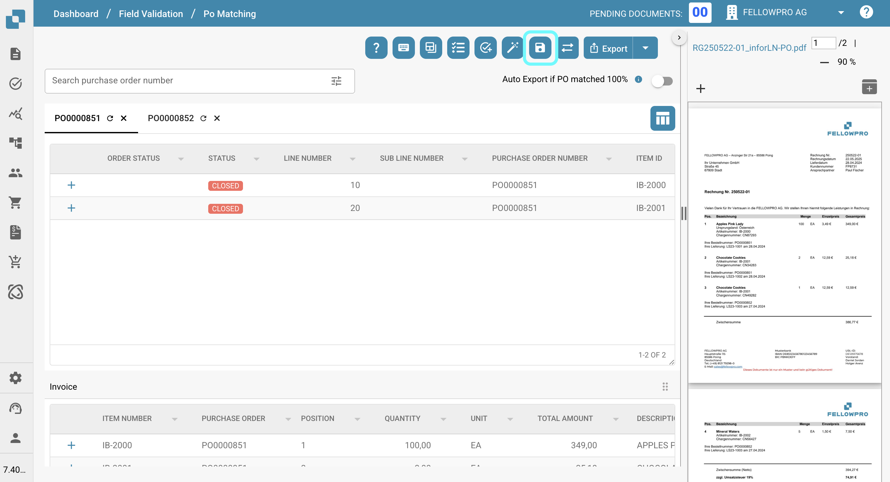<figcaption></figcaption></figure>

## Exporting the Document

After matching all line items and validating their correctness, you can export the document by clicking the **Export** button in the toolbar.

* Clicking the small arrow next to the **Export** button reveals all available export options.
* Clicking **Export** directly will trigger the default export option (the first one in the list).

<figure>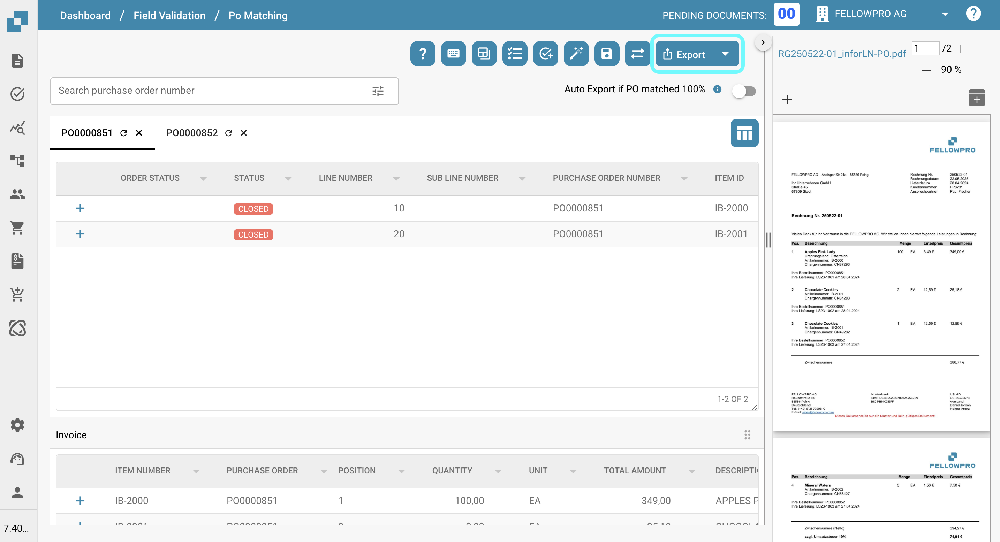<figcaption></figcaption></figure>