# Bildschirm „Bestellabgleich“

## Überblick

Im Bildschirm **Bestellabgleich (Purchase Order Matching)** können Sie die aus Ihrem Dokument extrahierten Positionen mit den im **Infor-System** hinterlegten Positionen vergleichen, wobei die Bestellnummer als Referenz dient.

Sie können:

* etwaige Unterschiede zwischen extrahierten und hinterlegten Daten **sofort erkennen**
* **Toleranzen festlegen**, um akzeptable Abweichungen zuzulassen
* bei Bedarf **bestimmte Status aus Infor ignorieren**
* das Dokument nach einem erfolgreichen Abgleich **freigeben und exportieren**
* das Dokument **ablehnen**, wenn die Daten die erforderlichen Validierungskriterien nicht erfüllen

Diese Seite führt Sie durch den Bestellabgleichsprozess und erläutert alle damit verbundenen Funktionen, die in diesem Bereich verfügbar sind.

## Werkzeuge im Bildschirm „Bestellabgleich“

Am oberen Rand des Bildschirms „Bestellabgleich“ finden Sie mehrere Werkzeuge – wie **Save**, **Auto-Match**, **Export** und weitere –, die Sie beim Abgleichsprozess unterstützen.\nEine ausführliche Beschreibung jedes Werkzeugs und seiner Funktionalität finden Sie [hier](purchase-order-matching-tools.md).

<figure>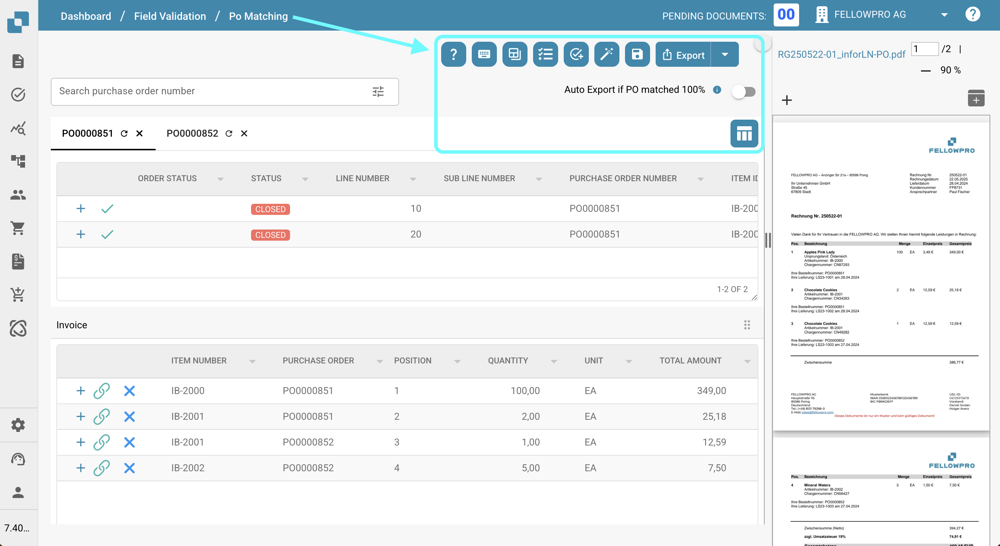<figcaption></figcaption></figure>

## Bestellnummern filtern und hinzufügen

Sie können nach bestimmten Bestellnummern suchen, indem Sie die Nummer in das Suchfeld eingeben.\nFür eine genauere Filterung klicken Sie auf das Symbol auf der rechten Seite der Suchleiste, um bestimmte Kriterien für Ihre Suche auszuwählen.

<figure>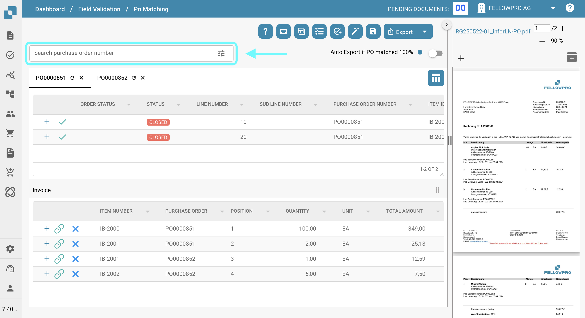<figcaption></figcaption></figure>

Die folgenden Filteroptionen stehen Ihnen zur Verfügung, um Ihre Suche nach Bestellungen zu verfeinern:

* **Keyword** – Filtern nach Bestellnummern.
* **Supplier** – Filtern nach Lieferantenname oder -ID.
* **After Date** – Bestellungen anzeigen, die nach einem bestimmten Datum erstellt wurden.
* **Before Date** – Bestellungen anzeigen, die vor einem bestimmten Datum erstellt wurden.
* **Minimum Order Amount** – Filtern nach Mindestbestellwert.
* **Maximum Order Amount** – Filtern nach maximalem Bestellwert.
* **Sort By** – Auswählen des Attributs, nach dem die Ergebnisse sortiert werden (z. B. Datum, Betrag).
* **Sort Direction** – Auswählen der Sortierreihenfolge: aufsteigend oder absteigend.
* **Number of Records to Display** – Festlegen, wie viele Ergebnisse pro Seite angezeigt werden sollen.
* **More** – Zu den zusätzlichen Filteroptionen gehören:
  * **Delivery Number**
  * **Packing Slip Number**
  * **Item ID**

Nachdem Sie Ihre Filter konfiguriert haben, klicken Sie auf **Apply**, um sie anzuwenden, oder auf **Clear**, um alle Filtereinstellungen zurückzusetzen.

Die passenden Bestellungen werden auf Grundlage der angewendeten Filter angezeigt.\nSie können entweder:

* die Filter anpassen und erneut suchen oder
* auf einen Bestelleintrag doppelklicken, um ihn dem Bildschirm „Bestellabgleich“ hinzuzufügen.

<figure><figcaption></figcaption></figure>

## Bestellnummern auswählen und Spalten neu anordnen

Sie können zwischen einzelnen Bestellungen wechseln, um deren jeweilige Positionen anzuzeigen, indem Sie oben in der Tabelle auf die Bestellnummer klicken.

Außerdem können Sie die Spalten innerhalb jeder Bestellansicht neu anordnen, indem Sie sie einfach per Drag & Drop in die von Ihnen bevorzugte Reihenfolge ziehen.

<figure>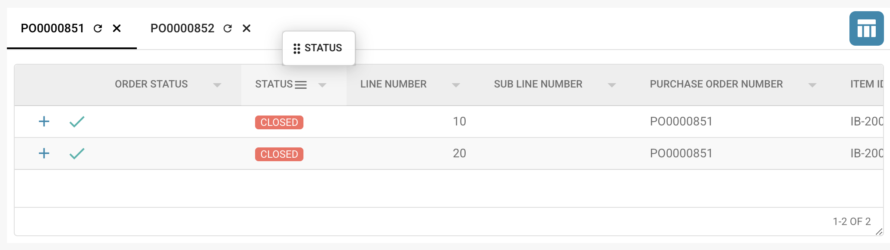<figcaption></figcaption></figure>

Um bestimmte Spalten dauerhaft auszublenden, verwenden Sie die Funktion [**PO-Tabellenspalten für Organisationen festlegen**](./#set-po-table-columns-for-organizations).

## PO-Tabellenspalten für Organisationen festlegen

Sie haben die Möglichkeit, bestimmte Spalten in der Bestelltabelle ein- oder auszublenden, indem Sie auf das Symbol für die Spalteneinstellungen klicken (siehe unten).\nDiese Einstellung ist sowohl im Bildschirm **Bestellabgleich** als auch im Menü **Erweiterte Bestellsuche (Advanced Purchase Order Search)** verfügbar.

<figure><figcaption></figcaption></figure>

Weitere Einzelheiten finden Sie [hier](purchase-order-matching-tools.md#set-po-table-columns-for-organization).

## Bestellnummer mit Infor neu synchronisieren

Um die Daten in **DocBits** mit den Daten aus **Infor** neu zu synchronisieren, klicken Sie auf die **Aktualisierungsschaltfläche** neben der Bestellnummer über der Tabelle.

<figure><figcaption></figcaption></figure>

Wenn Ihr Abgleichsprozess auf dem Attribut **Received Delivery Open Quantity** basiert, haben Sie außerdem die Möglichkeit, eine **manuelle Synchronisierung** durchzuführen, wie [hier](purchase-order-matching-tools.md#sync-data) ausführlich beschrieben.

<figure><figcaption></figcaption></figure>

## Wie wird abgeglichen?

Um eine Bestellposition mit einer aus dem Dokument extrahierten Position abzugleichen, haben Sie drei Möglichkeiten:

1. **Drag & Drop**\n Ziehen Sie die gewünschte Bestellposition und legen Sie sie auf der entsprechenden Position in der extrahierten Tabelle ab.
2. **Rechtsklick und Verbinden**
   * Klicken Sie mit der rechten Maustaste auf die Bestellposition, die Sie abgleichen möchten, und wählen Sie **Select for match**.
   * Klicken Sie anschließend mit der rechten Maustaste auf die entsprechende Position in der extrahierten Tabelle und wählen Sie **Connect**.
3.  **Auto Match**

    Klicken Sie auf die Schaltfläche **Auto Match**, damit das System automatisch versucht, alle Positionen auf Grundlage der extrahierten Daten und der Bestelldaten abzugleichen.

    <figure><figcaption></figcaption></figure>

Sie können auch **mehrere Bestellpositionen** auswählen und sie einer **einzelnen Position** in der extrahierten Tabelle zuordnen. Weitere Einzelheiten finden Sie [hier](./#multi-matches).

## Warum gibt es keine Übereinstimmung?

Wenn ein Dokument nicht zugeordnet wird, zeigt der Bildschirm **einen Satz über dem Bestellbereich** an, der den Grund nennt und was zu tun ist:

| Nachricht                                                      | Bedeutung und nächster Schritt                                                                                                                                               |
| -------------------------------------------------------------- | ---------------------------------------------------------------------------------------------------------------------------------------------------------------------------- |
| Keine Bestellnummer                                            | Das Dokument enthält keine Bestellnummer. Geben Sie diese im Kopfbereich ein und speichern Sie — die Zuordnung wird beim Speichern erneut ausgeführt.                         |
| Keine Bestellung im ERP für … gefunden                         | Die Nummer auf dem Dokument existiert nicht im ERP. Überprüfen Sie die Nummer und speichern Sie.                                                                              |
| … wurde noch nicht abgefragt                                   | Die Nummer ist nach der Verarbeitung eingetroffen (z. B. aus Stammdaten). Speichern Sie das Dokument oder klicken Sie auf **Auto Match**.                                    |
| … ist geladen, aber nicht verbunden                            | Die Bestellpositionen sind auf dem Bildschirm, aber noch nichts ist zugeordnet. Klicken Sie auf **Auto Match** oder verbinden Sie die Positionen manuell.                   |
| … wurde gefunden, aber keine der Bestellpositionen passt      | Jede Position hat die Zuordnungsregeln nicht bestanden. Öffnen Sie die **Matching-Historie**, um zu sehen, in welcher Spalte, und ordnen Sie manuell zu oder korrigieren Sie das Dokument. |
| Das Dokument enthält keine Positionen                          | Nichts zum Zuordnen; überprüfen Sie die Tabellenerkennung.                                                                                                                   |
| Die Positions-Tabelle hat keine Bestellspalten zugeordnet     | Menge, Einzelpreis und Artikelnummer sind für diese Tabelle nicht zugeordnet. Ordnen Sie sie in den Tabelleneinstellungen zu.                                               |
| Die Bestellung hat keine offenen Positionen mehr              | Jede Position der Bestellung ist bereits verbraucht oder deaktiviert (siehe [Status verbrauchter Bestellpositionen](./#consumed-po-line-status) und [Deaktivierungsstatus](./#disable-statuses)). |

Unter dem Satz listet der Bildschirm Kandidaten auf, die **beiseitegelegt** wurden, zum Beispiel _"Ignoriert: 2900233285 aus der Positionsspalte ist die Rechnungsnummer, keine Bestellnummer"_ oder _"… ist durch Konfiguration ausgeschlossen"_. Die Meldung verschwindet, sobald das Dokument zugeordnet ist.


**Die Zuordnung wird beim Speichern erneut ausgeführt.** Wenn sich die Bestellnummer ändert oder sie zuvor nie abgefragt wurde, erfolgt die Zuordnung beim Speichern. Eine bestehende Zuordnung wird durch das Speichern nie überschrieben — und manuell entfernte Positionen bleiben entfernt.


**Wenn eine Zuordnung nicht gespeichert werden kann**, meldet der Bildschirm nicht „gespeichert“: Er stellt die Zuordnung auf dem Bildschirm wieder her, markiert das Dokument als ungespeichert und zeigt an, warum der Server sie verworfen hat — zum Beispiel _"Die PO-Zuordnung konnte nicht gespeichert werden: die Transformationsregel „…“ hat die Tabelle neu aufgebaut"_. Administratoren sehen einen Link zur betreffenden Regel. Bitten Sie einen Administrator, die [Transformationsregel](../../../administration-and-setup/settings/global-settings/document-types/transformation-rules.md) oder die [Zuordnungsregeln](../../../administration-and-setup/settings/global-settings/document-types/more-settings/purchase-order/purchase-order-matching-rules.md) anzupassen.

## Matching-Historie

Die Schaltfläche **Matching-Historie** (Uhr-Symbol in der Bestell-Symbolleiste; erfordert die Analytics-Berechtigung) öffnet eine schreibgeschützte Wiedergabe, wie die letzte Zuordnung entschieden wurde:

* die **Transformationsregeln**, die vor der Zuordnung ausgeführt wurden, und ob eine davon eine Zuordnung verworfen hat,
* die Zuordnungs-**Phasen und Regeln**, die versucht wurden — grün, wo eine Zuordnung gefunden wurde, rot, wo eine Regel nichts fand, grau, wo eine Regel durch ihre Aktivierungsbedingung übersprungen wurde (der Tooltip erklärt warum),
* bei einer fehlgeschlagenen Regel die **verglichene Spalte** mit dem Wert im Dokument und dem Wert in der Bestellung.

Das Öffnen und Abspielen der Historie löst weder eine Zuordnung noch einen Export aus. Administratoren finden dieselbe Wiedergabe mit einer Dokument-ID-Eingabe neben dem Regelwerksdiagramm in den Bestelleinstellungen des Dokumententyps.

## Welche Spalten werden abgeglichen?

Beim Bestellabgleich werden nur bestimmte Spalten abgeglichen. Die folgende Liste zeigt, welche Spalten abgeglichen werden, sofern verfügbar. Wenn keine [Toleranz](./#accept-tolerances) festgelegt ist, werden die Spalten nur dann als Übereinstimmung gewertet, wenn sie exakt (zu 100 %) übereinstimmen.

* [Menge](./#quantity) (Quantity | Received Quantity | Received Delivery Open Quantity)
* Stückpreis
* Bestellnummer
* Artikelnummer/Supplier Item ID
* Zugesagtes Lieferdatum

### Menge

Sie haben drei Möglichkeiten, die Menge abzugleichen.&#x20;

* Quantity&#x20;
* Received Quantity
* Received Delivery Open Quantity&#x20;

Diese Option können Sie unter **Settings → Global Settings → Document Types → More Settings → Purchase Order Section → Purchase Order** festlegen.

Die ausgewählte Mengenoption bestimmt, welche **Bestell-Mengenspalte** während des Abgleichsprozesses für den Vergleich verwendet wird.

## **Status verbrauchter PO-Positionen (Consumed PO Line Status)**

Diese Funktion fügt PO-Positionen eine Farbcodierung hinzu, sodass deren Abgleichsstatus auf einen Blick leichter erkennbar ist.\nWeitere Informationen finden Sie auf der Einstellungsseite [**Consumed PO Line Status**](../../../administration-and-setup/settings/global-settings/document-types/more-settings/purchase-order/consumed-po-line-status.md).

<figure>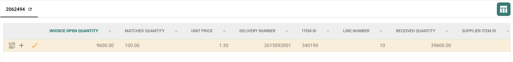<figcaption></figcaption></figure>

## **Abschnitt PO-Versandauftrag (PO Shipment Order)**

Dieser Abschnitt bietet eine visuelle Übersicht darüber, wie viel für jede PO-Position geliefert und in Rechnung gestellt wurde.\nEr hilft, den Rechnungsstellungsfortschritt anhand von Mengenwerten und einem Fortschrittsbalken zu verfolgen.

<div align="left"><figure>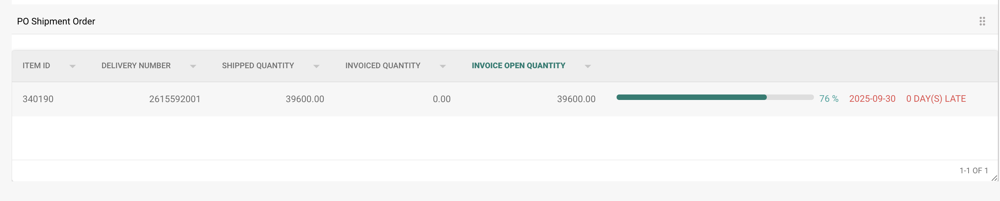<figcaption></figcaption></figure></div>

Weitere Einzelheiten finden Sie auf der Seite [**PO Shipment Order Setting**](../../../administration-and-setup/settings/document-processing/module/po-shipment-order-setting.md).

## Toleranzen akzeptieren

Sie können während des Abgleichsprozesses akzeptable Toleranzstufen festlegen.\nStandardmäßig werden nur exakte Übereinstimmungen (zu 100 %) als gültig betrachtet.

Wenn in den Systemeinstellungen Toleranzen konfiguriert sind, können Sie diese für die zulässigen Attribute direkt in der **Extracted Table** unter der Spalte **Actions** anpassen.

<figure>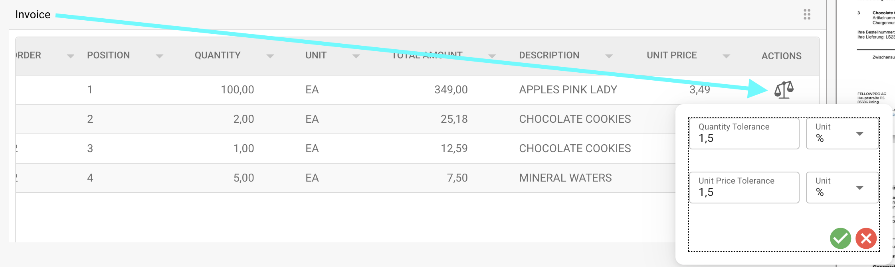<figcaption></figcaption></figure>

Weitere Informationen zum Konfigurieren und Verwenden von Toleranzen finden Sie in der [ausführlichen Dokumentation](../../../administration-and-setup/settings/global-settings/document-types/more-settings/purchase-order/purchase-order-tolerance-settings-additional-purchase-order-tolerance.md).

## Rabatte

Wenn in Ihrer extrahierten Tabelle Rabatte vorhanden sind, werden diese vor dem Abgleich automatisch auf den **Stückpreis** angewendet – außer bei Verwendung von [Multi-Matches](./#multi-matches). Weitere Informationen zu Rabatten finden Sie [hier](./#discounts).

## Status deaktivieren

Sie können bestimmte Positionen mit bestimmten Status vom Abgleich ausschließen. Weitere Informationen finden Sie in der [ausführlichen Dokumentation](../../../administration-and-setup/settings/global-settings/document-types/more-settings/purchase-order/purchase-order-disable-statuses.md).

## Abgeglichene Positionen überprüfen

Es stehen mehrere Indikatoren zur Verfügung, die Ihnen helfen zu überprüfen, ob eine Position erfolgreich abgeglichen wurde oder nicht.

### Bestelltabelle

<figure>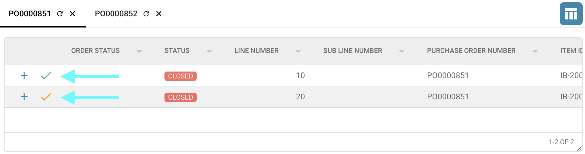<figcaption></figcaption></figure>

* Dieses Symbol zeigt an, dass die Bestellposition erfolgreich abgeglichen wurde.

<figure><figcaption></figcaption></figure>

* Dieses Symbol zeigt an, dass die Bestellposition eine Abweichung enthält.

<figure><figcaption></figcaption></figure>

### Aus dem Dokument extrahierte Tabelle

*   Dieses Symbol zeigt an, dass die Position erfolgreich abgeglichen wurde. Sie können mit dem Mauszeiger über das Symbol fahren, um die entsprechende Bestellposition hervorzuheben.

    <figure>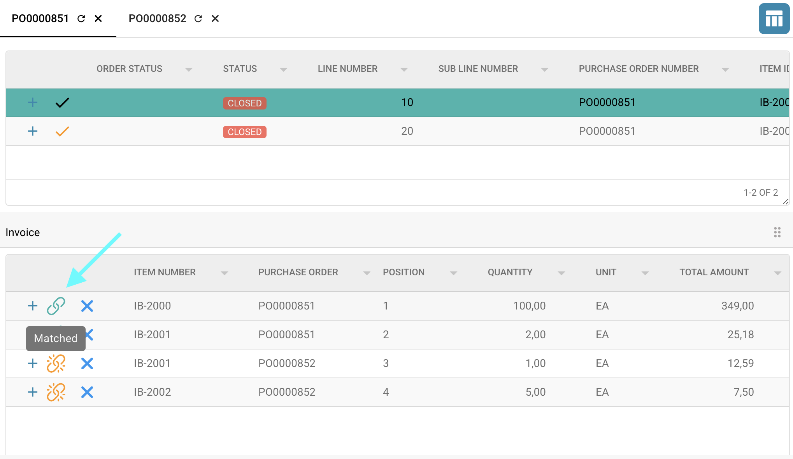<figcaption></figcaption></figure>
*   Dieses Symbol zeigt an, dass die Position eine Abweichung enthält. Sie können mit dem Mauszeiger über das Symbol fahren, um die entsprechende Bestellposition hervorzuheben und die Spalten anzuzeigen, in denen Abweichungen auftreten.

    <figure>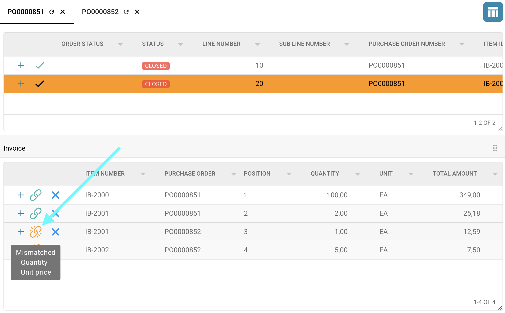<figcaption></figcaption></figure>

## Multi-Matches

Multi-Matching ermöglicht es, mehrere Positionen einer Tabelle mit einer einzelnen Position in der entsprechenden (gegenüberliegenden) Tabelle abzugleichen.

<figure>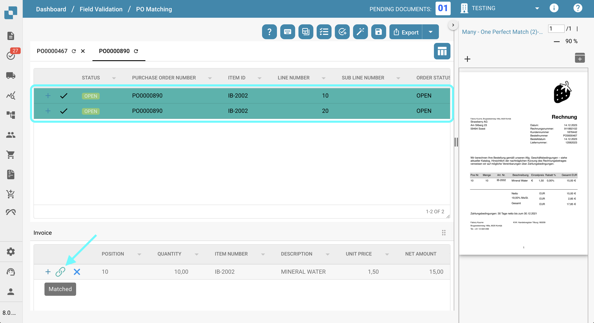<figcaption></figcaption></figure>

Diese Funktion ist besonders nützlich für Szenarien, in denen Details auf mehrere Positionen verteilt sind.

### Abgleichskriterien

Positionen gelten als übereinstimmend, wenn die folgenden aggregierten Bedingungen erfüllt sind:

* **Stückpreis**:\n Der durchschnittliche Stückpreis der mehreren Positionen wird berechnet und mit dem Stückpreis in der gegenüberliegenden Tabelle verglichen.
* **Menge**:\n Die Summe der Mengen über die abgeglichenen Positionen hinweg muss mit der Menge in der gegenüberliegenden Tabelle übereinstimmen.
* **Zusätzliche Anforderungen**:\n Alle weiteren [Abgleichskriterien](./#which-columns-are-being-matched) müssen ebenfalls erfüllt sein.

Wenn eine einzelne Position mehreren Positionen zugeordnet ist, können Sie detaillierte Informationen anzeigen, indem Sie auf das Plus-Symbol (+) neben der jeweiligen Position klicken.

Dadurch wird die Ansicht erweitert, um alle abgeglichenen Einträge anzuzeigen, was Ihnen hilft, mehrere Übereinstimmungen effektiv zu überprüfen und zu verwalten.

<figure><figcaption></figcaption></figure>

<figure>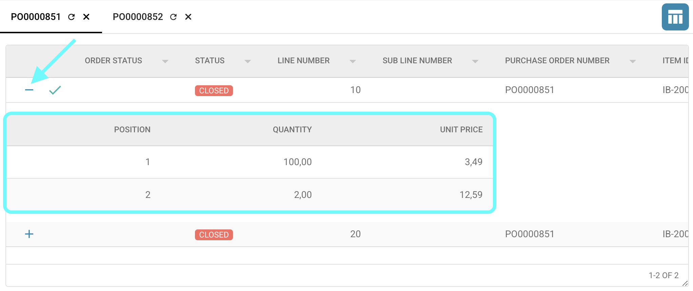<figcaption></figcaption></figure>

## PO-Verbindungen entfernen

Um eine Verbindung zwischen einer Bestellposition und einer extrahierten Position zu entfernen, klicken Sie einfach auf das **X**-Symbol neben dem abgeglichenen Paar.\nNach dem Entfernen wird die Verbindung aufgehoben, und die Position steht erneut für den Abgleich zur Verfügung.

<figure><figcaption></figcaption></figure>

## Berechnung

Unterhalb der Tabelle mit den aus Ihrem Dokument extrahierten Informationen finden Sie einfache Berechnungen, mit denen Sie überprüfen können, ob die Summen der Buchungen übereinstimmen.

<figure>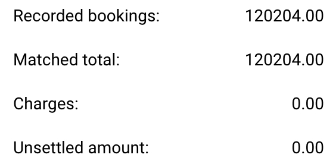<figcaption></figcaption></figure>

### Erfasste Buchungen:

Der Wert der erfassten Buchungen wird aus dem aus dem Dokument extrahierten Nettobetrag abgeleitet.

```
Recorded bookings = Total net amount (extracted from the document)
```

### Abgeglichene Summe:

Dieser Wert wird berechnet, indem **Stückpreis** × **Menge** für alle Positionen summiert wird, die erfolgreich mit den Positionen der Bestellnummer abgeglichen wurden.

```
 Matched Total = Sum of (Unit Price × Quantity) for all matched line items
```

### **Gebühren:**

Etwaige anfallende Gebühren werden in diesem Abschnitt berücksichtigt, sofern vorhanden.\nWeitere Einzelheiten finden Sie in der [ausführlichen Dokumentation](../../../administration-and-setup/settings/document-processing/classification-and-extraction/table-extraction-for-costing-element.md).

```
Charges = Costing element
```

### Offener Betrag:

Die resultierende Differenz wird hier angezeigt und wie folgt berechnet:

```
Unsettled amount = Recorded bookings - Matched total - Costing element
```

## Anzeige des Dokuments zur Validierung

Auf der rechten Seite des Bildschirms **Bestellabgleich** können Sie das Dokument anzeigen, um die Validierung zu unterstützen.

<figure>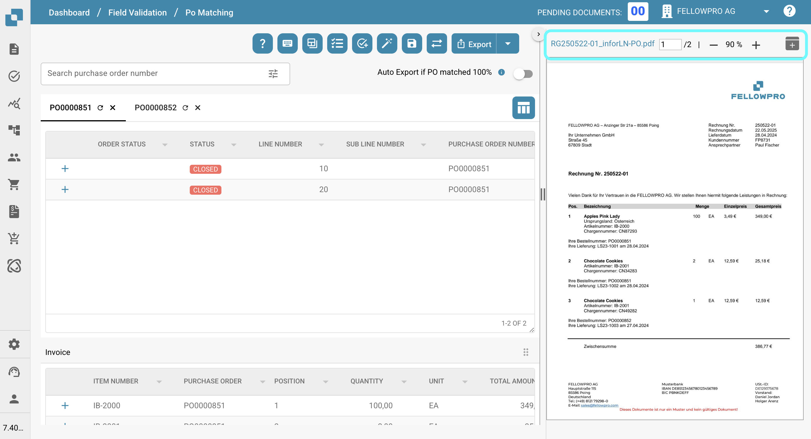<figcaption></figcaption></figure>

**Funktionen der Symbolleiste des Dokumentenbetrachters:**

* Blättern Sie durch die Dokumentseiten, um den Inhalt zu prüfen.
* Klicken Sie auf den Dateinamen, um den vollständigen Validierungsbildschirm zu öffnen.
* Geben Sie eine Seitenzahl ein und drücken Sie die Eingabetaste, um direkt zu dieser Seite zu springen.
* Verwenden Sie die Plus- (+) und Minus-Schaltflächen (–), um in das Dokument hinein- oder herauszuzoomen.
*   Klicken Sie auf die Schaltfläche ganz rechts, um das Dokument in einem separaten Fenster zu öffnen, was besonders nützlich ist, wenn Sie mit mehreren Bildschirmen arbeiten.

    <figure><figcaption></figcaption></figure>

## Änderungen speichern:

Um Ihre Änderungen zu speichern, klicken Sie in der Symbolleiste auf die Schaltfläche **Save**.\nWenn Sie die Seite verlassen, ohne zu speichern, gehen alle während des Abgleichsprozesses erzielten Fortschritte verloren.

<figure>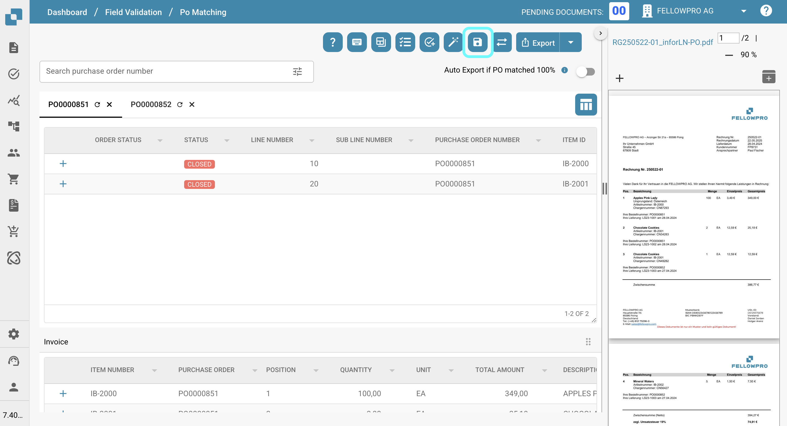<figcaption></figcaption></figure>

## Exportieren des Dokuments

Nachdem Sie alle Positionen abgeglichen und deren Richtigkeit validiert haben, können Sie das Dokument exportieren, indem Sie in der Symbolleiste auf die Schaltfläche **Export** klicken.

* Wenn Sie auf den kleinen Pfeil neben der Schaltfläche **Export** klicken, werden alle verfügbaren Exportoptionen angezeigt.
* Wenn Sie direkt auf **Export** klicken, wird die Standard-Exportoption ausgelöst (die erste in der Liste).

<figure>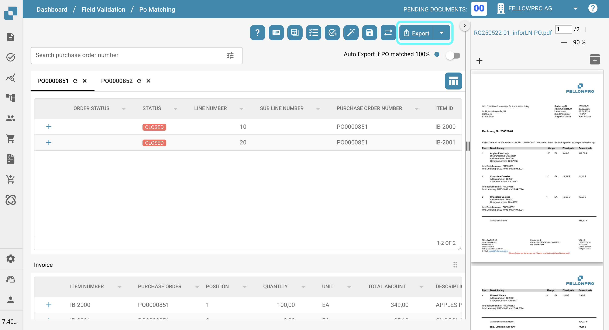<figcaption></figcaption></figure>
