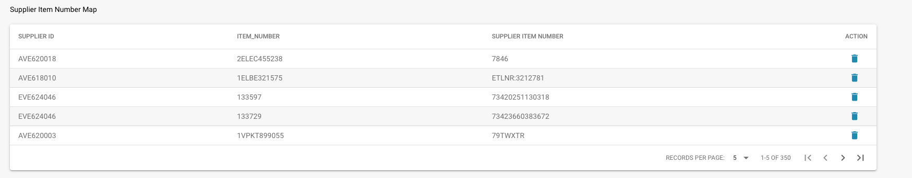

# Correspondance des numéros d'article du fournisseur

## **Vue d'ensemble**

Cette fonctionnalité vous aide à gérer et à réconcilier les numéros d'article entre votre système et vos fournisseurs. Souvent, les numéros d'article que vous utilisez en interne peuvent ne pas correspondre aux numéros d'article utilisés par vos fournisseurs. Docbits facilite la gestion de ces divergences en créant une correspondance entre vos numéros d'article et ceux de vos fournisseurs.

<figure><figcaption></figcaption></figure>

## **Comment ça fonctionne**

1. **Correspondance manuelle :**
   * La première fois que vous rencontrez une divergence entre votre numéro d'article et celui de votre fournisseur, vous devez les faire correspondre manuellement.
   * Vous pouvez le faire en entrant le numéro d'article fournisseur correct correspondant à votre numéro d'article interne.
2. **Correspondance automatique :**
   * Une fois que vous avez fait correspondre manuellement un numéro d'article avec celui de votre fournisseur, Docbits se souvient de cette correspondance.
   * La prochaine fois que le même article apparaît, Docbits le fera correspondre automatiquement en fonction de la correspondance enregistrée, vous faisant gagner du temps et réduisant les erreurs.

## **Décomposition de l'interface**

* **ID du fournisseur :** L'identifiant unique du fournisseur.
* **Numéro d'article :** Votre numéro d'article interne pour le produit.
* **Numéro d'article du fournisseur :** Le numéro d'article correspondant utilisé par le fournisseur.
* **Action :** Options pour gérer les correspondances, telles que la suppression des correspondances incorrectes.


Voir ici la [Section Admin](broken-reference) également


## **Avantages**

* **Efficacité :** Réduit le besoin de saisie manuelle répétée, rendant le processus plus rapide.
* **Précision :** Minimise les erreurs en s'assurant que les numéros d'article sont correctement appariés.
* **Commodité :** Simplifie le flux de travail en automatisant le processus de correspondance après la saisie manuelle initiale.
