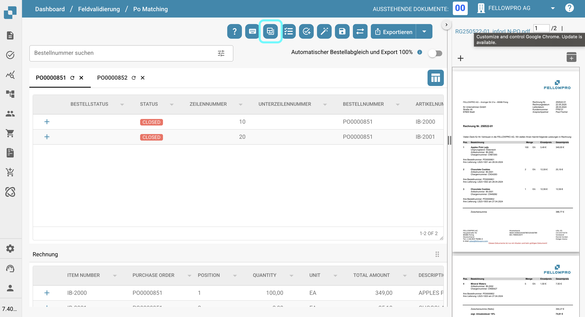
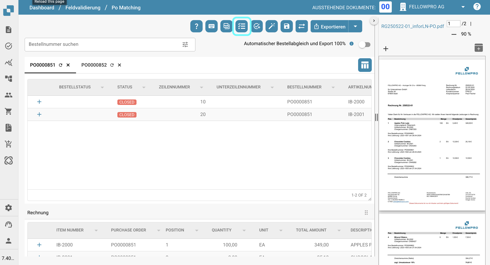
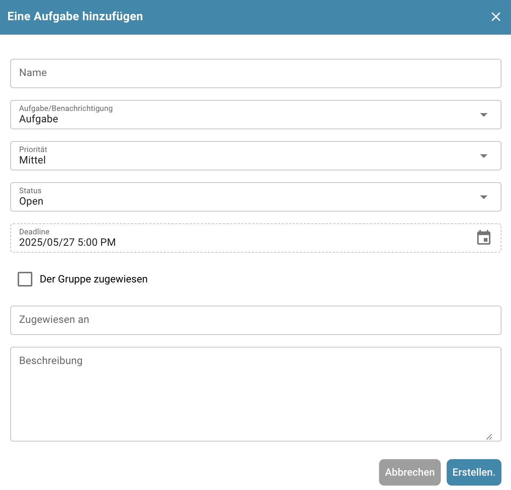
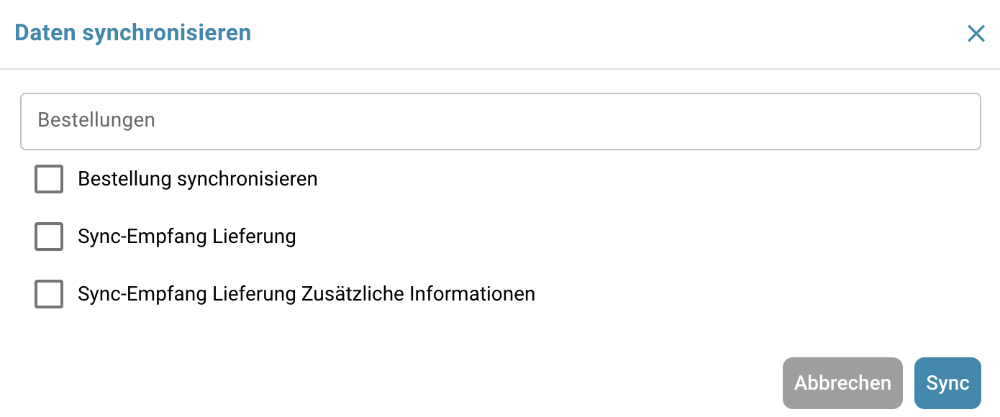
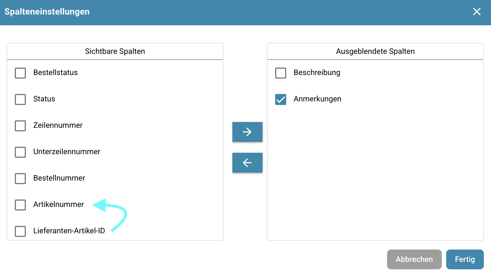

# Bestellnummer-Abgleich-Tools

## Übersicht

Rechts von der Suchleiste finden Sie mehrere nützliche Werkzeuge, die mit dem Bestellnummer-Abgleichprozess zusammenhängen.\
Diese Seite bietet eine detaillierte Erklärung jedes Werkzeugs und seiner Funktionalität.

<figure><figcaption></figcaption></figure>

## Hilfe

Verwenden Sie diesen Button, um zur Dokumentationsseite für den Bestellnummer-Abgleichbereich zu navigieren.

<figure><figcaption></figcaption></figure>

## Tastaturkurzbefehle

Verwenden Sie diesen Button, um alle Tastaturkurzbefehle für das Dashboard anzuzeigen. Detaillierte Erklärungen zu jedem Kurzbefehlen finden Sie [hier](keyboard-shortcuts.md).

<figure><figcaption></figcaption></figure>

## Trainingsmodus ein-/ausschalten

Dieser Button ermöglicht es Ihnen, den Trainingsmodus zu aktivieren oder zu deaktivieren.

<figure><figcaption></figcaption></figure>

Wenn **Trainingsmodus** aktiviert ist, können Sie exakte Kopien von Bestellnummer-Positionen in der extrahierten Tabelle erstellen.\
Diese Funktion ist dazu gedacht, Ihnen zu helfen, zu üben und besser zu verstehen, wie der Bestellnummer-Abgleichprozess in einer sicheren Testumgebung funktioniert.

Um eine Kopie zu erstellen, ziehen Sie einfach eine Bestellnummer-Position in die extrahierte Tabelle.

## Auto Accounting

Klicken Sie auf diesen Button, um zum Abschnitt Auto Accounting weitergeleitet zu werden.

<figure><figcaption></figcaption></figure>

<mark style="color:red;">**Hinweis**</mark>: Diese Funktion ist nur verfügbar, wenn **Auto Accounting** für Ihre Organisation aktiviert ist.

## Aufgaben

Klicken Sie auf diesen Button, um zum Aufgabenbereich zu gelangen, der mit dem Dokument zusammenhängt, an dem Sie gerade arbeiten.

<figure><figcaption></figcaption></figure>

## Aufgabe erstellen

Verwenden Sie diesen Button, um Aufgaben zu erstellen, die direkt mit dem aktuellen Dokument verbunden sind.

<figure><figcaption></figcaption></figure>

Um eine gültige Aufgabe zu erstellen, müssen Sie einen Namen eingeben, eine Beschreibung bereitstellen und sie einem Benutzer oder einer Gruppe zuweisen. Optional können Sie die Aufgabe als nur Benachrichtigung markieren, ihre Priorität (Niedrig, Mittel oder Hoch) festlegen, ihren Status definieren und eine Frist angeben.

<figure><figcaption></figcaption></figure>

## Automatischer PO-Abgleich

Klicken Sie auf diesen Button, um den Bestellnummer-Abgleich automatisch durchzuführen.

<figure><figcaption></figcaption></figure>

## Speichern

Klicken Sie auf diesen Button, um die abgeglichenen Bestellnummer-Positionen zu speichern.

<figure><figcaption></figcaption></figure>

## Daten synchronisieren

Klicken Sie auf diesen Button, um die Daten für eine bestimmte Bestellnummer manuell zwischen DocBits und Infor zu synchronisieren.

<figure><figcaption></figcaption></figure>

Sie müssen eine gültige Bestellnummer angeben und dann auswählen, welche der verfügbaren Optionen Sie synchronisieren möchten. Danach können Sie mit der Synchronisierung Ihrer Daten fortfahren.

<figure><figcaption></figcaption></figure>

<mark style="color:red;">**Hinweis**</mark>: Diese Funktion ist nur verfügbar, wenn Ihr Abgleichprozess auf **Empfangene Lieferung Offene Menge** basiert.\
Sie können diese Einstellung ändern, indem Sie zu:\
**Einstellungen → Globale Einstellungen → Dokumenttypen → Weitere Einstellungen → Bestellnummer-Bereich → Bestellnummer** navigieren.

## Exportieren

Klicken Sie auf **Exportieren**, um das Dokument nach Abschluss des PO-Abgleichprozesses zu exportieren.\
Wenn mehrere Exportoptionen verfügbar sind, wird standardmäßig die erste Option verwendet.\
Um alle verfügbaren Exportoptionen anzuzeigen und auszuwählen, klicken Sie auf den kleinen Pfeil neben dem Exportieren-Button.

<figure><figcaption></figcaption></figure>

## Automatischer Export, wenn PO zu 100% übereinstimmt

Wenn aktiviert, werden Dokumente automatisch abgeglichen und exportiert, wenn die Bestellnummer genau mit den aus dem Dokument extrahierten Informationen übereinstimmt.

<figure><figcaption></figcaption></figure>

## Spalten der PO-Tabelle für die Organisation festlegen

<figure><figcaption></figcaption></figure>

Klicken Sie auf diesen Button, um ein Menü zu öffnen, in dem Sie die Sichtbarkeit der Spalten in der Bestellnummer-Tabelle verwalten können.\
Verwenden Sie die Kontrollkästchen und Pfeiltasten, um Spalten zwischen den Abschnitten **Sichtbar** und **Ausgeblendet** zu verschieben.\
Sie können auch die Reihenfolge der Spalten ändern, indem Sie die Spaltennamen ziehen und ablegen.\
Klicken Sie auf **Fertig**, um Ihre Änderungen zu speichern.

<figure><figcaption></figcaption></figure>

