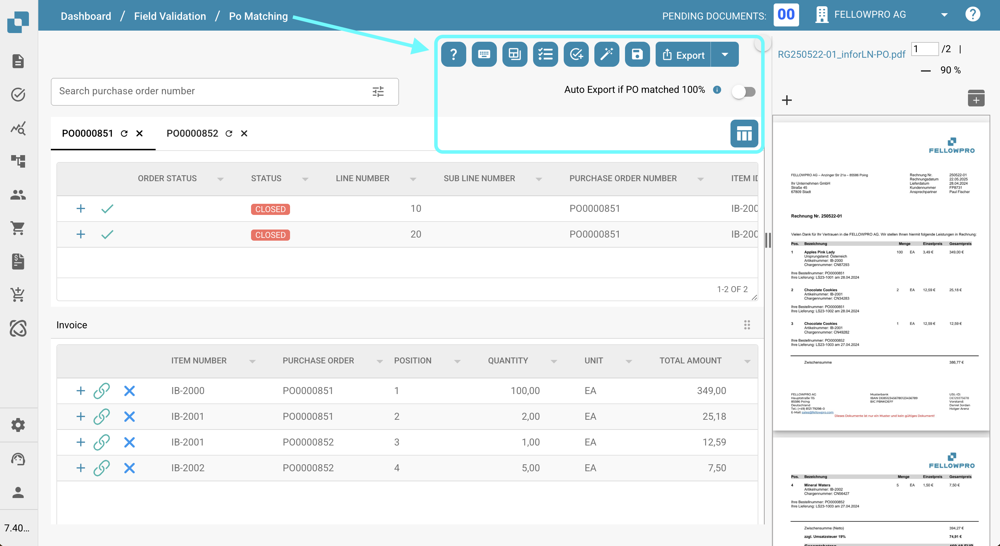
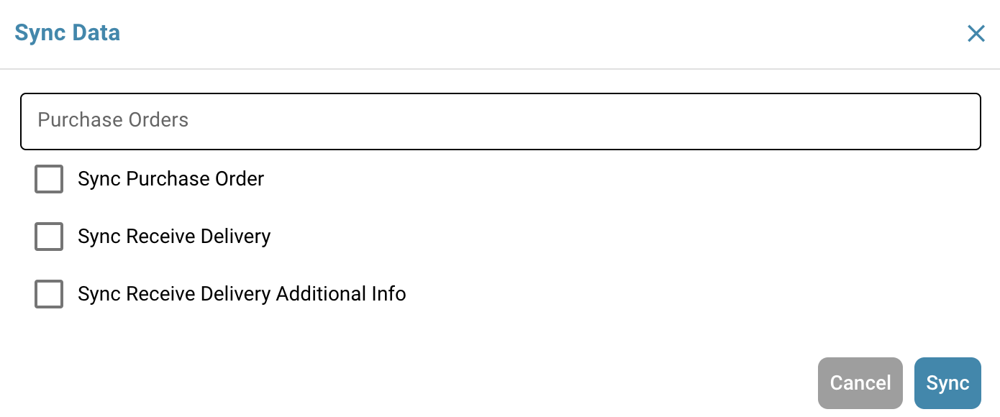

# Purchase Order Matching Tools

## Overview

To the right of the search bar, you’ll find several useful tools related to the purchase order matching process.\
This page provides a detailed explanation of each tool and its functionality.

<figure><figcaption></figcaption></figure>

## Help

Use this button to navigate to the documentation page for the Purchase Order Matching section.

<figure><figcaption></figcaption></figure>

## Keyboard shortcuts

Use this button to display all keyboard shortcuts for the dashboard. Detailed explanations for each shortcut can be found [here](keyboard-shortcuts.md).

<figure><figcaption></figcaption></figure>

## Turn on/off training mode

This button allows you to activate or deactivate Training Mode.

When **Training Mode** is enabled, you can create exact copies of purchase order line items in the extracted table.\
This feature is designed to help you practice and better understand how the purchase order matching process works in a safe, test environment.

To create a copy, simply drag and drop a purchase order line item into the extracted table.

## Auto Accounting

Click this button to be redirected to the Auto Accounting section.

<figure><figcaption></figcaption></figure>

## Tasks

Click this button to be redirected to the task section related to the document you are currently working on.

<figure><figcaption></figcaption></figure>

## Create task

Use this button to create tasks directly related to the current document.

<figure><figcaption></figcaption></figure>

To create a valid task, you must enter a name, provide a description, and assign it to a user or group. Optionally, you can mark the task as notification-only, set its priority (Low, Medium, or High), define its status, and specify a deadline.

<figure><figcaption></figcaption></figure>

## Auto PO match

Click this button to automatically perform the Purchase Order matching.

<figure><figcaption></figcaption></figure>

## Save

Click this button to save the matched Purchase Order lines.

<figure><figcaption></figcaption></figure>

## Sync Data

Click this button to manually synchronize data for a specified Purchase Order number between DocBits and Infor.

<figure><figcaption></figcaption></figure>

You need to provide a valid Purchase Order number, then select which of the available options you want to synchronize. After that, you can proceed to synchronize your data.

<figure><figcaption></figcaption></figure>

## Export

Click **Export** to export the document after completing the PO matching process.\
If multiple export options are available, the first option will be used by default.\
To view and select from all available export options, click the small arrow next to the Export button.

<figure><figcaption></figcaption></figure>

## Auto Export if PO matched 100%

If enabled, documents are automatically matched and exported when the purchase order number exactly matches the information extracted from the document.

<figure><figcaption></figcaption></figure>

## Set PO Table Columns for Organization

<figure><figcaption></figcaption></figure>

Click this button to open a menu where you can manage the visibility of columns in the purchase order table.\
Use the checkboxes and arrow buttons to move columns between the **Visible** and **Hidden** sections.\
You can also reorder columns by dragging and dropping the column names.\
Click **Done** to save your changes.

<figure><figcaption></figcaption></figure>

