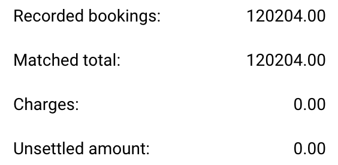

# Regras e Cálculos

Nesta página, você pode encontrar quais colunas estão sendo comparadas, as regras que elas seguem e como o cálculo resultante é realizado.

## Quais colunas estão sendo comparadas?

O processo de Comparação de Pedido de Compra compara apenas colunas específicas. A lista abaixo descreve quais colunas são comparadas, se disponíveis. Se nenhuma [tolerância](rules-and-calculations.md#aceitar-tolerancias) for definida, as colunas só serão comparadas se forem uma correspondência exata (100%).

* [Quantidade](rules-and-calculations.md#quantidade) (Quantidade | Quantidade Recebida | Quantidade de Entrega Recebida em Aberto)
* Preço Unitário
* Número do Pedido de Compra
* Número do Item/ID do Item do Fornecedor
* Data Prometida de Entrega

## Quantidade

Você tem três opções para comparar a quantidade.

* Quantidade
* Quantidade Recebida
* Quantidade de Entrega Recebida em Aberto

Você pode definir esta opção em **Configurações → Configurações Globais → Tipos de Documentos → Mais Configurações → Pedido de Compra → Pedido de Compra**

## Aceitar Tolerâncias

Você pode especificar que uma determinada tolerância é aceitável durante o processo de comparação. Por padrão, apenas correspondências exatas (100%) são consideradas válidas. Para mais informações, consulte a [documentação detalhada](../../../administration-and-setup/settings/global-settings/document-types/more-settings/purchase-order/purchase-order-tolerance-settings-additional-purchase-order-tolerance.md).

## Desativar status

Você pode excluir linhas específicas com certos status de serem comparadas. Para mais informações, consulte a [documentação detalhada](../../../administration-and-setup/settings/global-settings/document-types/more-settings/purchase-order/purchase-order-disable-statuses.md).

## Cálculo

Abaixo da tabela contendo as informações extraídas do seu documento, você pode encontrar cálculos simples para verificar se as reservas totais correspondem.

<figure><figcaption></figcaption></figure>

### Reservas registradas:

Isso é calculado com base no número do Pedido de Compra registrado usando a seguinte fórmula:

```
Reservas registradas = PREÇO UNITÁRIO * QUANTIDADE (com base no pedido de compra)
```

### Total correspondente:

Isso é calculado com base no valor extraído do documento usando a seguinte fórmula:

```
 Total correspondente = PREÇO UNITÁRIO * QUANTIDADE (com base no documento)
```

### **Encargos:**

Nesta seção, quaisquer encargos aplicáveis serão adicionados se estiverem presentes.

### Montante não liquidado:

A diferença resultante é exibida aqui e é calculada da seguinte forma:

```
Montante não liquidado = Reservas registradas - Total correspondente - Encargos
```
