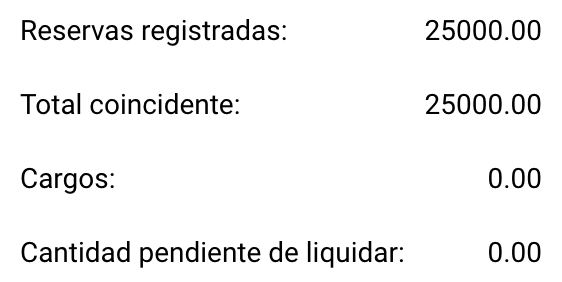

# Reglas y Cálculos

En esta página, puedes encontrar qué columnas están emparejadas, las reglas que siguen y cómo se realiza el cálculo resultante.

## ¿Qué columnas están siendo emparejadas?

El proceso de emparejamiento de la Orden de compra solo empareja columnas específicas. La lista a continuación describe qué columnas están emparejadas, si están disponibles. Si no se establece ninguna [tolerancia](rules-and-calculations.md#aceptar-tolerancias), las columnas solo coincidirán si son una coincidencia exacta (100%).

* [Cantidad](rules-and-calculations.md#cantidad) (Cantidad | Cantidad recibida | Entrega recibida Cantidad pendiente)
* Precio unitario
* Número de orden de compra
* Número de artículo/ID de artículo del proveedor
* Fecha de entrega prometida

## Cantidad

Tienes tres opciones para emparejar la cantidad.

* Cantidad
* Cantidad recibida
* Entrega recibida Cantidad pendiente

Puedes establecer esta opción en **Ajustes → Ajustes globales → Tipos de documentos → Más ajustes → Orden de compra → Orden de compra**

## Aceptar Tolerancias

Puedes especificar que una tolerancia particular es aceptable durante el proceso de emparejamiento. Por defecto, solo las coincidencias exactas (100%) se consideran válidas. Para más información, consulta la [documentación detallada](../../../administration-and-setup/settings/global-settings/document-types/more-settings/purchase-order/purchase-order-tolerance-settings-additional-purchase-order-tolerance.md).

## Deshabilitar estados

Puedes excluir líneas específicas con ciertos estados de ser emparejadas. Para más información, consulta la [documentación detallada](../../../administration-and-setup/settings/global-settings/document-types/more-settings/purchase-order/purchase-order-disable-statuses.md).

## Cálculo

Debajo de la tabla que contiene la información extraída de tu documento, puedes encontrar cálculos simples para verificar si las reservas totales coinciden.

<figure><figcaption></figcaption></figure>

### Reservas registradas:

Esto se calcula en base al número de Orden de compra registrado utilizando la siguiente fórmula:

```
Reservas registradas = PRECIO UNITARIO * CANTIDAD (basado en la orden de compra)
```

### Total coincidente:

Esto se calcula en base a la cantidad extraída del documento utilizando la siguiente fórmula:

```
 Total coincidente = PRECIO UNITARIO * CANTIDAD (basado en el documento)
```

### **Cargos:**

En esta sección, se agregarán cualquier cargo aplicable si están presentes.

### Cantidad pendiente de liquidar:

La diferencia resultante se muestra aquí y se calcula de la siguiente manera:

```
Cantidad pendiente de liquidar = Reservas registradas - Total coincidente - Cargos
```
