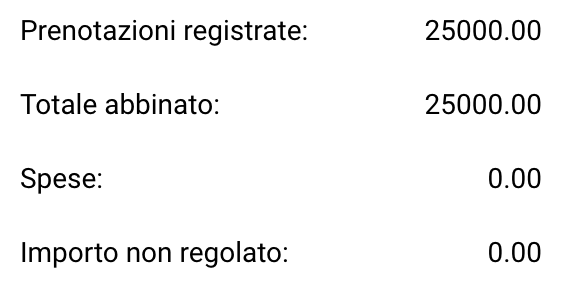

# Regole e Calcoli

In questa pagina, puoi trovare quali colonne sono abbinate, le regole che seguono e come viene eseguito il calcolo risultante.

## Quali colonne vengono abbinate?

Il processo di abbinamento dell'Ordine di acquisto abbina solo colonne specifiche. L'elenco qui sotto delinea quali colonne sono abbinate, se disponibili. Se non viene impostata alcuna [tolleranza](rules-and-calculations.md#accetta-tolleranze), le colonne si abbineranno solo se sono un abbinamento esatto (100%).

* [Quantità](rules-and-calculations.md#quantita) (Quantità | Quantità ricevuta | Consegna ricevuta Quantità aperta)
* Prezzo unitario
* Numero dell'ordine di acquisto
* Numero di articolo/ID articolo fornitore
* Data di consegna promessa

## Quantità

Hai tre opzioni per abbinare la quantità.

* Quantità
* Quantità ricevuta
* Consegna ricevuta Quantità aperta

Puoi impostare questa opzione in **Impostazioni → Impostazioni globali → Tipi di documenti → Altre impostazioni → Ordine di acquisto → Ordine di acquisto**

## Accetta Tolleranze

Puoi specificare che una particolare tolleranza è accettabile durante il processo di abbinamento. Per impostazione predefinita, solo gli abbinamenti esatti (100%) sono considerati validi. Per ulteriori informazioni, consulta la [documentazione dettagliata](../../../administration-and-setup/settings/global-settings/document-types/more-settings/purchase-order/purchase-order-tolerance-settings-additional-purchase-order-tolerance.md).

## Disabilita stati

Puoi escludere righe specifiche con determinati stati dall'essere abbinate. Per ulteriori informazioni, fai riferimento alla [documentazione dettagliata](../../../administration-and-setup/settings/global-settings/document-types/more-settings/purchase-order/purchase-order-disable-statuses.md).

## Calcolo

Sotto la tabella contenente le informazioni estratte dal tuo documento, puoi trovare calcoli semplici per verificare se le prenotazioni totali corrispondono.

<figure><figcaption></figcaption></figure>

### Prenotazioni registrate:

Questo è calcolato in base al numero dell'Ordine di acquisto registrato utilizzando la seguente formula:

```
Prenotazioni registrate = PREZZO UNITARIO * QUANTITÀ (basato sull'ordine di acquisto)
```

### Totale abbinato:

Questo è calcolato in base all'importo estratto dal documento utilizzando la seguente formula:

```
 Totale abbinato = PREZZO UNITARIO * QUANTITÀ (basato sul documento)
```

### **Spese:**

In questa sezione, eventuali spese applicabili verranno aggiunte se presenti.

### Importo non regolato:

La differenza risultante è visualizzata qui ed è calcolata come segue:

```
Importo non regolato = Prenotazioni registrate - Totale abbinato - Spese
```
