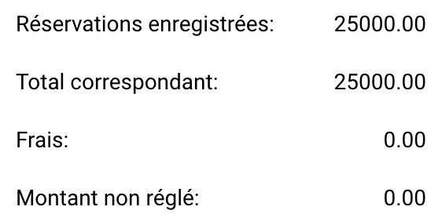

# Règles et Calculs

Sur cette page, vous pouvez trouver quelles colonnes sont appariées, les règles qu'elles suivent et comment le calcul résultant est effectué.

## Quelles colonnes sont appariées ?

Le processus d'appariement des Bon de commande ne correspond qu'à des colonnes spécifiques. La liste ci-dessous décrit quelles colonnes sont appariées, si disponibles. Si aucune [tolérance](rules-and-calculations.md#accepter-les-tolerances) n'est définie, les colonnes ne correspondront que si elles sont une correspondance exacte (100 %).

* [Quantité](rules-and-calculations.md#quantite) (Quantité | Quantité Reçue | Réception Livraison Quantité en cours)
* Prix unitaire
* Numéro de bon de commande
* Numéro d'article/Identifiant de l'article du fournisseur
* Date de livraison promise

## Quantité

Vous avez trois options pour apparier la quantité.

* Quantité
* Quantité Reçue
* Réception Livraison Quantité en cours

Vous pouvez définir cette option dans **Paramètres → Paramètres globaux → Types de documents → Plus de paramètres → Bon de commande → Bon de commande**

## Accepter les tolérances

Vous pouvez spécifier qu'une tolérance particulière est acceptable pendant le processus d'appariement. Par défaut, seules les correspondances exactes (100 %) sont considérées comme valides. Pour plus d'informations, consultez la [documentation détaillée](../../../administration-and-setup/settings/global-settings/document-types/more-settings/purchase-order/purchase-order-tolerance-settings-additional-purchase-order-tolerance.md).

## Désactiver les statuts

Vous pouvez exclure des lignes spécifiques avec certains statuts d'être appariées. Pour plus d'informations, reportez-vous à la [documentation détaillée](../../../administration-and-setup/settings/global-settings/document-types/more-settings/purchase-order/purchase-order-disable-statuses.md).

## Calcul

Sous le tableau contenant les informations extraites de votre document, vous pouvez trouver des calculs simples pour vérifier si les réservations totales correspondent.

<figure><figcaption></figcaption></figure>

### Réservations enregistrées :

Ceci est calculé en fonction du numéro de Bon de commande enregistré en utilisant la formule suivante :

```
Réservations enregistrées = PRIX UNITAIRE * QUANTITÉ (basé sur le bon de commande)
```

### Total correspondant :

Ceci est calculé en fonction du montant extrait du document en utilisant la formule suivante :

```
 Total correspondant = PRIX UNITAIRE * QUANTITÉ (basé sur le document)
```

### **Frais :**

Dans cette section, tous les frais applicables seront ajoutés s'ils sont présents.

### Montant non réglé :

La différence résultante est affichée ici et est calculée comme suit :

```
Montant non réglé = Réservations enregistrées - Total correspondant - Frais
```
