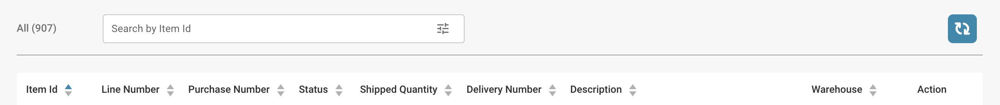

# Tableau de bord des ordres d'expédition

Cette section offre un aperçu détaillé de toutes les commandes d'expédition. Elle comprend une barre de recherche avec divers filtres que vous pouvez sélectionner pour affiner rapidement vos résultats. De plus, vous pouvez personnaliser l'agencement des en-têtes de colonne en utilisant la fonctionnalité de glisser-déposer pour une expérience de visualisation plus adaptée.

<figure><figcaption></figcaption></figure>
