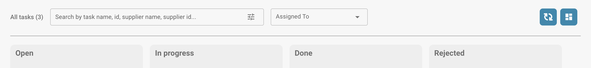

# Tasks

This is where you can keep an eye on your tasks. You can pick between two different layouts – one is a bit more detailed than the other. You can also filter tasks by different criteria, like whether they're assigned to you or the status of the task.

<figure><figcaption></figcaption></figure>

<figure><figcaption></figcaption></figure>