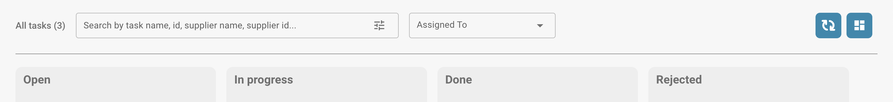
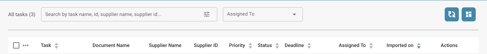

# Tâches

C'est ici que vous pouvez garder un œil sur vos tâches. Vous pouvez choisir entre deux mises en page différentes – l'une est un peu plus détaillée que l'autre. Vous pouvez également filtrer les tâches selon différents critères, comme si elles vous sont assignées ou l'état de la tâche.

<figure><figcaption></figcaption></figure>

<figure><figcaption></figcaption></figure>
