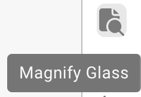
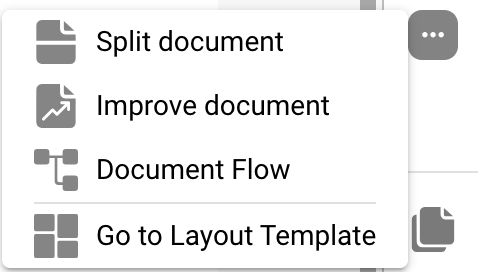

# Tela de Validação



## Visão Geral

<figure><figcaption></figcaption></figure>

### **Botão Salvar:**

<figure><figcaption></figcaption></figure>

* **Botão Salvar:**
  * **Propósito:** Salva o estado atual do documento ou script em que se está trabalhando.
  * **Caso de Uso:** Após fazer alterações ou anotações em um documento, use este botão para garantir que todas as modificações sejam salvas.

### **Adicionar Regras Especiais:**

<figure><figcaption></figcaption></figure>

<figure><figcaption></figcaption></figure>

* **Adicionar Regras Especiais / Adicionar Script em DocBits:**
  * **Propósito:** Permite que os usuários implementem regras ou scripts específicos que personalizam como os documentos são processados.
  * **Caso de Uso:** Use este recurso para automatizar tarefas como extração de dados ou validação de formato, aumentando a eficiência do fluxo de trabalho.


Veja aqui adicionar [Script em DocBits](../../../advanced-functions-and-tools/scripting-in-docbits/)


### **Campos Fuzzy:**

<figure><figcaption></figcaption></figure>

* **Campos Fuzzy:**
  * **Propósito:** Ajuda a identificar e corrigir campos onde os dados podem não ser uma correspondência perfeita, mas são suficientemente próximos.
  * **Caso de Uso:** Útil em processos de validação de dados onde correspondências exatas nem sempre são possíveis, como nomes ou endereços levemente incorretos.

### **Campos Obrigatórios:**

<figure><figcaption></figcaption></figure>

Existem campos que são obrigatórios para edições futuras, estes podem ser editados nas configurações.

Use a dica de ferramenta para descobrir se:

* É um campo obrigatório (required)
* Validação necessária
* Baixa confiança
* Descompasso no valor total de impostos

**Campos Obrigatórios:**

* **Propósito:** Identifica campos obrigatórios dentro dos documentos que devem ser preenchidos ou corrigidos antes de um processamento adicional.
* **Caso de Uso:** Garante que dados essenciais sejam capturados com precisão, mantendo a integridade dos dados e conformidade com as regras de negócios.

### **Lupa:**

<figure><figcaption></figcaption></figure>

* **Lupa:**
  * **Propósito:** Fornece uma visão ampliada de uma área selecionada do documento.
  * **Caso de Uso:** Ajuda a examinar detalhes finos ou texto pequeno em documentos, garantindo precisão na entrada ou revisão de dados.

<figure><figcaption></figcaption></figure>

### **Abrir nova janela:**

<figure><figcaption></figcaption></figure>

* **Abrir Nova Janela:**
  * **Propósito:** Abre uma nova janela para comparação lado a lado de documentos ou multitarefa.
  * **Caso de Uso:** Útil ao comparar dois documentos ou ao consultar informações adicionais sem sair do documento atual.

### **Atalhos de teclado:**

<figure><figcaption></figcaption></figure>

* **Atalhos de Teclado:**
  * **Propósito:** Permite que os usuários realizem ações rapidamente usando combinações de teclado.
  * **Caso de Uso:** Aumenta a velocidade e eficiência na navegação e processamento de documentos, minimizando a dependência da navegação com o mouse.

<figure><figcaption></figcaption></figure>

### **Tarefas:**

<figure><figcaption></figcaption></figure>

Para compartilhar informações internas, você pode criar tarefas e atribuí-las a um funcionário específico ou grupo dentro da empresa.

* **Tarefas:**
  * **Propósito:** Permite que os usuários criem tarefas relacionadas a documentos e as atribuam a membros da equipe.
  * **Caso de Uso:** Facilita a colaboração e gestão de tarefas dentro das equipes, garantindo que todos saibam suas responsabilidades.

<figure><figcaption></figcaption></figure>

### **Modo de Anotação:**

<figure><figcaption></figcaption></figure>

<figure><figcaption></figcaption></figure>

Você pode deixar anotações em um documento. Isso pode ser útil para deixar informações para outros usuários que irão editar este documento posteriormente.

* **Modo de Anotação:**
  * **Propósito:** Permite que os usuários deixem notas ou anotações diretamente no documento.
  * **Caso de Uso:** Útil para fornecer feedback, instruções ou notas importantes para outros membros da equipe que trabalharão no documento mais tarde.

### **Mesclar:**

<figure><figcaption></figcaption></figure>

Documentos podem ser mesclados aqui, por exemplo, se uma página de uma fatura estava faltando, essas páginas podem ser mescladas posteriormente desta forma sem que o documento inteiro precise ser excluído ou reenviado.

* **Mesclar Documentos:**
  * **Propósito:** Combina vários documentos em um único arquivo.
  * **Caso de Uso:** Útil em cenários onde partes de um documento são digitalizadas separadamente e precisam ser consolidadas.

### **Visualização OCR:**

<figure><figcaption></figcaption></figure>

Na visualização OCR, o texto é automaticamente filtrado do documento. Isso é usado para reconhecer características relevantes, como o código postal, número do contrato, número da fatura e a ordenação de um documento.

* **Visualização OCR:**
  * **Propósito:** Reconhece automaticamente o texto dentro dos documentos usando tecnologia de Reconhecimento Óptico de Caracteres.
  * **Caso de Uso:** Simplifica o processo de digitalização de textos impressos ou manuscritos, tornando-os pesquisáveis e editáveis.

<figure><figcaption></figcaption></figure>

### **Criar ticket:**

<figure><figcaption></figcaption></figure>

Ao contrário das tarefas que são passadas internamente dentro da empresa, este ticket de suporte é importante para nos notificar e criar imediatamente um ticket em caso de erros e/ou discrepâncias. Isso torna o processo muito mais fácil porque você pode enviar imediatamente o bug com o documento apropriado. Também há a opção de definir prioridade, tirar uma captura de tela do documento ou fazer upload de uma.

* **Criar Ticket:**
  * **Propósito:** Permite que os usuários relatem problemas ou discrepâncias criando um ticket de suporte.
  * **Caso de Uso:** Essencial para a rápida resolução de problemas e bugs, ajudando a manter a integridade e o funcionamento suave do sistema.

<figure><figcaption></figcaption></figure>

### **Logs de Script do Documento:**

<figure><figcaption></figcaption></figure>

Scripts podem ser criados nas configurações sob Tipos de Documento; esta informação será então exibida aqui.

* **Logs de Script do Documento:**
  * **Propósito:** Exibe logs relacionados a scripts que foram implementados para diferentes tipos de documentos.
  * **Caso de Uso:** Útil para rastrear e depurar ações de script em documentos, ajudando os usuários a entender os processos automatizados e corrigir quaisquer problemas.

<figure><figcaption></figcaption></figure>

### **Mais configurações:**

<figure><figcaption></figcaption></figure>

### **Fluxo do Documento:**

Lá você encontrará o fluxo do documento

* **Propósito:** Mostra a sequência e progressão do processamento de documentos dentro do sistema.
* **Caso de Uso:** Ajuda a rastrear o status do documento através de diferentes estágios, garantindo que todas as etapas necessárias de processamento sejam seguidas.

### **Ir para o Modelo de Layout:**

* Com esta opção você será redirecionado e poderá editar seu layout ou usar o modelo padrão
* **Ir para o Modelo de Layout:**
  * **Propósito:** Redireciona os usuários para um editor de layout onde eles podem modificar modelos existentes ou aplicar um padrão.
  * **Caso de Uso:** Permite a personalização dos layouts de documentos para atender a necessidades ou preferências específicas de negócios, melhorando o alinhamento visual e funcional do documento com os padrões da empresa.

### Use E-Text if Available

* **Propósito:** Permite que o DocBits utilize e-text para todos os documentos de um fornecedor específico, se disponível, melhorando a precisão da extração.
* **Caso de Uso:** Melhora a extração de texto aproveitando o texto incorporado em vez de OCR, o que pode levar a resultados mais precisos para este fornecedor.

### Supplier-Based AI Model

* **Propósito:** Permite a seleção entre três modelos de IA diferentes para otimizar os resultados de extração para um fornecedor específico.
* **Caso de Uso:** Garante melhor precisão na extração ao escolher o modelo de IA mais adequado para a estrutura e conteúdo dos documentos de cada fornecedor.
