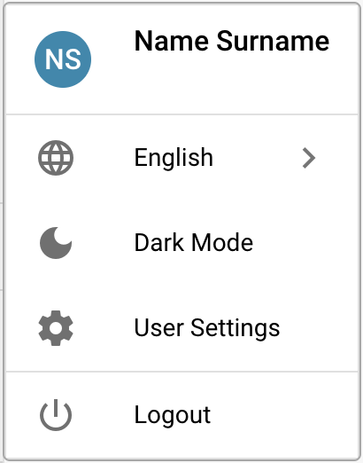

# Opciones de Configuración del Usuario

Para configurar tus ajustes, haz clic en el Icono de Usuario ubicado en la esquina inferior izquierda de la pantalla. Aquí puedes personalizar varias opciones:

<figure><figcaption></figcaption></figure>

<figure><figcaption></figcaption></figure>

**Idioma**

* **Seleccionar Idioma Preferido:** Elige tu idioma deseado de las opciones disponibles.

**Dark Mode**

* **Activar Dark Mode:** Habilita o deshabilita el Dark Mode para una experiencia de visualización más cómoda.

**Ajustes de usuario**

En esta sección, puedes ajustar las siguientes preferencias:

* **Patrón de Fecha:** Personaliza cómo se muestran las fechas.
* **Formato de Cantidad:** Establece tu formato preferido para valores numéricos.
* **Nombre:** Actualiza tu nombre.
* **Contraseña:** Cambia tu contraseña para la seguridad de la cuenta.
* **Tamaño de Letra:** Ajusta el tamaño del texto para una mejor legibilidad.
* **Dual Monitor Mode:** Habilita esta función si estás utilizando dos monitores.

<figure><figcaption></figcaption></figure>

**Cerrar Sesión**

* **Cerrar Sesión:** Haz clic aquí para cerrar sesión de forma segura en tu cuenta.
