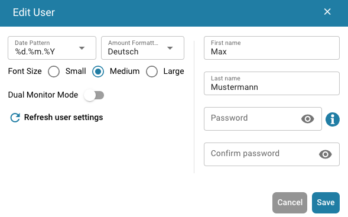

# User Configuration Options

To configure your settings, click on the User Icon located in the bottom-left corner of the screen. Here you can customize several options:

<figure><figcaption></figcaption></figure>

<figure><figcaption></figcaption></figure>

**Language**

* **Select Preferred Language:** Choose your desired language from the available options.

**Dark Mode**

* **Switch to Dark Mode:** Enable or disable Dark Mode for a more comfortable viewing experience.

**User Settings**

In this section, you can adjust the following preferences:

* **Date Pattern:** Customize how dates are displayed.
* **Amount Formatting:** Set your preferred format for numerical values.
* **Name:** Update your name.
* **Password:** Change your password for account security.
* **Font Size:** Adjust the text size for better readability.
* **Dual Monitor Mode:** Enable this feature if you’re using two monitors.

<figure><figcaption></figcaption></figure>

**Logout**

* **Logout:** Click here to securely log out of your account.
