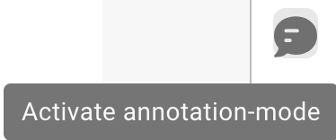

# Pantalla de Validación



## Descripción General

<figure><figcaption></figcaption></figure>

### Origen del Documento (Document Origin)


DocBits Origin Setting Explained: Country Standards for Dates & Number Formats


### **Botón Guardar:**

<figure><figcaption></figcaption></figure>

* **Botón Guardar:**
  * **Propósito:** Guarda el estado actual del documento o script en el que se está trabajando.
  * **Caso de Uso:** Después de realizar cambios o anotaciones en un documento, use este botón para asegurar que todas las modificaciones se guarden.

### **Agregar Reglas Especiales:**

<figure><figcaption></figcaption></figure>

<figure><figcaption></figcaption></figure>

* **Agregar Reglas Especiales / Agregar Script en DocBits:**
  * **Propósito:** Permite a los usuarios implementar reglas o scripts específicos que personalizan cómo se procesan los documentos.
  * **Caso de Uso:** Use esta función para automatizar tareas como la extracción de datos o la validación de formatos, mejorando la eficiencia del flujo de trabajo.


Vea aquí agregar [Script en DocBits](../../../administration-and-setup/settings/global-settings/document-types/script/scripting-in-docbits/)


### **Campos Difusos:**

<figure><figcaption></figcaption></figure>

* **Campos Difusos:**
  * **Propósito:** Ayuda a identificar y corregir campos donde los datos pueden no coincidir perfectamente pero son lo suficientemente cercanos.
  * **Caso de Uso:** Útil en procesos de validación de datos donde no siempre son posibles coincidencias exactas, como nombres o direcciones ligeramente mal escritos.

### **Campos Requeridos:**

<figure><figcaption></figcaption></figure>

Hay campos que son necesarios para una edición posterior, estos se pueden editar en la configuración.

Use el consejo de herramienta para averiguar si:

* Es un campo obligatorio (requerido)
* Se requiere validación
* Baja confianza
* Desajuste del monto total de impuestos

**Campos Requeridos:**

* **Propósito:** Identifica campos obligatorios dentro de los documentos que deben completarse o corregirse antes de un procesamiento posterior.
* **Caso de Uso:** Asegura que los datos esenciales se capturen con precisión, manteniendo la integridad de los datos y el cumplimiento de las reglas comerciales.

### **Lupa:**

<figure><figcaption></figcaption></figure>

* **Lupa:**
  * **Propósito:** Proporciona una vista ampliada de un área seleccionada del documento.
  * **Caso de Uso:** Ayuda a examinar detalles finos o texto pequeño en documentos, asegurando precisión en la entrada o revisión de datos.

<figure><figcaption></figcaption></figure>

### **Abrir nueva ventana:**

<figure><figcaption></figcaption></figure>

* **Abrir Nueva Ventana:**
  * **Propósito:** Abre una nueva ventana para la comparación de documentos lado a lado o multitarea.
  * **Caso de Uso:** Útil al comparar dos documentos o al referenciar información adicional sin salir del documento actual.

### **Atajos de teclado:**

<figure><figcaption></figcaption></figure>

* **Atajos de Teclado:**
  * **Propósito:** Permite a los usuarios realizar acciones rápidamente usando combinaciones de teclado.
  * **Caso de Uso:** Mejora la velocidad y eficiencia en la navegación y procesamiento de documentos al minimizar la dependencia de la navegación con el ratón.

<figure><figcaption></figcaption></figure>

### **Tareas:**

<figure><figcaption></figcaption></figure>

Para compartir información interna, puede crear tareas y asignarlas a un empleado o grupo específico dentro de la empresa.

* **Tareas:**
  * **Propósito:** Permite a los usuarios crear tareas relacionadas con documentos y asignarlas a miembros del equipo.
  * **Caso de Uso:** Facilita la colaboración y gestión de tareas dentro de los equipos, asegurando que todos conozcan sus responsabilidades.

<figure><figcaption></figcaption></figure>

### **Modo de anotación:**

<figure><figcaption></figcaption></figure>

<figure><figcaption></figcaption></figure>


DocBits Annotation Mode Tutorial: Add Notes in Validation & Download With/Without Annotations


You can leave annotations on a document. This can be helpful to leave information for other users who further edit this document.

* **Modo de Anotación:**
  * **Propósito:** Permite a los usuarios dejar notas o anotaciones directamente en el documento.
  * **Caso de Uso:** Útil para proporcionar comentarios, instrucciones o notas importantes a otros miembros del equipo que trabajarán en el documento más tarde.

### **Combinar:**

<figure><figcaption></figcaption></figure>

Los documentos se pueden combinar aquí, por ejemplo, si faltaba una página de una factura, estas páginas se pueden combinar más tarde de esta manera sin tener que eliminar o volver a cargar todo el documento.

* **Combinar Documentos:**
  * **Propósito:** Combina múltiples documentos en un solo archivo.
  * **Caso de Uso:** Útil en escenarios donde partes de un documento se escanean por separado y necesitan ser consolidadas.

### **Vista OCR:**

<figure><figcaption></figcaption></figure>

En la vista OCR, el texto se filtra automáticamente del documento. Esto se utiliza para reconocer características relevantes, como el código postal, número de contrato, número de factura y la clasificación de un documento.

* **Vista OCR:**
  * **Propósito:** Reconoce automáticamente el texto dentro de los documentos utilizando tecnología de Reconocimiento Óptico de Caracteres.
  * **Caso de Uso:** Optimiza el proceso de digitalización de textos impresos o manuscritos, haciéndolos buscables y editables.

<figure><figcaption></figcaption></figure>

### **Crear ticket:**

<figure><figcaption></figcaption></figure>

A diferencia de las tareas que se transmiten internamente dentro de la empresa, este ticket de soporte es importante para notificarnos y crear inmediatamente un ticket en caso de errores y/o discrepancias. Esto facilita mucho el proceso porque puede enviar inmediatamente el error con el documento correspondiente. También existe la opción de establecer prioridad, tomar una captura de pantalla del documento o cargar una.

* **Crear Ticket:**
  * **Propósito:** Permite a los usuarios reportar problemas o discrepancias creando un ticket de soporte.
  * **Caso de Uso:** Esencial para la rápida resolución de problemas y errores, ayudando a mantener la integridad y el buen funcionamiento del sistema.

<figure><figcaption></figcaption></figure>

### **Registros de scripts de documentos:**

<figure><figcaption></figcaption></figure>

Los scripts se pueden crear en la configuración bajo Tipos de Documentos; esta información se mostrará aquí.

* **Registros de Scripts de Documentos:**
  * **Propósito:** Muestra registros relacionados con scripts que se han implementado para diferentes tipos de documentos.
  * **Caso de Uso:** Útil para rastrear y depurar acciones de scripts en documentos, ayudando a los usuarios a comprender los procesos automatizados y corregir cualquier problema.

<figure><figcaption></figcaption></figure>

### **Más configuraciones:**

<figure><figcaption></figcaption></figure>

### **Flujo de Documento:**

Allí encontrará el flujo del documento

* **Propósito:** Muestra la secuencia y progresión del procesamiento de documentos dentro del sistema.
* **Caso de Uso:** Ayuda a rastrear el estado del documento a través de diferentes etapas, asegurando que se sigan todos los pasos de procesamiento necesarios.

### **Ir a la plantilla de diseño:**

* Con esta opción será redirigido y podrá editar su diseño o usar la plantilla predeterminada
* **Ir a la Plantilla de Diseño:**
  * **Propósito:** Redirige a los usuarios a un editor de diseño donde pueden modificar plantillas existentes o aplicar una predeterminada.
  * **Caso de Uso:** Permite la personalización de los diseños de documentos para satisfacer necesidades o preferencias comerciales específicas, mejorando la alineación visual y funcional del documento con los estándares de la empresa.

### Utilizar E-Texto si Está Disponible

* **Propósito:** Permite que DocBits utilice e-texto para todos los documentos de un proveedor específico si está disponible, mejorando la precisión de la extracción.
* **Caso de Uso:** Mejora la extracción de texto aprovechando el texto incrustado en lugar de OCR, lo que puede llevar a resultados más precisos para este proveedor.

### [Modelo de IA Basado en Proveedor](supplier-specific-ai-model-for-field-and-table-extraction.md)

* **Propósito:** Permite la selección entre tres modelos de IA diferentes para optimizar los resultados de extracción para un proveedor específico.
* **Caso de Uso:** Asegura una mejor precisión de extracción al elegir el modelo de IA más adecuado para la estructura y contenido del documento de cada proveedor.
