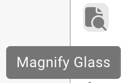
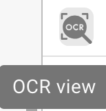
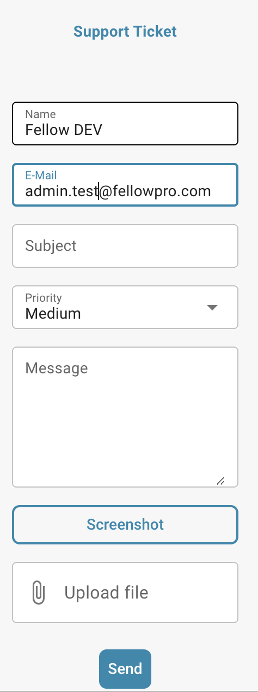

# Validatiescherm



## Overzicht

<figure><figcaption></figcaption></figure>

### **Opslaan knop:**

<figure><figcaption></figcaption></figure>

* **Opslaan knop:**
  * **Doel:** Slaat de huidige staat van het document of script waar aan gewerkt wordt op.
  * **Gebruiksscenario:** Na het aanbrengen van wijzigingen of annotaties in een document, gebruik deze knop om ervoor te zorgen dat alle aanpassingen zijn opgeslagen.

### **Speciale regels toevoegen:**

<figure><figcaption></figcaption></figure>

<figure><figcaption></figcaption></figure>

* **Speciale regels toevoegen / Script in DocBits toevoegen:**
  * **Doel:** Stelt gebruikers in staat om specifieke regels of scripts te implementeren die aanpassen hoe documenten worden verwerkt.
  * **Gebruiksscenario:** Gebruik deze functie om taken te automatiseren zoals gegevensextractie of formatvalidatie, wat de efficiëntie van de workflow verbetert.


Zie hier toevoegen [Script in DocBits](../../../administration-and-setup/settings/global-settings/document-types/script/scripting-in-docbits/)


### **Vage velden:**

<figure><figcaption></figcaption></figure>

* **Vage velden:**
  * **Doel:** Helpt bij het identificeren en corrigeren van velden waar de gegevens mogelijk niet perfect overeenkomen, maar dicht genoeg zijn.
  * **Gebruiksscenario:** Nuttig in gegevensvalidatieprocessen waar exacte overeenkomsten niet altijd mogelijk zijn, zoals licht verkeerd gespelde namen of adressen.

### **Verplichte velden:**

<figure><figcaption></figcaption></figure>

Er zijn velden die vereist zijn voor verdere bewerking, deze kunnen in de instellingen worden bewerkt.

Gebruik de tooltips om te achterhalen of:

* Is het een verplicht veld (vereist)
* Validatie vereist
* Lage betrouwbaarheid
* Volledig belastingbedrag mismatch

**Verplichte velden:**

* **Doel:** Identificeert verplichte velden binnen documenten die moeten worden ingevuld of gecorrigeerd voordat verdere verwerking plaatsvindt.
* **Gebruiksscenario:** Zorgt ervoor dat essentiële gegevens nauwkeurig worden vastgelegd, waardoor de integriteit van de gegevens en de naleving van bedrijfsregels behouden blijven.

<figure><figcaption></figcaption></figure>

### **Vergrootglas:**

<figure><figcaption></figcaption></figure>

* **Vergrootglas:**
  * **Doel:** Biedt een ingezoomd overzicht van een geselecteerd gebied van het document.
  * **Gebruiksscenario:** Helpt bij het onderzoeken van fijne details of kleine tekst in documenten, waardoor de nauwkeurigheid bij gegevensinvoer of -beoordeling wordt gewaarborgd.

<figure><figcaption></figcaption></figure>

### **Open nieuw venster:**

<figure><figcaption></figcaption></figure>

* **Open nieuw venster:**
  * **Doel:** Opent een nieuw venster voor zij-aan-zij documentvergelijking of multitasking.
  * **Gebruiksscenario:** Nuttig bij het vergelijken van twee documenten of wanneer aanvullende informatie moet worden geraadpleegd zonder het huidige document te verlaten.

### **Sneltoetsen:**

<figure><figcaption></figcaption></figure>

* **Sneltoetsen:**
  * **Doel:** Stelt gebruikers in staat om acties snel uit te voeren met behulp van toetsencombinaties.
  * **Gebruiksscenario:** Verhoogt de snelheid en efficiëntie in documentnavigatie en -verwerking door de afhankelijkheid van muisnavigatie te minimaliseren.

<figure><figcaption>
Keyboard
</figcaption></figure>

### **Taken:**

<figure><figcaption></figcaption></figure>

Om interne informatie te delen, kunt u taken aanmaken en deze toewijzen aan een specifieke werknemer of groep binnen het bedrijf.

* **Taken:**
  * **Doel:** Stelt gebruikers in staat om taken te creëren die verband houden met documenten en deze aan teamleden toe te wijzen.
  * **Gebruiksscenario:** Vergemakkelijkt samenwerking en taakbeheer binnen teams, zodat iedereen op de hoogte is van zijn verantwoordelijkheden.

<figure><figcaption></figcaption></figure>

### **Annotatiemodus:**

<figure><figcaption></figcaption></figure>

<figure><figcaption></figcaption></figure>

U kunt annotaties op een document achterlaten. Dit kan nuttig zijn om informatie achter te laten voor andere gebruikers die dit document verder bewerken.

* **Annotatiemodus:**
  * **Doel:** Laat gebruikers notities of annotaties direct op het document achterlaten.
  * **Gebruiksscenario:** Nuttig voor het geven van feedback, instructies of belangrijke notities aan andere teamleden die later aan het document zullen werken.

### **Samenvoegen:**

<figure><figcaption></figcaption></figure>

Documenten kunnen hier worden samengevoegd, bijvoorbeeld als een pagina van een factuur ontbrak, kunnen deze pagina's later op deze manier worden samengevoegd zonder dat het hele document hoeft te worden verwijderd of opnieuw geüpload.

* **Documenten samenvoegen:**
  * **Doel:** Combineert meerdere documenten tot één bestand.
  * **Gebruiksscenario:** Handig in scenario's waarin delen van een document afzonderlijk zijn gescand en moeten worden samengevoegd.

### **OCR-weergave:**

<figure><figcaption></figcaption></figure>

In de OCR-weergave wordt de tekst automatisch gefilterd uit het document. Dit wordt gebruikt om relevante kenmerken te herkennen, zoals de postcode, contractnummer, factuurnummer en de sortering van een document.

* **OCR-weergave:**
  * **Doel:** Herkent automatisch tekst binnen documenten met behulp van Optical Character Recognition-technologie.
  * **Gebruiksscenario:** Vereenvoudigt het proces van het digitaliseren van gedrukte of handgeschreven teksten, waardoor ze doorzoekbaar en bewerkbaar worden.

<figure><figcaption>
OCR
</figcaption></figure>

### **Ticket aanmaken:**

<figure><figcaption></figcaption></figure>

In tegenstelling tot taken die intern binnen het bedrijf worden doorgegeven, is dit ondersteuningsticket belangrijk om ons te informeren en onmiddellijk een ticket aan te maken in geval van fouten en/of discrepanties. Dit maakt het proces veel gemakkelijker omdat u de bug onmiddellijk met het bijbehorende document kunt verzenden. Er is ook de optie om prioriteit in te stellen, een screenshot van het document te maken of er een te uploaden.

* **Ticket aanmaken:**
  * **Doel:** Stelt gebruikers in staat om problemen of discrepanties te melden door een ondersteuningsticket aan te maken.
  * **Gebruiksscenario:** Essentieel voor een snelle oplossing van problemen en bugs, wat helpt om de integriteit en soepele werking van het systeem te behouden.

<figure><figcaption></figcaption></figure>

### **Document scriptlogs:**

<figure><figcaption></figcaption></figure>

Scripts kunnen worden aangemaakt in de instellingen onder Documenttypes; deze informatie wordt hier vervolgens weergegeven.

* **Document scriptlogs:**
  * **Doel:** Toont logs die verband houden met scripts die zijn geïmplementeerd voor verschillende documenttypes.
  * **Gebruiksscenario:** Nuttig voor het volgen en debuggen van scriptacties op documenten, wat gebruikers helpt de geautomatiseerde processen te begrijpen en eventuele problemen te corrigeren.

<figure><figcaption></figcaption></figure>

### **Meer instellingen:**

<figure><figcaption></figcaption></figure>

### **Documentflow:**

Daar vindt u de flow van het document.

* **Doel:** Toont de volgorde en voortgang van documentverwerking binnen het systeem.
* **Gebruiksscenario:** Helpt bij het volgen van de documentstatus door verschillende fasen, en zorgt ervoor dat alle noodzakelijke verwerkingsstappen worden gevolgd.

### **Ga naar lay-outsjabloon:**

* Met deze optie wordt u doorgestuurd en kunt u uw lay-out bewerken of het standaard sjabloon gebruiken.
* **Ga naar lay-outsjabloon:**
  * **Doel:** Verwijst gebruikers naar een lay-outeditor waar ze bestaande sjablonen kunnen wijzigen of een standaard sjabloon kunnen toepassen.
  * **Gebruiksscenario:** Maakt aanpassing van documentlay-outs mogelijk om te voldoen aan specifieke zakelijke behoeften of voorkeuren, waardoor de visuele en functionele afstemming van het document op de bedrijfsnormen wordt verbeterd.

### Gebruik E-Text indien Beschikbaar

* **Doel:** Stelt DocBits in staat om e-text te gebruiken voor alle documenten van een specifieke leverancier indien beschikbaar, wat de extractie-accuraatheid verbetert.
* **Gebruikscase:** Verbetert de tekstextractie door gebruik te maken van ingebedde tekst in plaats van OCR, wat kan leiden tot nauwkeurigere resultaten voor deze leverancier.

### [Leverancier-gebaseerd AI Model](supplier-specific-ai-model-for-field-and-table-extraction.md)

* **Doel:** Maakt selectie mogelijk tussen drie verschillende AI-modellen om de extractieresultaten voor een specifieke leverancier te optimaliseren.
* **Gebruikscase:** Zorgt voor een betere extractie-accuraatheid door het meest geschikte AI-model te kiezen voor de documentstructuur en inhoud van elke leverancier.
