# Ekran Walidacji



## Przegląd

<figure>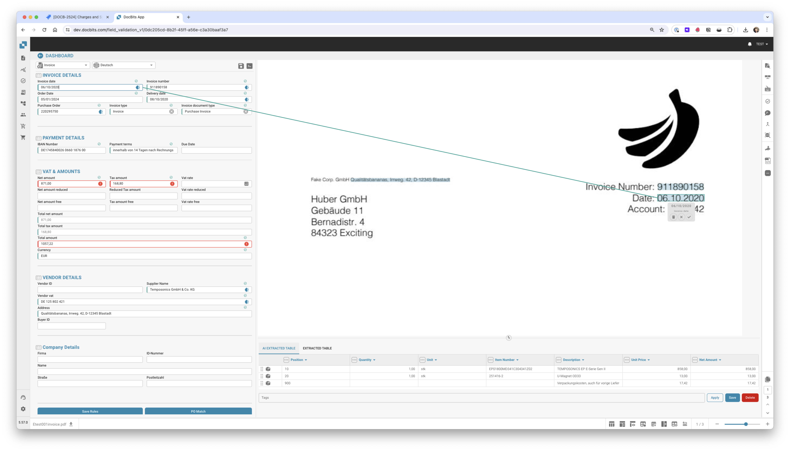<figcaption></figcaption></figure>

### **Przycisk Zapisz:**

<figure><figcaption></figcaption></figure>

* **Przycisk Zapisz:**
  * **Cel:** Zapisuje bieżący stan dokumentu lub skryptu, nad którym pracujesz.
  * **Przypadek użycia:** Po wprowadzeniu zmian lub adnotacji do dokumentu, użyj tego przycisku, aby upewnić się, że wszystkie modyfikacje zostały zapisane.

### **Dodaj specjalne zasady:**

<figure><figcaption></figcaption></figure>

<figure>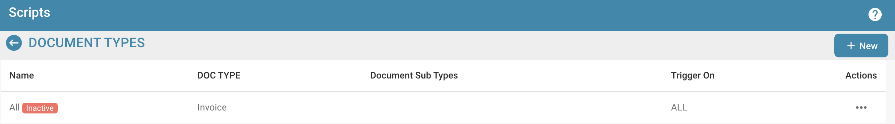<figcaption></figcaption></figure>

* **Dodaj specjalne zasady / Dodaj skrypt w DocBits:**
  * **Cel:** Umożliwia użytkownikom wdrażanie specyficznych zasad lub skryptów, które dostosowują sposób przetwarzania dokumentów.
  * **Przypadek użycia:** Użyj tej funkcji, aby zautomatyzować zadania takie jak ekstrakcja danych lub walidacja formatu, zwiększając efektywność pracy.


Zobacz tutaj dodaj [Skrypt w DocBits](../../../administration-and-setup/settings/global-settings/document-types/script/scripting-in-docbits/)


### **Pola rozmyte:**

<figure><figcaption></figcaption></figure>

* **Pola rozmyte:**
  * **Cel:** Pomaga w identyfikacji i korekcie pól, gdzie dane mogą nie być idealnie dopasowane, ale są wystarczająco bliskie.
  * **Przypadek użycia:** Przydatne w procesach walidacji danych, gdzie dokładne dopasowanie nie zawsze jest możliwe, na przykład w przypadku lekko błędnie napisanych nazwisk lub adresów.

### **Pola wymagane:**

<figure><figcaption></figcaption></figure>

Istnieją pola, które są wymagane do dalszej edycji, można je edytować w ustawieniach.

Użyj podpowiedzi, aby dowiedzieć się, czy:

* Jest to pole obowiązkowe (wymagane)
* Wymagana walidacja
* Niska pewność
* Niezgodność pełnej kwoty podatku

**Pola wymagane:**

* **Cel:** Identyfikuje obowiązkowe pola w dokumentach, które muszą być wypełnione lub poprawione przed dalszym przetwarzaniem.
* **Przypadek użycia:** Zapewnia, że niezbędne dane są dokładnie uchwycone, utrzymując integralność danych i zgodność z zasadami biznesowymi.

### **Szkło powiększające:**

<figure>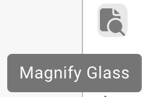<figcaption></figcaption></figure>

* **Szkło powiększające:**
  * **Cel:** Zapewnia powiększony widok wybranego obszaru dokumentu.
  * **Przypadek użycia:** Pomaga w badaniu drobnych szczegółów lub małego tekstu w dokumentach, zapewniając dokładność wprowadzania danych lub przeglądu.

<figure>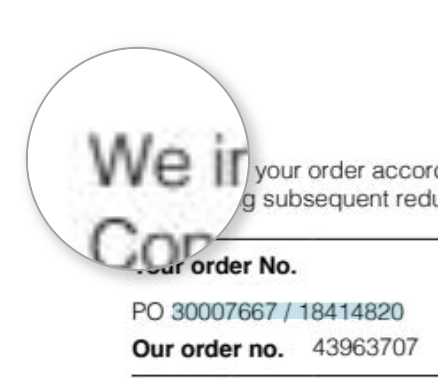<figcaption></figcaption></figure>

### **Otwórz nowe okno:**

<figure><figcaption></figcaption></figure>

* **Otwórz nowe okno:**
  * **Cel:** Otwiera nowe okno do porównania dokumentów obok siebie lub do wielozadaniowości.
  * **Przypadek użycia:** Przydatne przy porównywaniu dwóch dokumentów lub przy odwoływaniu się do dodatkowych informacji bez opuszczania bieżącego dokumentu.

### **Skróty klawiszowe:**

<figure>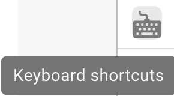<figcaption></figcaption></figure>

* **Skróty klawiszowe:**
  * **Cel:** Umożliwia użytkownikom szybkie wykonywanie działań za pomocą kombinacji klawiszy.
  * **Przypadek użycia:** Zwiększa szybkość i efektywność nawigacji i przetwarzania dokumentów, minimalizując zależność od nawigacji myszą.

<figure>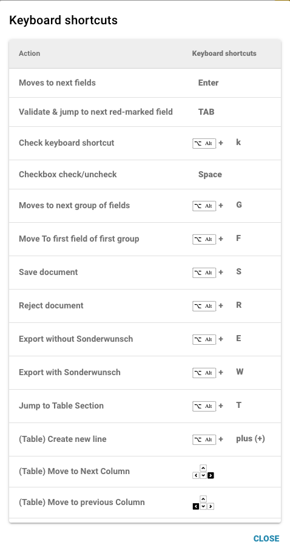<figcaption></figcaption></figure>

### **Zadania:**

<figure><figcaption></figcaption></figure>

Aby udostępnić informacje wewnętrzne, możesz tworzyć zadania i przypisywać je do konkretnego pracownika lub grupy w firmie.

* **Zadania:**
  * **Cel:** Umożliwia użytkownikom tworzenie zadań związanych z dokumentami i przypisywanie ich członkom zespołu.
  * **Przypadek użycia:** Ułatwia współpracę i zarządzanie zadaniami w zespołach, zapewniając, że każdy zna swoje obowiązki.

<figure>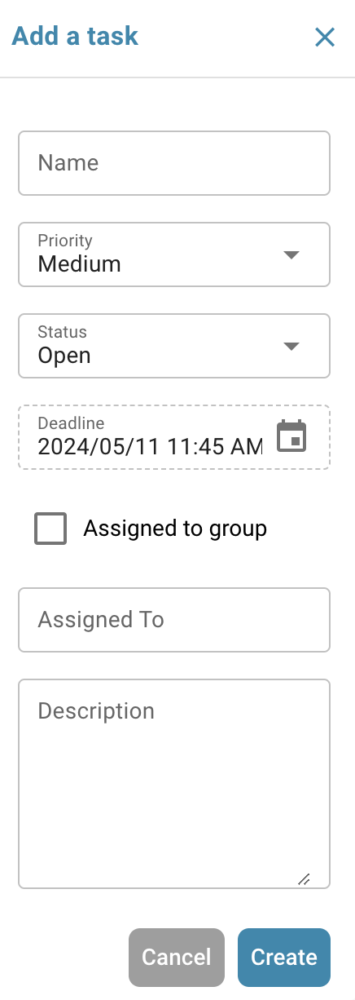<figcaption></figcaption></figure>

### **Tryb adnotacji:**

<figure><figcaption></figcaption></figure>

<figure>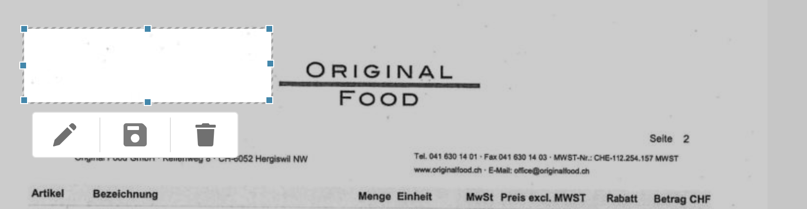<figcaption></figcaption></figure>

Możesz zostawić adnotacje na dokumencie. Może to być pomocne, aby zostawić informacje dla innych użytkowników, którzy będą dalej edytować ten dokument.

* **Tryb adnotacji:**
  * **Cel:** Pozwala użytkownikom zostawiać notatki lub adnotacje bezpośrednio na dokumencie.
  * **Przypadek użycia:** Przydatne do udzielania informacji zwrotnych, instrukcji lub ważnych notatek dla innych członków zespołu, którzy będą pracować nad dokumentem później.

### **Scal:**

<figure><figcaption></figcaption></figure>

Dokumenty można tutaj scalać, na przykład jeśli brakowało strony faktury, te strony można później scalić w ten sposób bez konieczności usuwania lub ponownego przesyłania całego dokumentu.

* **Scal dokumenty:**
  * **Cel:** Łączy wiele dokumentów w jeden plik.
  * **Przypadek użycia:** Przydatne w sytuacjach, gdy części dokumentu są skanowane osobno i muszą być skonsolidowane.

### **Widok OCR:**

<figure>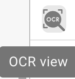<figcaption></figcaption></figure>

W widoku OCR tekst jest automatycznie filtrowany z dokumentu. Służy to do rozpoznawania istotnych cech, takich jak kod pocztowy, numer umowy, numer faktury i sortowanie dokumentu.

* **Widok OCR:**
  * **Cel:** Automatycznie rozpoznaje tekst w dokumentach za pomocą technologii rozpoznawania znaków optycznych.
  * **Przypadek użycia:** Usprawnia proces digitalizacji tekstów drukowanych lub pisanych ręcznie, czyniąc je przeszukiwalnymi i edytowalnymi.

<figure>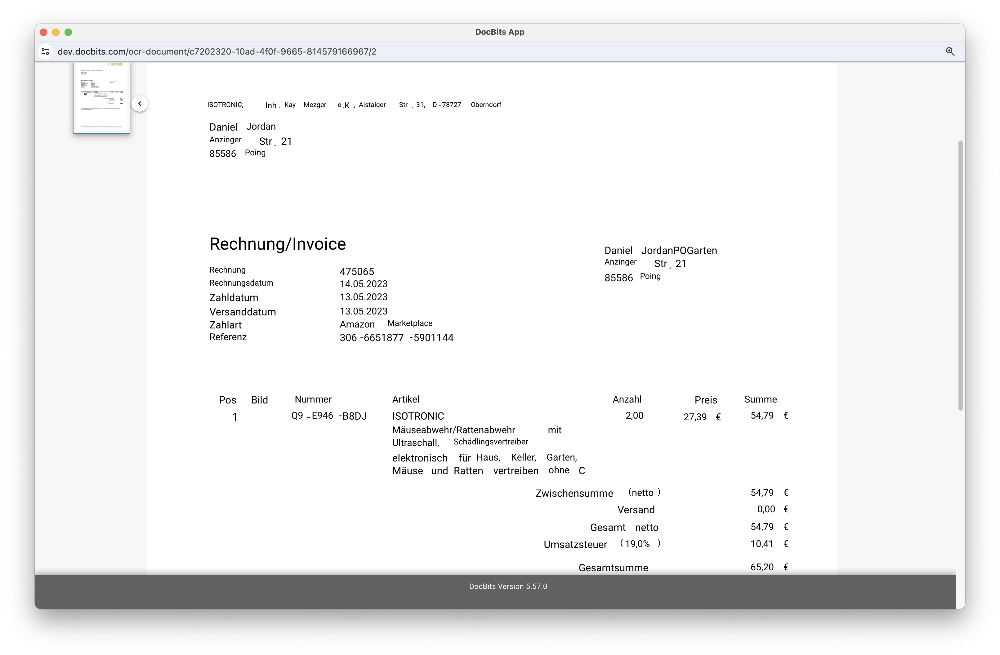<figcaption></figcaption></figure>

### **Utwórz zgłoszenie:**

<figure><figcaption></figcaption></figure>

W przeciwieństwie do zadań, które są przekazywane wewnętrznie w firmie, to zgłoszenie wsparcia jest ważne, aby nas powiadomić i natychmiast utworzyć zgłoszenie w przypadku błędów i/lub rozbieżności. To znacznie ułatwia proces, ponieważ można od razu wysłać błąd z odpowiednim dokumentem. Istnieje również opcja ustawienia priorytetu, zrobienia zrzutu ekranu dokumentu lub przesłania go.

* **Utwórz zgłoszenie:**
  * **Cel:** Umożliwia użytkownikom zgłaszanie problemów lub rozbieżności poprzez tworzenie zgłoszenia wsparcia.
  * **Przypadek użycia:** Niezbędne do szybkiego rozwiązywania problemów i błędów, pomagając utrzymać integralność i płynne funkcjonowanie systemu.

<figure>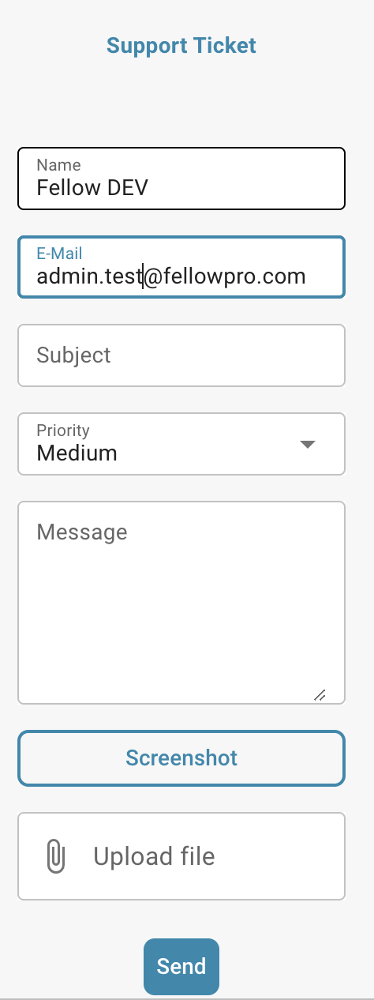<figcaption></figcaption></figure>

### **Logi skryptów dokumentów:**

<figure>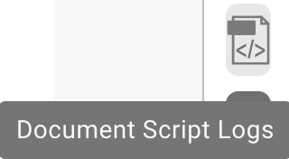<figcaption></figcaption></figure>

Skrypty można tworzyć w ustawieniach w sekcji Typy dokumentów; te informacje będą następnie wyświetlane tutaj.

* **Logi skryptów dokumentów:**
  * **Cel:** Wyświetla logi związane ze skryptami, które zostały wdrożone dla różnych typów dokumentów.
  * **Przypadek użycia:** Przydatne do śledzenia i debugowania działań skryptów na dokumentach, pomagając użytkownikom zrozumieć procesy automatyczne i poprawić wszelkie problemy.

<figure>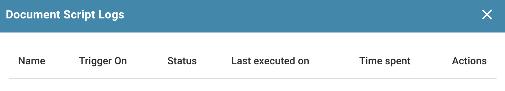<figcaption></figcaption></figure>

### **Więcej ustawień:**

<figure><figcaption></figcaption></figure>

### **Przepływ dokumentu:**

Tam znajdziesz przepływ dokumentu

* **Cel:** Pokazuje sekwencję i postęp przetwarzania dokumentu w systemie.
* **Przypadek użycia:** Pomaga w śledzeniu statusu dokumentu przez różne etapy, zapewniając, że wszystkie niezbędne kroki przetwarzania są przestrzegane.

### **Przejdź do szablonu układu:**

* Dzięki tej opcji zostaniesz przekierowany i możesz edytować swój układ lub użyć domyślnego szablonu
* **Przejdź do szablonu układu:**
  * **Cel:** Przekierowuje użytkowników do edytora układu, gdzie mogą modyfikować istniejące szablony lub zastosować domyślny.
  * **Przypadek użycia:** Umożliwia dostosowanie układów dokumentów do spełnienia specyficznych potrzeb biznesowych lub preferencji, poprawiając wizualne i funkcjonalne dopasowanie dokumentu do standardów firmy.

### Użyj E-Text, jeśli dostępne

* **Cel:** Umożliwia DocBits korzystanie z e-text dla wszystkich dokumentów od konkretnego dostawcy, jeśli jest dostępny, poprawiając dokładność ekstrakcji.
* **Przykład użycia:** Zwiększa ekstrakcję tekstu, wykorzystując osadzone teksty zamiast OCR, co może prowadzić do dokładniejszych wyników dla tego dostawcy.

### [Model AI oparty na dostawcy](supplier-specific-ai-model-for-field-and-table-extraction.md)

* **Cel:** Umożliwia wybór pomiędzy trzema różnymi modelami AI w celu optymalizacji wyników ekstrakcji dla konkretnego dostawcy.
* **Przykład użycia:** Zapewnia lepszą dokładność ekstrakcji, wybierając najbardziej odpowiedni model AI dla struktury dokumentu i treści każdego dostawcy.
