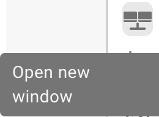

# Écran de validation



## Vue d'ensemble

<figure><figcaption></figcaption></figure>

### **Bouton Enregistrer:**

<figure><figcaption></figcaption></figure>

* **Bouton Enregistrer:**
  * **Objectif :** Enregistre l'état actuel du document ou du script en cours de travail.
  * **Cas d'utilisation :** Après avoir apporté des modifications ou des annotations à un document, utilisez ce bouton pour vous assurer que toutes les modifications sont enregistrées.

### **Ajouter des règles spéciales:**

<figure><figcaption></figcaption></figure>

<figure><figcaption></figcaption></figure>

* **Ajouter des règles spéciales / Ajouter un script dans DocBits :**
  * **Objectif :** Permet aux utilisateurs de mettre en œuvre des règles ou des scripts spécifiques qui personnalisent le traitement des documents.
  * **Cas d'utilisation :** Utilisez cette fonctionnalité pour automatiser des tâches telles que l'extraction de données ou la validation de format, améliorant ainsi l'efficacité du flux de travail.


Voir ici ajouter [Script dans DocBits](../../../administration-and-setup/settings/global-settings/document-types/script/scripting-in-docbits/)


### **Champs flous:**

<figure><figcaption></figcaption></figure>

* **Champs flous:**
  * **Objectif:** Aide à identifier et corriger les champs où les données peuvent ne pas correspondre parfaitement mais sont suffisamment proches.
  * **Cas d'utilisation:** Utile dans les processus de validation de données où des correspondances exactes ne sont pas toujours possibles, comme des noms ou adresses légèrement mal orthographiés.

### **Champs obligatoires:**

<figure><figcaption></figcaption></figure>

Il y a des champs requis pour une édition ultérieure, ceux-ci peuvent être modifiés dans les paramètres.

Utilisez l'info-bulle pour savoir si:

* Est-ce un champ obligatoire (requis)
* Validation requise
* Faible confiance
* Inadéquation du montant total des taxes

**Champs obligatoires:**

* **Objectif :** Identifie les champs obligatoires dans les documents qui doivent être remplis ou corrigés avant un traitement ultérieur.
* **Cas d'utilisation :** Assure que les données essentielles sont capturées avec précision, maintenant l'intégrité des données et la conformité aux règles de l'entreprise.

<figure><figcaption></figcaption></figure>

### **Loupe:**

<figure><figcaption></figcaption></figure>

* **Loupe:**
  * **Objectif:** Fournit une vue agrandie d'une zone sélectionnée du document.
  * **Cas d'utilisation:** Aide à examiner les détails fins ou les petits textes dans les documents, assurant l'exactitude de la saisie ou de la révision des données.

<figure><figcaption></figcaption></figure>

### **Ouvrir une nouvelle fenêtre:**

<figure><figcaption></figcaption></figure>

* **Ouvrir une nouvelle fenêtre:**
  * **Objectif:** Ouvre une nouvelle fenêtre pour une comparaison de documents côte à côte ou pour le multitâche.
  * **Cas d'utilisation:** Utile lors de la comparaison de deux documents ou lors de la consultation d'informations supplémentaires sans quitter le document actuel.

### **Raccourcis clavier:**

<figure><figcaption></figcaption></figure>

* **Raccourcis clavier:**
  * **Objectif:** Permet aux utilisateurs d'effectuer des actions rapidement à l'aide de combinaisons de touches.
  * **Cas d'utilisation:** Améliore la rapidité et l'efficacité de la navigation et du traitement des documents en minimisant la dépendance à la navigation à la souris.

<figure><figcaption></figcaption></figure>

### **Tâches:**

<figure><figcaption></figcaption></figure>

Pour partager des informations internes, vous pouvez créer des tâches et les attribuer à un employé ou un groupe spécifique au sein de l'entreprise.

* **Tâches:**
  * **Objectif:** Permet aux utilisateurs de créer des tâches liées aux documents et de les attribuer aux membres de l'équipe.
  * **Cas d'utilisation:** Facilite la collaboration et la gestion des tâches au sein des équipes, assurant que chacun connaît ses responsabilités.

<figure><figcaption></figcaption></figure>

### **Mode annotation:**

<figure><figcaption></figcaption></figure>

<figure><figcaption></figcaption></figure>

Vous pouvez laisser des annotations sur un document. Cela peut être utile pour laisser des informations à d'autres utilisateurs qui éditeront ce document par la suite.

* **Mode annotation:**
  * **Objectif :** Permet aux utilisateurs de laisser des notes ou des annotations directement sur le document.
  * **Cas d'utilisation:** Utile pour fournir des commentaires, des instructions ou des notes importantes à d'autres membres de l'équipe qui travailleront sur le document plus tard.

### **Fusionner:**

<figure><figcaption></figcaption></figure>

Les documents peuvent être fusionnés ici, par exemple si une page d'une facture manquait, ces pages peuvent être fusionnées plus tard de cette manière sans que le document entier doive être supprimé ou re-téléchargé.

* **Fusionner des documents:**
  * **Objectif:** Combine plusieurs documents en un seul fichier.
  * **Cas d'utilisation:** Pratique dans les scénarios où des parties d'un document sont numérisées séparément et doivent être consolidées.

### **Vue OCR:**

<figure><figcaption></figcaption></figure>

Dans la vue OCR, le texte est automatiquement filtré du document. Cela est utilisé pour reconnaître des caractéristiques pertinentes, telles que le code postal, le numéro de contrat, le numéro de facture et le tri d'un document.

* **Vue OCR:**
  * **Objectif:** Reconnaît automatiquement le texte dans les documents à l'aide de la technologie de reconnaissance optique de caractères.
  * **Cas d'utilisation:** Rationalise le processus de numérisation des textes imprimés ou manuscrits, les rendant consultables et modifiables.

<figure><figcaption></figcaption></figure>

### **Créer un ticket:**

<figure><figcaption></figcaption></figure>

Contrairement aux tâches qui sont transmises en interne au sein de l'entreprise, ce ticket de support est important pour nous notifier et créer immédiatement un ticket en cas d'erreurs et/ou de divergences. Cela rend le processus beaucoup plus facile car vous pouvez immédiatement envoyer le bug avec le document approprié. Il y a aussi l'option de définir la priorité, de prendre une capture d'écran du document ou d'en télécharger une.

* **Créer un ticket:**
  * **Objectif:** Permet aux utilisateurs de signaler des problèmes ou des divergences en créant un ticket de support.
  * **Cas d'utilisation:** Essentiel pour une résolution rapide des problèmes et des bugs, aidant à maintenir l'intégrité et le bon fonctionnement du système.

<figure><figcaption></figcaption></figure>

### **Journaux de scripts de documents:**

<figure><figcaption></figcaption></figure>

Les scripts peuvent être créés dans les paramètres sous Types de documents ; ces informations seront ensuite affichées ici.

* **Journaux de scripts de documents:**
  * **Objectif:** Affiche les journaux liés aux scripts qui ont été mis en œuvre pour différents types de documents.
  * **Cas d'utilisation:** Utile pour suivre et déboguer les actions des scripts sur les documents, aidant les utilisateurs à comprendre les processus automatisés et à corriger les éventuels problèmes.

<figure><figcaption></figcaption></figure>

### **Plus de paramètres:**

<figure><figcaption></figcaption></figure>

### **Flux de documents:**

Vous y trouverez le flux du document

* **Objectif:** Montre la séquence et la progression du traitement des documents dans le système.
* **Cas d'utilisation:** Aide à suivre le statut du document à travers différentes étapes, assurant que toutes les étapes de traitement nécessaires sont suivies.

### **Aller au modèle de mise en page:**

* Avec cette option, vous serez redirigé et pourrez éditer votre mise en page ou utiliser le modèle par défaut
* **Aller au modèle de mise en page:**
  * **Objectif:** Redirige les utilisateurs vers un éditeur de mise en page où ils peuvent modifier les modèles existants ou appliquer un modèle par défaut.
  * **Cas d'utilisation:** Permet la personnalisation des mises en page de documents pour répondre à des besoins ou préférences spécifiques de l'entreprise, améliorant l'alignement visuel et fonctionnel du document avec les normes de l'entreprise.

### Utiliser E-Text si Disponible

* **Objectif :** Permet à DocBits d'utiliser le texte électronique pour tous les documents d'un fournisseur spécifique si disponible, améliorant ainsi la précision de l'extraction.
* **Cas d'utilisation :** Améliore l'extraction de texte en tirant parti du texte intégré au lieu de l'OCR, ce qui peut conduire à des résultats plus précis pour ce fournisseur.

### [Modèle AI Basé sur le Fournisseur](supplier-specific-ai-model-for-field-and-table-extraction.md)

* **Objectif :** Permet de choisir entre trois modèles AI différents pour optimiser les résultats d'extraction pour un fournisseur spécifique.
* **Cas d'utilisation :** Assure une meilleure précision d'extraction en choisissant le modèle AI le plus adapté à la structure et au contenu des documents de chaque fournisseur.
