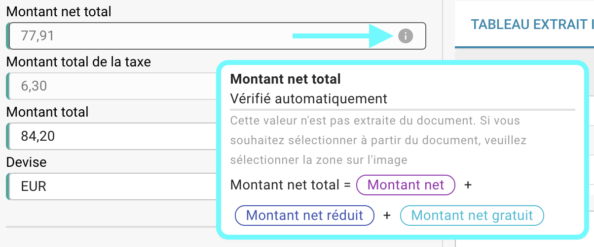

# Vérifications automatiques sur l'écran de validation

## Aperçu

Par défaut, des champs spécifiques dans le processus de validation des champs sont automatiquement vérifiés en vérifiant leurs valeurs à l'aide de formules basées sur d'autres valeurs extraites. Sur cette page, vous pouvez trouver les formulaires utilisés pour ces calculs automatiques.

Vous pouvez toujours vérifier la formule utilisée en survolant l'icône d'information.

<figure><figcaption></figcaption></figure>

<mark style="color:red;">**Remarque :**</mark> L'icône d'information n'est visible que si une valeur a été extraite pour le champ correspondant.

## Formulaires pour les vérifications automatiques :

### Montant net :

```
Montant net = Montant de la taxe * 100 / Taux de TVA 
```

### Taux de TVA :

```
Taux de TVA = Montant de la taxe * 100 / Montant net 
```

### Montant de la taxe :

```
Montant de la taxe = Montant net + Taux de TVA / 100
```

### Montant net réduit :

```
Montant net réduit = Montant de la taxe réduite * 100 / Taux de TVA réduit
```

### Taux de TVA réduit :

```
Taux de TVA réduit = Montant de la taxe réduite * 100 / Montant net réduit
```

### Montant de la taxe réduite :

```
Montant de la taxe réduite = Montant de la taxe réduite + Taux de TVA réduit / 100
```

### Montant net total :

```
Montant net total = Montant net + Montant de la taxe réduite + Montant net gratuit
```

### Montant net total US :

```
Montant net total US = Montant net + Frais d'expédition + Frais divers + Montant supplémentaire
```

### Montant total de la taxe :

```
Montant total de la taxe = Montant de la taxe + Montant de la taxe réduite + Montant de la taxe gratuite 
```

### Montant total :

```
Montant total = Montant net + Montant de la taxe
```

<mark style="color:red;">**Remarque :**</mark> Si la valeur extraite et la valeur validée ne correspondent pas, le document ne peut pas être traité davantage. Une erreur **Incohérence des montants** apparaîtra pour le champ correspondant.
