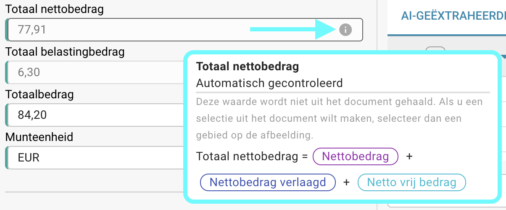

# Automatische controles op het validatiescherm

## Overzicht

Standaard worden specifieke velden in het validatieproces automatisch gecontroleerd door hun waarden te verifiëren met formules op basis van andere geëxtraheerde waarden. Op deze pagina vind je de formulieren die worden gebruikt voor deze automatische berekeningen.

Je kunt altijd de gebruikte formule verifiëren door met de muis over het info-icoon te bewegen.

<figure><figcaption></figcaption></figure>

<mark style="color:red;">**Opmerking:**</mark> Het info-icoon is alleen zichtbaar als er een waarde is geëxtraheerd voor het overeenkomstige veld.

## Formulieren voor automatische controles:

### Nettobedrag:

```
Nettobedrag = Belastingbedrag * 100 / BTW-tarief 
```

### BTW-tarief:

```
BTW-tarief = Belastingbedrag * 100 / Nettobedrag 
```

### Belastingbedrag:

```
Belastingbedrag = Nettobedrag + BTW-tarief / 100
```

### Nettobedrag verlaagd:

```
Nettobedrag verlaagd = Verlaagd belastingbedrag * 100 / BTW-tarief verlaagd
```

### BTW-tarief verlaagd:

```
BTW-tarief verlaagd = Verlaagd belastingbedrag * 100 / Nettobedrag verlaagd
```

### Belastingbedrag verlaagd:

```
Belastingbedrag verlaagd = Verlaagd belastingbedrag + BTW-tarief verlaagd / 100
```

### Totaal nettobedrag:

```
Totaal nettobedrag = Nettobedrag + Verlaagd belastingbedrag + Netto vrij bedrag
```

### Totaal nettobedrag VS:

```
Totaal nettobedrag VS = Nettobedrag + Verzendkosten + Diverse kosten + Extra bedrag
```

### Totaal belastingbedrag:

```
Totaal belastingbedrag = Belastingbedrag + Verlaagd belastingbedrag + Belastingbedrag vrij 
```

### Totaalbedrag:

```
Totaalbedrag = Nettobedrag + Belastingbedrag
```

<mark style="color:red;">**Opmerking:**</mark> Als de geëxtraheerde waarde en de gevalideerde waarde niet overeenkomen, kan het document niet verder worden verwerkt. Een **Bedragen Mismatch** fout zal verschijnen voor het overeenkomstige veld.
