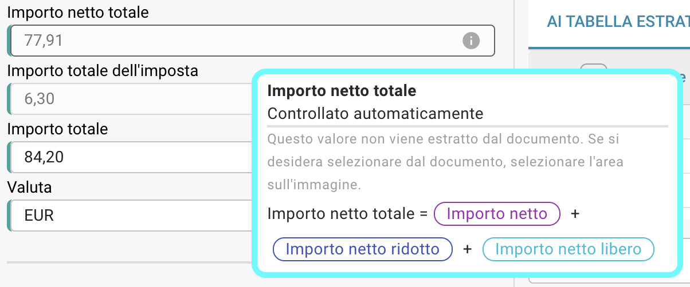

# Controlli automatici nella schermata di validazione

## Panoramica

Per impostazione predefinita, specifici campi nel processo di validazione dei campi vengono controllati automaticamente verificando i loro valori utilizzando formule basate su altri valori estratti. In questa pagina, puoi trovare le formule utilizzate per questi calcoli automatici.

Puoi sempre verificare la formula utilizzata passando il mouse sopra l'icona delle informazioni.

<figure><figcaption></figcaption></figure>

<mark style="color:red;">**Nota:**</mark> L'icona delle informazioni è visibile solo se è stato estratto un valore per il campo corrispondente.

## Formule per controlli automatici:

### Importo netto:

```
Importo netto = Importo dell'imposta * 100 / Aliquota IVA 
```

### Aliquota IVA:

```
Aliquota IVA = Importo dell'imposta * 100 / Importo netto 
```

### Importo dell'imposta:

```
Importo dell'imposta = Importo netto + Aliquota IVA / 100
```

### Importo netto ridotto:

```
Importo netto ridotto = Importo dell'imposta ridotto * 100 / Aliquota IVA ridotta
```

### Aliquota IVA ridotta:

```
Aliquota IVA ridotta = Importo dell'imposta ridotto * 100 / Importo netto ridotto
```

### Importo dell'imposta ridotto:

```
Importo dell'imposta ridotto = Importo dell'imposta ridotto + Aliquota IVA ridotta / 100
```

### Importo netto totale:

```
Importo netto totale = Importo netto + Importo dell'imposta ridotto + Importo netto libero
```

### Importo netto totale US:

```
Importo netto totale US = Importo netto + Spese di spedizione + Spese varie + Importo aggiuntivo
```

### Importo totale dell'imposta:

```
Importo totale dell'imposta = Importo dell'imposta + Importo dell'imposta ridotto + Importo dell'imposta libero 
```

### Importo totale:

```
Importo totale = Importo netto + Importo dell'imposta
```

<mark style="color:red;">**Nota:**</mark> Se il valore estratto e il valore validato non corrispondono, il documento non può essere elaborato ulteriormente. Si verificherà un errore di **Discrepanza degli importi** per il campo corrispondente.
