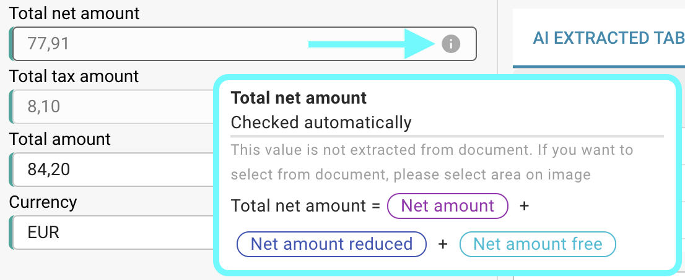

# Verificações Automáticas na Tela de Validação

## Visão Geral

Por padrão, campos específicos no processo de validação de campos são verificados automaticamente, validando seus valores usando fórmulas baseadas em outros valores extraídos. Nesta página, você pode encontrar os formulários usados para esses cálculos automáticos.

Você sempre pode verificar a fórmula utilizada passando o mouse sobre o ícone de informação.

<figure><figcaption></figcaption></figure>

<mark style="color:red;">**Nota:**</mark> O ícone de informação só é visível se um valor tiver sido extraído para o campo correspondente.

## Formulários para verificações automáticas:

### Kwota netto:

```
Kwota netto = Kwota podatku * 100 / Stawka VAT 
```

### Stawka VAT:

```
Stawka VAT = Kwota podatku * 100 / Kwota netto 
```

### Kwota podatku:

```
Kwota podatku = Kwota netto + Stawka VAT / 100
```

### Kwota netto zmniejszona:

```
Kwota netto zmniejszona = Obniżona kwota podatku * 100 / Obniżona stawka VAT
```

### Obniżona stawka VAT:

```
Obniżona stawka VAT = Obniżona kwota podatku * 100 / Kwota netto zmniejszona
```

### Obniżona kwota podatku:

```
Obniżona kwota podatku = Obniżona kwota podatku + Obniżona stawka VAT / 100
```

### Całkowita kwota netto:

```
Całkowita kwota netto = Kwota netto + Obniżona kwota podatku + Kwota netto wolna
```

### Całkowita kwota netto w USA:

```
Całkowita kwota netto w USA = Kwota netto + Koszty wysyłki + Opłaty różne + Dodatkowa kwota
```

### Całkowita kwota podatku:

```
Całkowita kwota podatku = Kwota podatku + Obniżona kwota podatku + Kwota podatku wolna 
```

### Całkowita kwota:

```
Całkowita kwota = Kwota netto + Kwota podatku
```

<mark style="color:red;">**Nota:**</mark> Se o valor extraído e o valor validado não corresponderem, o documento não pode ser processado. Um erro de **Incompatibilidade de Valores** aparecerá para o campo correspondente.
