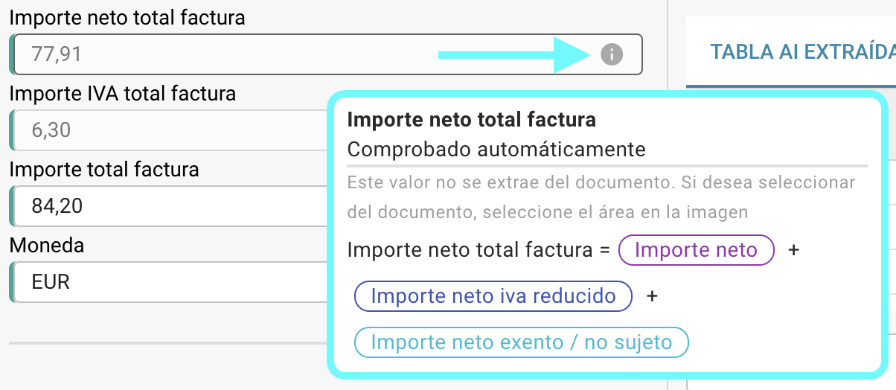

# Comprobaciones Automáticas en la Pantalla de Validación

## Descripción General

Por defecto, campos específicos en el proceso de validación de campos se verifican automáticamente al comprobar sus valores utilizando fórmulas basadas en otros valores extraídos. En esta página, puedes encontrar los formularios utilizados para estos cálculos automáticos.

Siempre puedes verificar la fórmula utilizada al pasar el cursor sobre el icono de información.

<figure><figcaption></figcaption></figure>

<mark style="color:red;">**Nota:**</mark> El icono de información solo es visible si se ha extraído un valor para el campo correspondiente.

## Formularios para comprobaciones automáticas:

### Importe neto:

```
Importe neto = Importe iva * 100 / % iva 
```

### % iva:

```
% iva = Importe iva * 100 / Importe neto 
```

### Importe iva:

```
Importe iva = Importe neto + % iva / 100
```

### Importe neto iva reducido:

```
Importe neto iva reducido = Importe iva reducido * 100 / % iva reducido
```

### % iva reducido:

```
% iva reducido = Importe iva reducido * 100 / Importe neto iva reducido
```

### Importe iva reducido:

```
Importe iva reducido = Importe iva reducido + % iva reducido / 100
```

### Importe neto total factura:

```
Importe neto total factura = Importe neto + Importe iva reducido + Importe neto exento / no sujeto
```

### Importe neto total factura US:

```
Importe neto total factura US = Importe neto + Gastos de envío + Gastos varios + Importe adicional
```

### Importe IVA total factura:

```
Importe IVA total factura = Importe iva + Importe iva reducido + Importe iva exento 
```

### Importe total factura:

```
Importe total factura = Importe neto + Importe iva
```

<mark style="color:red;">**Nota:**</mark> Si el valor extraído y el valor validado no coinciden, el documento no puede ser procesado. Aparecerá un error de **Desajuste de Montos** para el campo correspondiente.
