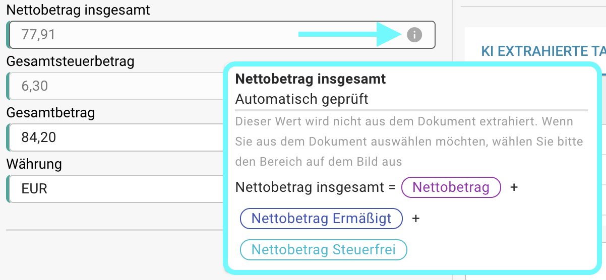

# Automatische Überprüfungen im Validierungsbildschirm

## Übersicht

Standardmäßig werden bestimmte Felder im Validierungsprozess automatisch überprüft, indem ihre Werte mithilfe von Formeln, die auf anderen extrahierten Werten basieren, verifiziert werden. Auf dieser Seite finden Sie die Formulare, die für diese automatischen Berechnungen verwendet werden.

Sie können die verwendete Formel jederzeit überprüfen, indem Sie über das Info-Symbol fahren.

<figure><figcaption></figcaption></figure>

<mark style="color:red;">**Hinweis:**</mark> Das Info-Symbol ist nur sichtbar, wenn ein Wert für das entsprechende Feld extrahiert wurde.

## Formulare für automatische Überprüfungen:

### Nettobetrag:

```
Nettobetrag = Steuerbetrag * 100 / Mehrwertsteuersatz 
```

### Mehrwertsteuersatz:

```
Mehrwertsteuersatz = Steuerbetrag * 100 / Nettobetrag 
```

### Steuerbetrag:

```
Steuerbetrag = Nettobetrag + Mehrwertsteuersatz / 100
```

### Nettobetrag Ermäßigt:

```
Nettobetrag Ermäßigt = Ermäßigter Steuerbetrag * 100 / Mehrwertsteuersatz Ermäßigt
```

### Mehrwertsteuersatz Ermäßigt:

```
Mehrwertsteuersatz Ermäßigt = Ermäßigter Steuerbetrag * 100 / Nettobetrag Ermäßigt
```

### Ermäßigter Steuerbetrag:

```
Ermäßigter Steuerbetrag = Ermäßigter Steuerbetrag + Mehrwertsteuersatz Ermäßigt / 100
```

### Nettobetrag insgesamt:

```
Nettobetrag insgesamt = Nettobetrag + Ermäßigter Steuerbetrag + Nettobetrag Steuerfrei
```

### Nettobetrag insgesamt US:

```
Nettobetrag insgesamt US = Nettobetrag + Versandkosten + Sonstige Kosten + Zusätzlicher Betrag
```

### Gesamtsteuerbetrag:

```
Gesamtsteuerbetrag = Steuerbetrag + Ermäßigter Steuerbetrag + Steuerbetrag Steuerfrei 
```

### Gesamtbetrag:

```
Gesamtbetrag = Nettobetrag + Steuerbetrag
```

<mark style="color:red;">**Hinweis:**</mark> Wenn der extrahierte Wert und der validierte Wert nicht übereinstimmen, kann das Dokument nicht weiter verarbeitet werden. Ein **Betragsabweichung**-Fehler wird für das entsprechende Feld angezeigt.
