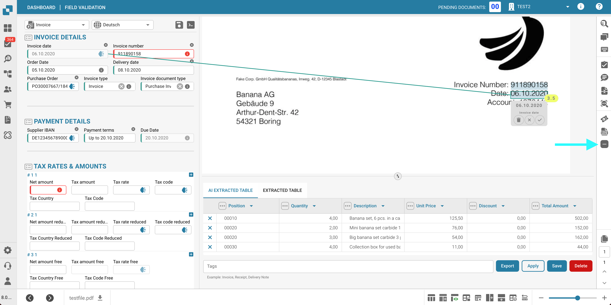
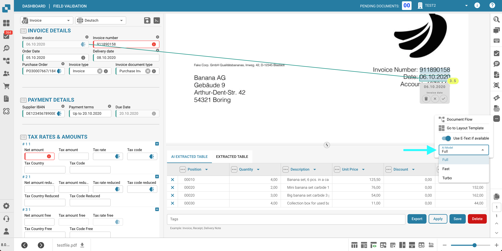

# Selecting a Supplier-Specific AI Model for Field and Table Extraction

In the tools section of the **Validation screen**, you can choose the AI model used for **Field Extraction** and **Table Extraction**.\
The selected **AI model** is applied to all documents for the current supplier only.

To change the model, open the options menu by clicking the **three dots** on the right side of the screen, then choose one of the available models: 

* **Full** – Costs 2 tokens
* **Fast** – Costs 1 token
* **Turbo** – Costs 1 token

<figure><figcaption></figcaption></figure>

<figure><figcaption></figcaption></figure>

If the **field extraction** or **table extraction** results are not satisfactory, try switching to another model to improve accuracy.

To configure the AI model **globally for suppliers without a custom model** or to **manage which model is active for each supplier**, please refer to the corresponding documentation [**here**](../../../administration-and-setup/settings/document-processing/classification-and-extraction/ai-model.md).

