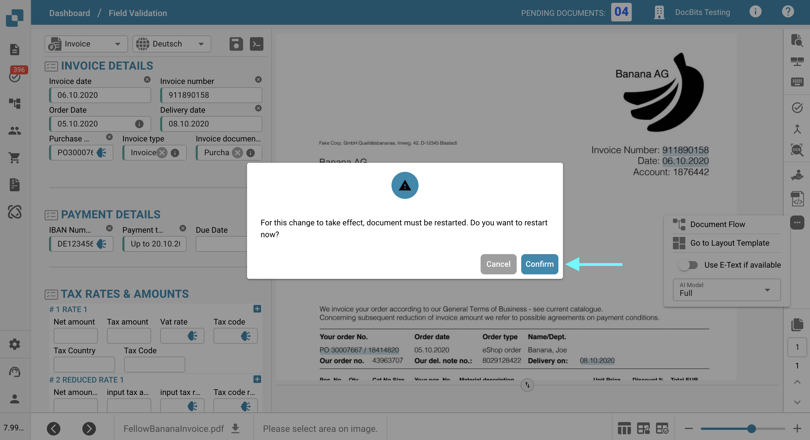
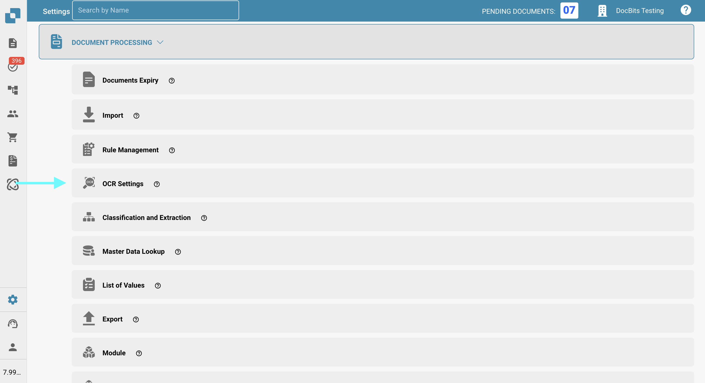
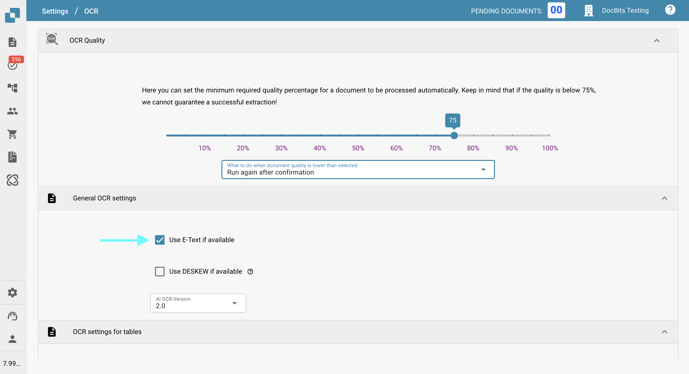

# Missing Text in OCR Extraction

## **Issue**

In some cases, text may appear to be missing in the **OCR View**, which prevents it from being extracted using the extraction feature.

<figure><figcaption></figcaption></figure>

To verify this, click the **OCR View** button in the toolbar on the right. If the text does not appear there, it means it is not available for extraction.

<figure><figcaption></figcaption></figure>

## **Cause**

The most likely cause is that the text you’re trying to extract is part of an image (e.g. a logo or scanned section) within the document.\
When the **E-Text** feature is enabled, text that appears on images or logos is not included in the extracted text layer. As a result, this text cannot be accessed or extracted through standard extraction logic.

## **Fix**

To resolve this issue, disable the **E-Text** feature—either for the [specific supplier](missing-text-in-ocr-extraction.md#disable-e-text-for-a-specific-supplier) or for the [entire organization](missing-text-in-ocr-extraction.md#disable-e-text-for-the-entire-organization). Once E-Text is deactivated, DocBits will rely solely on OCR, which is capable of extracting text from images and logos within the document.

### **Disable E-Text for a Specific Supplier**

1. Open a document from the specific supplier in the **Field Validation**.
2.  Click the three-dot menu in the toolbar on the right.

    <figure><figcaption></figcaption></figure>
3.  Uncheck **Use E-Text if available**.

    <figure><figcaption></figcaption></figure>
4.  Click **Confirm** to restart processing for the document.

    <figure><figcaption></figcaption></figure>

### Disable E-Text for the Entire Organization

1.  Go to **Settings → Document Processing → OCR Settings**.

    <figure><figcaption></figcaption></figure>
2.  Under **General OCR Settings**, uncheck the option **Use E-Text if available**.

    <figure><figcaption></figcaption></figure>

