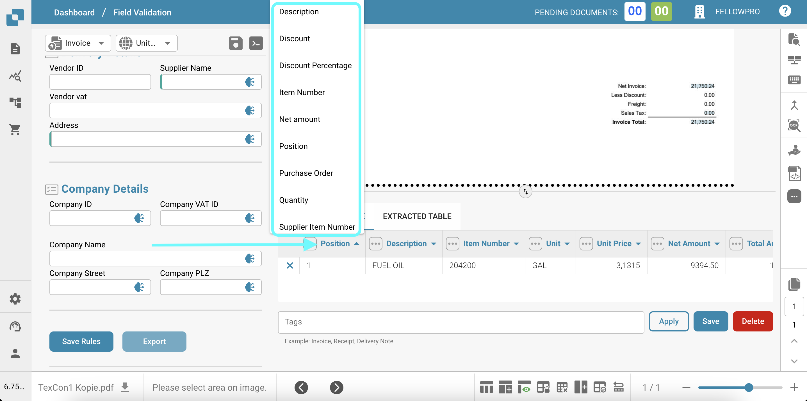

# Tabella AI

La funzionalità Tabella Estratta dall'IA consente agli utenti di manipolare e personalizzare facilmente i dati estratti dal documento della fattura. Ecco le principali capacità e istruzioni sull'uso:

* **Eliminazione delle colonne**: Se determinate colonne nella tabella estratta non sono necessarie, gli utenti possono rimuoverle facilmente facendo clic sull'icona "Elimina colonna" (rappresentata da tre punti verticali) accanto all'intestazione della colonna. Questo aiuta a ripulire la tabella e concentrarsi solo sulle informazioni rilevanti.

<figure><figcaption></figcaption></figure>

* **Modifica del Formato della Valuta**: Il formato della valuta può essere modificato selezionando il formato desiderato dal menu a discesa accanto al campo "Valuta". Ciò garantisce che i valori della valuta siano visualizzati nel formato preferito, rendendo più facile interpretare e analizzare i dati finanziari.

<figure><figcaption></figcaption></figure>

* **Mostrare/Nascondere Colonne Non Mappate**: Per impostazione predefinita, nella tabella sono visibili solo le colonne mappate (colonne con dati estratti). Tuttavia, gli utenti possono scegliere di mostrare o nascondere le colonne non mappate facendo clic sul pulsante "Nascondi colonne non mappate" o "Mostra colonne non mappate" in fondo alla tabella. Questa funzionalità è utile quando gli utenti desiderano esaminare tutte le colonne disponibili, anche se attualmente non contengono dati.

<figure><figcaption></figcaption></figure>

* **Modifica degli Intestazioni della Tabella**: Le intestazioni della tabella (nomi delle colonne) possono essere modificate facendo clic sull'intestazione e inserendo il nome desiderato. Questa funzionalità consente agli utenti di personalizzare i nomi delle colonne per allinearli meglio con la propria terminologia o preferenze, rendendo i dati più leggibili e comprensibili.

<figure><figcaption></figcaption></figure>

Queste funzionalità forniscono agli utenti flessibilità e controllo sui dati estratti, consentendo loro di adattare le informazioni in base alle proprie esigenze e preferenze specifiche. La Tabella Estratta dall'IA mira a migliorare l'esperienza dell'utente offrendo un modo fluido e intuitivo per interagire e analizzare i dati delle fatture.
