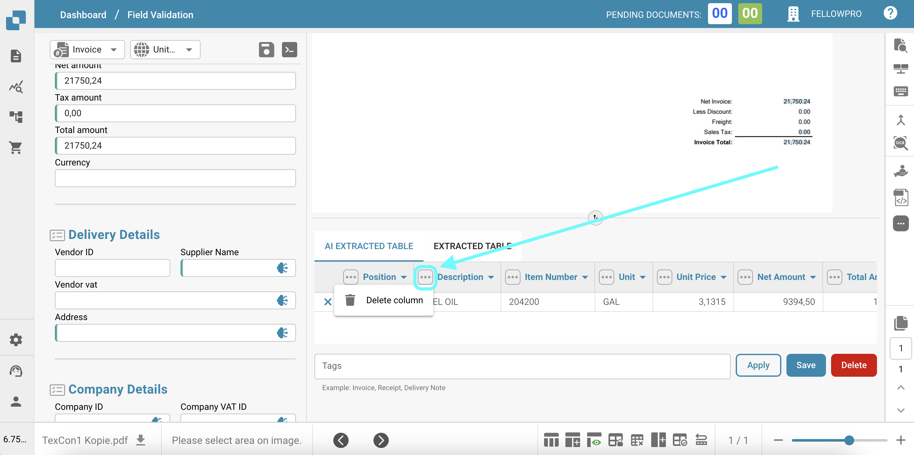
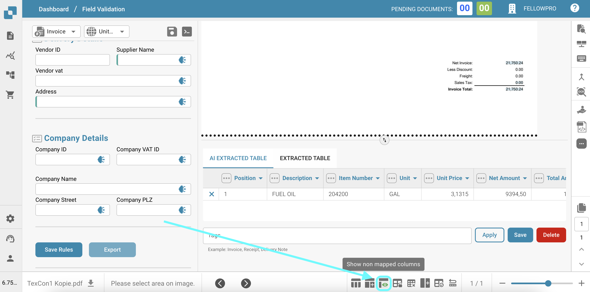

# Tabela de IA

O recurso de Tabela Extraída por IA permite que os usuários manipulem e personalizem facilmente os dados extraídos do documento de fatura. Aqui estão as principais capacidades e instruções de uso:

* **Excluindo Colunas**: Se certas colunas na tabela extraída não forem necessárias, os usuários podem removê-las facilmente clicando no ícone "Excluir coluna" (representado por três pontos verticais) ao lado do cabeçalho da coluna. Isso ajuda a desordenar a tabela e focar apenas nas informações relevantes.

<figure><figcaption></figcaption></figure>

* **Mudando o Formato da Moeda**: O formato da moeda pode ser alterado selecionando o formato desejado no menu suspenso ao lado do campo "Moeda". Isso garante que os valores monetários sejam exibidos no formato preferido, facilitando a interpretação e análise dos dados financeiros.

<figure><figcaption></figcaption></figure>

* **Mostrando/Ocultando Colunas Não Mapeadas**: Por padrão, apenas as colunas mapeadas (colunas com dados extraídos) são visíveis na tabela. No entanto, os usuários podem optar por mostrar ou ocultar as colunas não mapeadas clicando no botão "Ocultar colunas não mapeadas" ou "Mostrar colunas não mapeadas" na parte inferior da tabela. Esse recurso é útil quando os usuários desejam revisar todas as colunas disponíveis, mesmo que atualmente não contenham dados.

<figure><figcaption></figcaption></figure>

* **Mudando os Cabeçalhos da Tabela**: Os cabeçalhos da tabela (nomes das colunas) podem ser modificados clicando no cabeçalho e inserindo o nome desejado. Esse recurso permite que os usuários personalizem os nomes das colunas para alinhar melhor com sua terminologia ou preferências, tornando os dados mais legíveis e compreensíveis.

<figure><figcaption></figcaption></figure>

Esses recursos fornecem aos usuários flexibilidade e controle sobre os dados extraídos, permitindo que personalizem as informações de acordo com suas necessidades e preferências específicas. A Tabela Extraída por IA visa aprimorar a experiência do usuário, oferecendo uma maneira intuitiva e fluida de interagir e analisar os dados da fatura.
