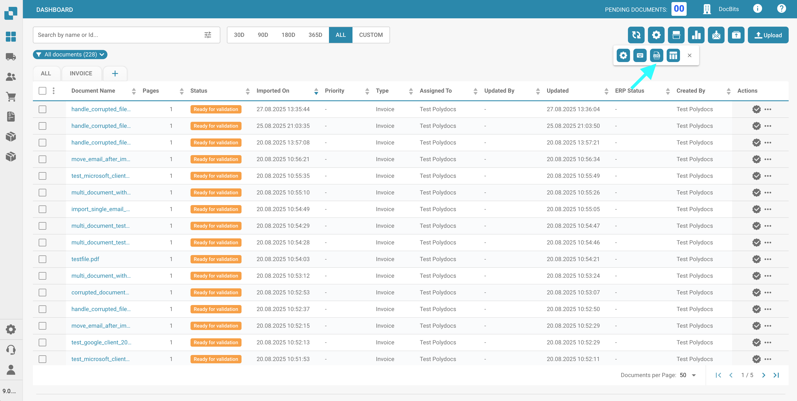
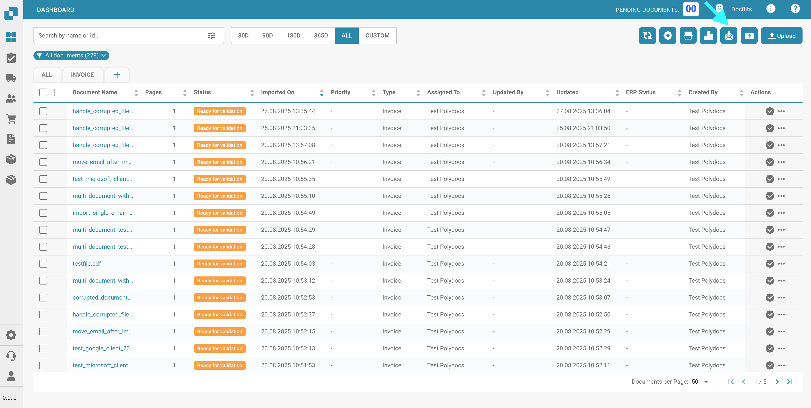

# Dashboard-Tools

Rechts von der Suchleiste finden Sie einige Dashboard-Tools.

<figure><figcaption></figcaption></figure>

## Tabelle aktualisieren:

Klicken Sie auf diese Schaltfläche, um das Dashboard zu aktualisieren und die aktuellsten Daten und Status zu laden.

<figure><figcaption></figcaption></figure>

## Erweiterte Einstellungen:

Klicken Sie auf das Zahnrad-Symbol, um das Menü für die erweiterten Einstellungen zu öffnen.

<figure><figcaption></figcaption></figure>

Im Menü für die erweiterten Einstellungen stehen Ihnen folgende Optionen zur Verfügung:

### Weitere Einstellungen

Verwenden Sie diese Schaltfläche, um auf die Admin-Einstellungen für das Dashboard zuzugreifen. Die vollständige Dokumentation zu diesen Einstellungen finden Sie [hier](../../admin-section/settings/global-settings/dashboard.md).

<figure><figcaption></figcaption></figure>

### Tastaturkurzbefehle

Verwenden Sie diese Schaltfläche, um alle Tastaturkurzbefehle für das Dashboard anzuzeigen. Detaillierte Erklärungen zu jedem Kurzbefehlen finden Sie [hier](../../end-user-and-partner-section/end-user-section/dashboard/keyboard-shortcuts.md).

<figure><figcaption></figcaption></figure>

### Import-Log

Verwenden Sie diese Schaltfläche, um eine Tabelle zu öffnen, die alle kürzlich per E-Mail importierten Dokumente sowie relevante Informationen für jedes anzeigt.

<figure><figcaption></figcaption></figure>

<figure><figcaption></figcaption></figure>

Sie können die Protokolle nach Betreff oder Absender filtern, die Spalten in aufsteigender oder absteigender Reihenfolge sortieren, indem Sie auf die Spaltenüberschriften klicken, und sie mit Drag-and-Drop neu anordnen.

### Tabellenspalten für die Organisation festlegen

<figure><figcaption></figcaption></figure>

Klicken Sie auf diese Schaltfläche, um ein Menü zu öffnen, in dem Sie die Sichtbarkeit der Dashboard-Spalten verwalten können. Wählen Sie Spaltennamen aus und verwenden Sie die Pfeile, um sie zur Dashboard-Ansicht hinzuzufügen oder zu entfernen. Klicken Sie auf 'Erledigt', um Ihre Änderungen zu speichern.

<figure><figcaption></figcaption></figure>

Sie können die Spaltenreihenfolge festlegen, indem Sie auf die Punkte neben einem Spaltennamen klicken und ihn an die gewünschte Position ziehen.

#### Fügen Sie Felder aus einem Dokumenttyp als Spalten im Dashboard hinzu.

Sie haben auch die Möglichkeit, zusätzliche Spalten aus bestimmten Feldern bestimmter Dokumenttypen hinzuzufügen, um Ihre Dashboard-Ansicht anzupassen. Klicken Sie dazu einfach auf 'Feld aus Dokumenttyp hinzufügen'.

<figure><figcaption></figcaption></figure>

Wählen Sie einen Dokumenttyp aus, um zu sehen, welche Felder für den ausgewählten Typ verfügbar sind. Für jeden Dokumenttyp gibt es unterschiedliche Felder, die Sie hinzufügen können. Sie können ein bestimmtes Feld mit der Suchleiste oben suchen.

<figure><figcaption></figcaption></figure>

Wählen Sie die Felder aus, die Sie als Spalten anzeigen möchten, und klicken Sie dann auf 'Zu sichtbaren Spalten hinzufügen'. Die ausgewählten Felder erscheinen als Spalten im Dashboard und zeigen ihre entsprechenden Werte an.

### Dashboard-Sortierung für die Organisation festlegen

<figure><figcaption></figcaption></figure>

<figure><figcaption></figcaption></figure>

Verwenden Sie diese Schaltfläche, um die Standard-Sortierreihenfolge für Spalten im Dashboard festzulegen. Wählen Sie die Spalte aus und wählen Sie die Sortierreihenfolge (aufsteigend oder absteigend), und klicken Sie dann auf 'Erledigt'. Sie können die Sortierung für alle aktiven Spalten im Dashboard konfigurieren.

### Dokumente filtern:

Sie können Dokumente nach Tag, Woche, Monat, Jahr filtern oder alle anzeigen, indem Sie auf den gewünschten Zeitraum klicken. Die Filterung basiert auf der Importzeit des Dokuments.

<figure><figcaption></figcaption></figure>

## Dokument scannen:

Verwenden Sie diese Schaltfläche, um ein Dokument direkt zu scannen.

<figure><figcaption></figcaption></figure>

<figure><figcaption></figcaption></figure>

Um diese Funktion zu nutzen, müssen Sie einen Scanner an Ihr System angeschlossen haben. Wenn ein Scanner verfügbar ist, können Sie ihn rechts auswählen, Ihr Dokument benennen und auf 'Scannen' klicken. Optional können Sie die Scaneinstellungen rechts anpassen, bevor Sie den Vorgang starten.

<mark style="color:red;">**Hinweis:**</mark> Diese Funktion muss unter Einstellungen -> Verarbeitung von Dokumenten/Modul -> Dokumenttyp/Dokument scannen aktiviert werden

<figure><figcaption></figcaption></figure>

## Analytik:

Wenn Sie auf diese Schaltfläche klicken, wird ein neuer Bereich angezeigt, der die aktuelle Anzahl der Dokumente in jeder Kategorie anzeigt.

<figure><figcaption></figcaption></figure>

<figure><figcaption></figcaption></figure>

Klicken Sie auf eine beliebige Kategorie, um die Dokumente nach dieser spezifischen Kategorie zu filtern.

## E-Mail-Import starten:

Wenn Sie auf diese Schaltfläche klicken, wird Ihr E-Mail-Posteingang gemäß der E-Mail-Importkonfiguration überprüft und alle neuen Dokumente importiert.

<figure><figcaption></figcaption></figure>

## Diese Tabelle exportieren:

Verwenden Sie diese Schaltfläche, um alle Dokumente, die derzeit im Dashboard angezeigt werden, basierend auf der Anzahl der pro Seite angezeigten Dokumente zu exportieren.

<figure><figcaption></figcaption></figure>

<mark style="color:red;">**Hinweis:**</mark> Diese Funktion muss unter Einstellungen -> Verarbeitung von Dokumenten/Modul -> Dokumenttyp/Dashboard-Daten exportieren aktiviert werden

<figure><figcaption></figcaption></figure>

## Hochladen:

Klicken Sie auf diese Schaltfläche, um manuell eine oder mehrere Dateien hochzuladen.

<figure><figcaption></figcaption></figure>

<figure><figcaption></figcaption></figure>

Sie können Dateien entweder in das Popup-Fenster ziehen und ablegen oder auf 'Dokumente hochladen' klicken, um sie im Datei-Explorer auszuwählen.

## Debugging-Modus

Sie können den Debugging-Modus aktivieren, um eine zusätzliche Option zu erhalten.\
Um auf den Debug-Modus zuzugreifen, fügen Sie einfach `?debug=true` zur URL hinzu. Jetzt sollten Sie eine zusätzliche Option haben.

<figure><figcaption></figcaption></figure>

### Show loading times

<figure><figcaption></figcaption></figure>

Wenn Sie auf diese Schaltfläche klicken, wird ein Popup-Fenster geöffnet, das die Ladezeiten für jeden Dienst anzeigt, wobei die gesamte Ladezeit unten angezeigt wird.

<figure><figcaption></figcaption></figure>
