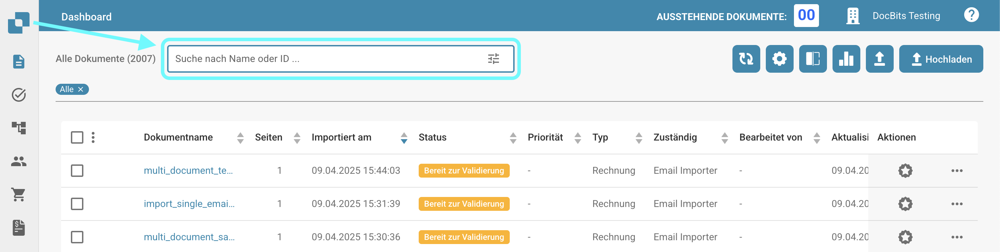
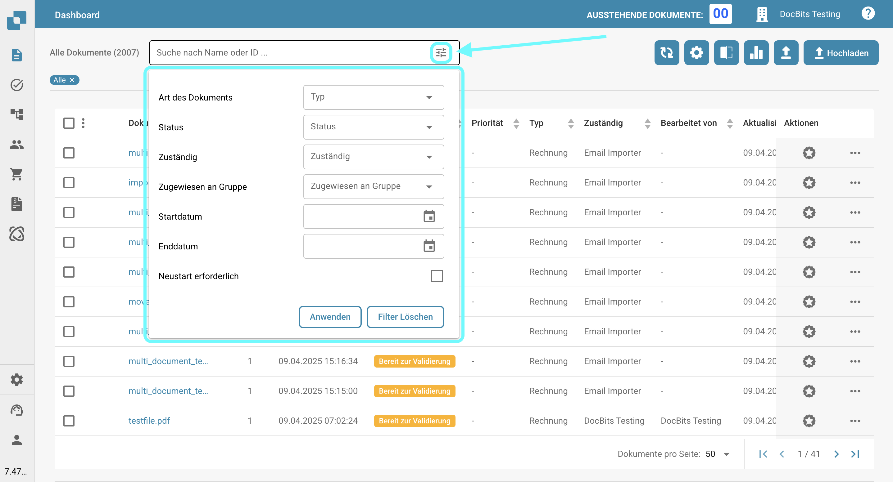

# Dokumente filtern

Sie können nach bestimmten Dokumenten suchen, indem Sie den Dokumentnamen oder die ID in die Suchleiste eingeben, wie unten gezeigt.

<figure><figcaption></figcaption></figure>

Für eine verfeinerte Filterung klicken Sie auf das Symbol auf der rechten Seite der Suchleiste, um spezifische Kriterien für die Dokumentensuche auszuwählen.

<figure><figcaption></figcaption></figure>

Die folgenden Filteroptionen stehen Ihnen zur Verfügung.

* **Art des Dokuments**: Typ des Dokuments (z. B. Rechnung, Bestellung).
* **Status**: Verarbeitungsstatus (z. B. Bereit zur Validierung, Abgelehnt).
* **Zuständig**: Benutzer, dem das Dokument zugewiesen ist.
* **Zugewiesen an Gruppe**: Gruppe, der das Dokument zugewiesen ist.
* **Startdatum / Enddatum**: Datumsbereich, in dem die Dokumente importiert wurden.
* **Neustart erforderlich**: Dokumente, die einen Neustart erfordern.

Klicken Sie auf "Anwenden", um die Filter anzuwenden, oder klicken Sie auf "Filter löschen", um sie zurückzusetzen.
