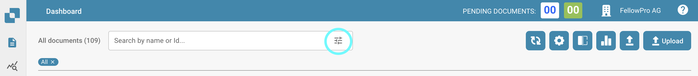

# Filtrando Documentos

Se você está procurando um documento ou documentos específicos, então você tem o seguinte disponível. Dentro da barra de pesquisa, fornecemos várias ferramentas para encontrar o documento que você está procurando. Para acessá-las, selecione o seguinte ícone.

<figure><figcaption></figcaption></figure>

As seguintes opções de filtro estarão disponíveis para você.

Oferecemos a opção de filtrar por tipo de documento, status do documento, responsável pelo documento e pela data.
